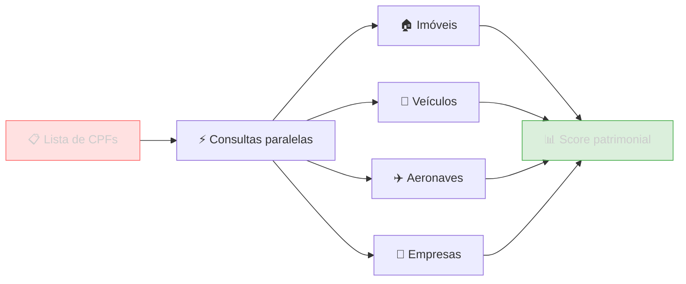

Classifique pessoas por capacidade financeira usando dados reais: valor venal de imóveis, frota de veículos, aeronaves, capital social de empresas e vínculos empregatícios. Ideal para **crédito**, **seguros**, **investimentos** e **marketing direcionado**.

## Estratégia

Para cada CPF da base, consulte em paralelo os principais sinais patrimoniais e monte um score simples baseado nos dados encontrados.



## Sinais e Pesos Sugeridos

| Sinal | Condição | Pontos |
|---|---|---|
| Imóveis alto valor | Valor venal > R$2M | +30 |
| Imóveis médio valor | Valor R$500k - R$2M | +20 |
| Imóveis baixo valor | Valor R$100k - R$500k | +10 |
| Frota 3+ veículos | 3 ou mais veículos | +10 |
| 1-2 veículos | 1 ou 2 veículos | +5 |
| Aeronave registrada | Possui aeronave | +30 |
| Capital alto em empresa | Capital social > R$1M | +15 |
| Capital médio em empresa | Capital R$100k - R$1M | +10 |

## Implementação

```python
import requests
from concurrent.futures import ThreadPoolExecutor, as_completed

BASE = "https://221b-api.sherlocker.com.br/api/v1"
TOKEN = "SEU_TOKEN"

def get(endpoint, **params):
    params["token"] = TOKEN
    return requests.get(f"{BASE}{endpoint}", params=params).json()

def calcular_score(cpf):
    with ThreadPoolExecutor(max_workers=4) as pool:
        fut_im  = pool.submit(get, f"/imoveis/cpf/{cpf}")
        fut_ve  = pool.submit(get, f"/aeronaves/cpf/{cpf}")  # aeronaves
        fut_vei = pool.submit(get, f"/veiculos/cpf/{cpf}")
        fut_emp = pool.submit(get, f"/empresas/cpf/{cpf}")

    imoveis   = fut_im.result().get("imoveis", [])
    aeronaves = fut_ve.result()
    veiculos  = fut_vei.result().get("veiculos", [])
    empresas  = fut_emp.result().get("socios", [])

    score = 0
    sinais = []

    # Imóveis — usar valor_venal quando disponível
    valor_imoveis = sum(float(im.get("valor_venal", 0) or 0) for im in imoveis)
    if valor_imoveis > 2_000_000:
        score += 30; sinais.append("imóveis >R$2M")
    elif valor_imoveis > 500_000:
        score += 20; sinais.append("imóveis R$500k-R$2M")
    elif valor_imoveis > 100_000:
        score += 10; sinais.append("imóveis R$100k-R$500k")

    # Veículos
    n_veiculos = len(veiculos)
    if n_veiculos >= 3:
        score += 10; sinais.append(f"{n_veiculos} veículos")
    elif n_veiculos > 0:
        score += 5; sinais.append(f"{n_veiculos} veículo(s)")

    # Aeronaves
    tem_aeronave = aeronaves.get("aeronaves") or aeronaves.get("total", 0) > 0
    if tem_aeronave:
        score += 30; sinais.append("aeronave registrada")

    # Capital social das empresas vinculadas
    capital_max = max(
        (e.get("capital_social") or 0 for e in empresas),
        default=0
    )
    if capital_max > 1_000_000:
        score += 15; sinais.append(f"empresa capital R${capital_max/1e6:.1f}M")
    elif capital_max > 100_000:
        score += 10; sinais.append(f"empresa capital R${capital_max/1e3:.0f}k")

    # Faixa
    if score >= 70:   faixa = "A"
    elif score >= 45: faixa = "B"
    elif score >= 25: faixa = "C"
    elif score >= 10: faixa = "D"
    else:             faixa = "E"

    return {"cpf": cpf, "score": score, "faixa": faixa, "sinais": sinais}

# Segmentar uma lista de CPFs
cpfs = ["12345678901", "98765432100", "11122233344"]

resultados = []
with ThreadPoolExecutor(max_workers=5) as pool:
    futures = {pool.submit(calcular_score, cpf): cpf for cpf in cpfs}
    for fut in as_completed(futures):
        resultados.append(fut.result())

# Agrupar por faixa
faixas = {"A": [], "B": [], "C": [], "D": [], "E": []}
for r in resultados:
    faixas[r["faixa"]].append(r)

for faixa, grupo in faixas.items():
    print(f"Faixa {faixa}: {len(grupo)} pessoas")
    for p in grupo:
        print(f"  {p['cpf']} (score {p['score']}) — {', '.join(p['sinais'])}")
```

## Faixas de Classificação

| Faixa | Score | Classificação | Perfil típico |
|---|---|---|---|
| **A** | >= 70 | Ultra-alta renda | Imóveis >R$2M, aeronave, capital >R$1M |
| **B** | >= 45 | Alta renda | Imóveis R$500k-2M, veículos, empresa com capital |
| **C** | >= 25 | Média-alta | Imóvel, veículo, empresa pequena |
| **D** | >= 10 | Média | 1 veículo ou empresa com capital mínimo |
| **E** | < 10 | Não identificada | Sem sinais patrimoniais detectados |

## Considerações

- O score é **conservador**: indica poder aquisitivo mínimo detectável, não renda exata
- Faixa E não significa renda baixa — pode ser ausência de dados patrimoniais registrados
- Use as consultas em **paralelo** (ThreadPoolExecutor) para performance
- Quando `valor_venal` não está disponível nos imóveis, o sinal de valor não é computado

## APIs utilizadas

<CardGroup cols={3}>
  <Card title="Imóveis" icon="house" href="/api-reference/imoveis/imoveis-urbanos-de-uma-pessoa">
    Valor venal de propriedades
  </Card>
  <Card title="Veículos" icon="car" href="/api-reference/veiculos/veiculos-de-uma-pessoa">
    Frota registrada
  </Card>
  <Card title="Aeronaves" icon="plane" href="/api-reference/aeronaves/aeronaves-de-uma-pessoa">
    Aeronaves e drones
  </Card>
  <Card title="Empresas" icon="building" href="/api-reference/empresas/vinculos-societarios-de-uma-pessoa">
    Capital social das empresas vinculadas
  </Card>
</CardGroup>
