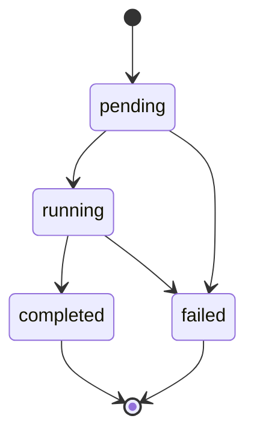

Toda operação criada via `POST /v1/operations` é processada de forma assíncrona. Esta página explica a máquina de estados de uma operação, o que os verdicts por título e do cedente significam, como a operação se relaciona com as análises-filhas do Motor de Análise e como consultar o resultado com polling.

<Note>
  Durante o beta, substitua `<API_HOST>` pelo host fornecido pelo time Sherlocker. O host definitivo será publicado na promoção a produção.
</Note>

## Máquina de estados

Uma operação passa por estes estados, no campo `status`:



Trate `failed` como possível a partir de qualquer estado não-terminal: uma operação que expira ainda em `pending` (sem chegar a `running`) também termina em `failed`.

| Status | Terminal? | Significado |
|--------|-----------|-------------|
| `pending` | Não | Operação aceita (202), CNAB parseado e aguardando processamento |
| `running` | Não | Motor analisando cedente, sacados e títulos |
| `completed` | Sim | Motor terminou; `summary` e `titulos` disponíveis |
| `failed` | Sim | O motor não conseguiu concluir a operação; `summary` e `titulos` permanecem `null` e os tokens são estornados |

Quando uma operação termina em `failed`, os tokens debitados na criação são **estornados automaticamente**. Veja [Cobrança](/credito/cobranca).

Respostas de operações terminais (`completed`/`failed`) são estáveis — o resultado não muda depois de pronto.

## Verdicts por título

Cada item de `titulos[]` traz um `verdict` que consolida, para aquele título, o resultado da análise do cedente, da análise do sacado e das validações do próprio título (dados do CNAB e cruzamento com NFe):

| `titulos[].verdict` | Significado |
|---------------------|-------------|
| `aprovado` | Nenhuma verificação do título resultou em alerta ou bloqueio |
| `alerta` | Pelo menos uma verificação resultou em alerta, sem nenhum bloqueio |
| `reprovado` | Pelo menos uma verificação resultou em bloqueio |

O `summary` agrega essas contagens em `aprovados`, `alertas` e `reprovados`, junto com `valor_total` e `valor_aprovado` para a decisão financeira da operação.

## Verdict do cedente

O campo `summary.cedente_verdict` carrega o veredito da análise de risco do **cedente** — a mesma semântica de `verdict` do [Motor de Análise](/motor-analise/ciclo-de-vida) (`aprovado` | `alerta` | `reprovado` | `incompleto`). Como o cedente é a contraparte de todos os títulos, um `cedente_verdict` de `reprovado` compromete o borderô inteiro, independentemente dos sacados.

## Operação e análises-filhas

Ao processar o borderô, o motor cria **uma análise por entidade única**: uma para o cedente e uma para cada sacado distinto. São análises normais do Motor de Análise, e é isso que os campos `cedente_analysis_id` e `sacado_analysis_id` de cada título referenciam:

- O mesmo sacado em vários títulos aponta para a **mesma** análise (e é cobrado uma única vez — veja [Cobrança](/credito/cobranca)).
- Todos os títulos compartilham o mesmo `cedente_analysis_id`.
- O detalhamento completo (verdict, `blocks`, `coverage`) de qualquer entidade está em `GET /v1/analyses/{id}`, com o formato documentado no [ciclo de vida da análise](/motor-analise/ciclo-de-vida).

É assim que os dois produtos compõem: o Motor de Crédito responde "o que fazer com cada título"; o drill-down nas análises responde "por quê".

## Quando os campos deixam de ser `null`

Enquanto a operação está em `pending` ou `running`:

- `summary` e `titulos` são `null`;
- `finished_at` é `null`.

Os campos de resultado são preenchidos de uma vez quando a operação chega a `completed`. Não há resultado parcial: ou a operação está em andamento (campos `null`), ou está pronta (campos completos).

Em `failed`, `summary` e `titulos` permanecem `null` — apenas `finished_at` é preenchido — e os tokens debitados na criação são estornados automaticamente.

## Polling

Consulte o resultado com `GET /v1/operations/{id}`. Enquanto a operação não é terminal, a resposta traz duas indicações equivalentes de quando consultar de novo:

- o campo `poll_after_seconds: 2` no body;
- o header `Retry-After: 2` na resposta.

Quando o status é terminal, esse campo e esse header deixam de aparecer — é o sinal de que não há mais o que aguardar.

<CodeGroup>
```bash cURL
curl "https://<API_HOST>/v1/operations/b2c3d4e5-0000-0000-0000-000000000001" \
  -H "Authorization: Bearer slhk_sua_chave_aqui"
```

```python Python
import requests
import time

API_HOST = "<API_HOST>"
HEADERS = {"Authorization": "Bearer slhk_sua_chave_aqui"}
operation_id = "b2c3d4e5-0000-0000-0000-000000000001"

while True:
    resp = requests.get(
        f"https://{API_HOST}/v1/operations/{operation_id}",
        headers=HEADERS,
    )
    data = resp.json()

    if data["status"] in ("completed", "failed"):
        break

    time.sleep(data.get("poll_after_seconds", 2))

if data["status"] == "completed":
    print("cedente:", data["summary"]["cedente_verdict"])
    print("aprovados:", data["summary"]["aprovados"])
else:
    # failed: summary/titulos sao null e os tokens sao estornados
    print("operacao falhou")
```

```javascript Node.js
const API_HOST = "<API_HOST>";
const headers = { Authorization: "Bearer slhk_sua_chave_aqui" };
const operationId = "b2c3d4e5-0000-0000-0000-000000000001";

let data;
while (true) {
  const resp = await fetch(
    `https://${API_HOST}/v1/operations/${operationId}`,
    { headers }
  );
  data = await resp.json();

  if (data.status === "completed" || data.status === "failed") break;

  const waitSeconds = data.poll_after_seconds ?? 2;
  await new Promise((r) => setTimeout(r, waitSeconds * 1000));
}

if (data.status === "completed") {
  console.log("cedente:", data.summary.cedente_verdict);
  console.log("aprovados:", data.summary.aprovados);
} else {
  // failed: summary/titulos sao null e os tokens sao estornados
  console.log("operacao falhou");
}
```
</CodeGroup>

<Tip>
  Consultar mais rápido que o intervalo indicado não acelera o resultado. Sempre honre `Retry-After`/`poll_after_seconds`.
</Tip>

### Boas práticas

- **Respeite o rate limit**: 100 requisições por minuto por IP. Exceder retorna `429`.
- **Use o intervalo indicado** (2 segundos) entre consultas, em vez de um valor fixo próprio.
- **Pare no estado terminal**: `completed` e `failed` são finais; não há transição depois deles.
- Consultar uma operação inexistente ou de outro workspace retorna `404 not_found` — veja [Erros](/credito/erros).

## Exemplo: resposta em andamento

`GET /v1/operations/{id}` com a operação ainda em `running` retorna `200` com header `Retry-After: 2`:

```json
{
  "id": "b2c3d4e5-0000-0000-0000-000000000001",
  "status": "running",
  "engine_id": "0b3c6c7e-9d2a-4f1b-8e5d-2a1b3c4d5e6f",
  "file_name": "remessa-0605.rem",
  "summary": null,
  "titulos": null,
  "created_at": "2026-07-06T10:00:00Z",
  "finished_at": null,
  "poll_after_seconds": 2,
  "request_id": "req-uuid"
}
```

## Exemplo: resposta concluída

Quando a operação termina, a resposta traz o resultado completo, sem `poll_after_seconds` nem `Retry-After`:

```json
{
  "id": "b2c3d4e5-0000-0000-0000-000000000001",
  "status": "completed",
  "engine_id": "0b3c6c7e-9d2a-4f1b-8e5d-2a1b3c4d5e6f",
  "file_name": "remessa-0605.rem",
  "created_at": "2026-07-06T10:00:00Z",
  "finished_at": "2026-07-06T10:02:15Z",
  "summary": {
    "titulos": 42,
    "aprovados": 30,
    "alertas": 8,
    "reprovados": 4,
    "valor_total": 123456.78,
    "valor_aprovado": 100000.00,
    "cedente_verdict": "aprovado",
    "entities_count": 12
  },
  "titulos": [
    {
      "seu_numero": "DUP-0001",
      "sacado_document": "12345678000190",
      "valor": 1234.56,
      "vencimento": "2026-08-01",
      "verdict": "aprovado",
      "nfe_status": "validada",
      "cedente_analysis_id": "a1b2c3d4-0000-0000-0000-000000000010",
      "sacado_analysis_id": "a1b2c3d4-0000-0000-0000-000000000011"
    }
  ],
  "tokens_charged": 12,
  "request_id": "req-uuid"
}
```

O shape completo de cada título, incluindo os estados de `nfe_status`, está em [Títulos e NFe](/credito/titulos-e-nfe).

## Próximos passos

<CardGroup cols={2}>
  <Card title="Quickstart" icon="rocket" href="/credito/quickstart">
    Analise seu primeiro borderô do início ao fim
  </Card>
  <Card title="Títulos e NFe" icon="file-invoice" href="/credito/titulos-e-nfe">
    Referência do shape de título e da validação cruzada com NFe
  </Card>
  <Card title="Cobrança" icon="coins" href="/credito/cobranca">
    Quando os tokens são debitados e quando há estorno
  </Card>
</CardGroup>
