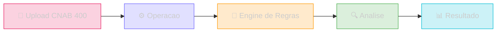

O **Sherlocker Credito** e o modulo de analise de credito da plataforma Sherlocker, construido sobre a API Mycroft. Ele permite que FIDCs (Fundos de Investimento em Direitos Creditorios) automatizem a analise de borderos CNAB 400 com total transparencia sobre cada regra aplicada.

## Como funciona

### Fluxo de analise

<Steps>
  <Step title="Upload do bordero">
    Envie o arquivo CNAB 400 remessa via `POST /credito/operacoes` com o CNPJ do cedente. Opcionalmente, inclua um ZIP com XMLs de NFe para validacao cruzada.
  </Step>
  <Step title="Processamento">
    A operacao entra em fila (`queued` → `processing`). Acompanhe o status em tempo real via `GET /credito/operacoes/{id}`.
  </Step>
  <Step title="Resultado">
    Quando `completed`, consulte `GET /credito/operacoes/{id}/result` para obter a arvore hierarquica completa: **Cedente → Sacados → Titulos**, cada um com suas issues detalhadas.
  </Step>
</Steps>

## Conceitos principais

### Operacao

Uma operacao representa uma analise completa de um bordero. Cada operacao produz um resultado com:

- **Cedente** — a empresa que cede os titulos
- **Sacados** — os devedores de cada titulo
- **Titulos** — as duplicatas/boletos individuais
- **Issues** — violacoes de regras detectadas em cada nivel

### Engine de Regras

Um engine e um conjunto configuravel de regras que define o criterio de aprovacao. Cada regra pode ser:

| Severidade | Comportamento |
|------------|---------------|
| **blocking** | Bloqueia o titulo — impede a aprovacao |
| **alert** | Gera alerta — nao impede a aprovacao |

Voce pode criar engines personalizados, clonar engines existentes ou usar o template padrao.

### Status das entidades

Cada cedente, sacado e titulo recebe um status baseado nas regras aplicadas:

| Status | Significado |
|--------|-------------|
| **approved** | Nenhuma violacao detectada |
| **blocked** | Pelo menos uma regra bloqueante violada |
| **alerted** | Apenas regras de alerta violadas |

## Endpoints disponiveis

### Operacoes

| Metodo | Rota | Descricao |
|--------|------|-----------|
| `POST` | `/credito/operacoes` | Criar operacao (upload CNAB 400) |
| `GET` | `/credito/operacoes/{id}` | Consultar status |
| `GET` | `/credito/operacoes/{id}/result` | Obter resultado da analise |

### Engines

| Metodo | Rota | Descricao |
|--------|------|-----------|
| `GET` | `/credito/engines` | Listar engines |
| `GET` | `/credito/engines/{id}` | Detalhe de um engine |
| `POST` | `/credito/engines` | Criar engine |
| `PUT` | `/credito/engines/{id}` | Atualizar engine |
| `DELETE` | `/credito/engines/{id}` | Remover engine |

### Perfil Agregado

| Metodo | Rota | Descricao |
|--------|------|-----------|
| `GET` | `/perfil/credito/cpf/{cpf}` | Perfil de credito por CPF |
| `GET` | `/perfil/credito/cnpj/{cnpj}` | Perfil de credito por CNPJ |

## Autenticacao

Todos os endpoints de credito utilizam o mesmo token da API Sherlocker, passado via query parameter `token`.

<Tip>
  Para comecar, consulte `GET /credito/engines` para ver os engines disponiveis e depois crie sua primeira operacao com `POST /credito/operacoes`.
</Tip>
