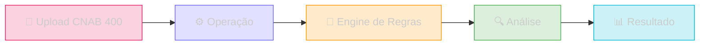

O **Sherlocker Crédito** é o módulo de análise de crédito da plataforma Sherlocker, construído sobre a API Mycroft. Ele permite que FIDCs (Fundos de Investimento em Direitos Creditórios) automatizem a análise de borderôs CNAB 400 com total transparência sobre cada regra aplicada.

## Como funciona

### Fluxo de análise

<Steps>
  <Step title="Upload do borderô">
    Envie o arquivo CNAB 400 remessa via `POST /credito/operacoes` com o CNPJ do cedente. Opcionalmente, inclua um ZIP com XMLs de NFe para validação cruzada.
  </Step>
  <Step title="Processamento">
    A operação entra em fila (`queued` → `processing`). Acompanhe o status em tempo real via `GET /credito/operacoes/{id}`.
  </Step>
  <Step title="Resultado">
    Quando `completed`, consulte `GET /credito/operacoes/{id}/result` para obter a árvore hierárquica completa: **Cedente → Sacados → Títulos**, cada um com suas issues detalhadas.
  </Step>
</Steps>

## Conceitos principais

### Operação

Uma operação representa uma análise completa de um borderô. Cada operação produz um resultado com:

- **Cedente** — a empresa que cede os títulos
- **Sacados** — os devedores de cada título
- **Títulos** — as duplicatas/boletos individuais
- **Issues** — violações de regras detectadas em cada nível

### Engine de Regras

Um engine é um conjunto configurável de regras que define o critério de aprovação. Cada regra pode ser:

| Severidade | Comportamento |
|------------|---------------|
| **blocking** | Bloqueia o título — impede a aprovação |
| **alert** | Gera alerta — não impede a aprovação |

Você pode criar engines personalizados, clonar engines existentes ou usar o template padrão.

### Status das entidades

Cada cedente, sacado e título recebe um status baseado nas regras aplicadas:

| Status | Significado |
|--------|-------------|
| **approved** | Nenhuma violação detectada |
| **blocked** | Pelo menos uma regra bloqueante violada |
| **alerted** | Apenas regras de alerta violadas |

## Endpoints disponíveis

### Operações

| Método | Rota | Descrição |
|--------|------|-----------|
| `POST` | `/credito/operacoes` | Criar operação (upload CNAB 400) |
| `GET` | `/credito/operacoes/{id}` | Consultar status |
| `GET` | `/credito/operacoes/{id}/result` | Obter resultado da análise |

### Engines

| Método | Rota | Descrição |
|--------|------|-----------|
| `GET` | `/credito/engines` | Listar engines |
| `GET` | `/credito/engines/{id}` | Detalhe de um engine |
| `POST` | `/credito/engines` | Criar engine |
| `PUT` | `/credito/engines/{id}` | Atualizar engine |
| `DELETE` | `/credito/engines/{id}` | Remover engine |

### Perfil Agregado

| Método | Rota | Descrição |
|--------|------|-----------|
| `GET` | `/perfil/credito/cpf/{cpf}` | Perfil de crédito por CPF |
| `GET` | `/perfil/credito/cnpj/{cnpj}` | Perfil de crédito por CNPJ |

## Autenticação

Todos os endpoints de crédito utilizam o mesmo token da API Sherlocker, passado via query parameter `token`.

<Tip>
  Para começar, consulte `GET /credito/engines` para ver os engines disponíveis e depois crie sua primeira operação com `POST /credito/operacoes`.
</Tip>
