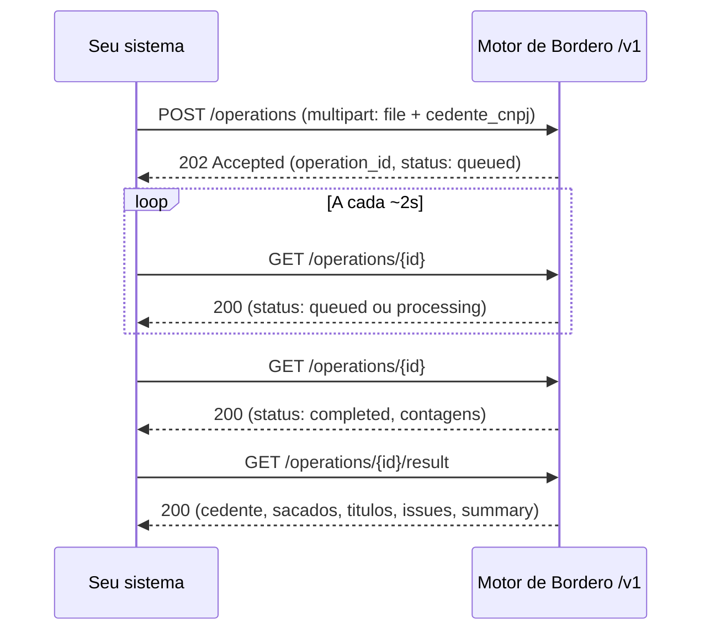

<Frame>
  
</Frame>

O **Motor de Borderô** é a API pública para analisar **borderôs CNAB 400** de operações de desconto de duplicatas. Você envia o arquivo remessa como `multipart/form-data`, o motor faz o parse dos títulos, roda uma análise de risco completa do **cedente** e de **cada sacado único**, valida cada título (com cruzamento opcional contra os XMLs de NFe) e devolve um **resultado hierárquico** — cedente → sacados → títulos, cada nó com status consolidado e as violações de regra (issues).

Foi feito para quem opera recebíveis e precisa da esteira de análise dentro do próprio fluxo:

- **FIDCs** — análise do borderô completo antes de aprovar a operação
- **Securitizadoras e factorings** — triagem automática de remessas de cedentes
- **Backoffices de crédito** — automação da conferência título a título

<Warning>
  O Motor de Borderô está em **beta**. O acesso é liberado por workspace através da feature `analysis_engine` — a mesma do Motor de Análise. Sem a feature, as chamadas retornam `403 feature_not_enabled`. [Solicite acesso aqui](/api/access).
</Warning>

## Como funciona

A API é assíncrona, com três endpoints:

1. `POST /operations` cria a operação: um `multipart/form-data` com o arquivo CNAB 400 (`file`), o CNPJ do cedente (`cedente_cnpj`) e, opcionalmente, o ZIP de XMLs de NFe (`xmls`). Retorna `202 Accepted` com apenas `operation_id`, `status: "queued"` e `created_at`. Os tokens do workspace são debitados nesse momento, logo após o parse do arquivo — mas a cobrança não aparece no payload.
2. Você faz polling com `GET /operations/{id}` a cada ~2 segundos, até o status chegar a `completed` ou `failed`. O envelope de status traz as contagens consolidadas (`titulo_count`, `approved_count`, `blocked_count`, `alert_count`) quando a operação conclui.
3. `GET /operations/{id}/result` devolve o resultado hierárquico: a árvore cedente → sacados → títulos com as `issues` de cada nó, o `summary` do dataset completo, `coverage` e `degraded_rules`. Por padrão (`?filter=issues`), só os nós com problemas; com `?filter=all`, a árvore completa.

```mermaid
sequenceDiagram
    participant C as Seu sistema
    participant S as Motor de Bordero /v1
    C->>S: POST /operations (multipart: file + cedente_cnpj)
    S-->>C: 202 Accepted (operation_id, status: queued)
    loop A cada ~2s
        C->>S: GET /operations/{id}
        S-->>C: 200 (status: queued ou processing)
    end
    C->>S: GET /operations/{id}
    S-->>C: 200 (status: completed, contagens)
    C->>S: GET /operations/{id}/result
    S-->>C: 200 (cedente, sacados, titulos, issues, summary)
```

Todos os endpoints usam a base `https://221b-api.sherlocker.com.br/api/v1` e autenticação pelo header `Authorization: Bearer slhk_sua_chave_aqui` — a **mesma base, a mesma chave e a mesma feature** do Motor de Análise.

<Note>
  Os Motores usam a **mesma base** da API 221b (`https://221b-api.sherlocker.com.br/api/v1`), mas autenticam via `Authorization: Bearer slhk_…` — **não** via `?token=`.
</Note>

A cobrança é por **entidade única** do borderô (cedente + sacados únicos), não por título: um borderô de 42 títulos com 1 cedente e 11 sacados únicos cobra 12 análises. Operações que terminam em `failed` têm os tokens reembolsados automaticamente. Veja [Cobrança](/motores/cobranca). A API é polling-only por enquanto: não há webhooks nem listagem de operações.

## E o Motor de CPF/CNPJ?

Este é o motor de **borderô completo**. Se o seu caso é avaliar o risco de um CNPJ ou CPF específico — onboarding, KYC, due diligence de uma contraparte —, use o **[Motor de CPF/CNPJ](/motor-analise/introducao)**: mesma base `/v1`, mesma chave `slhk_`, mesma feature. Os dois compõem: este motor usa o Motor de CPF/CNPJ por baixo para o risco de cada entidade, e o detalhamento do cedente e de cada sacado chega nas `issues` dos próprios nós da árvore do `/result`. A comparação completa está em [Motores de Análise](/motores/introducao).

## Próximos passos

<CardGroup cols={2}>
  <Card title="Quickstart" icon="rocket" href="/credito/quickstart">
    Analise seu primeiro borderô em minutos
  </Card>
  <Card title="Autenticação" icon="key" href="/motor-analise/autenticacao">
    Chaves de API, header Bearer e rastreamento de requisições
  </Card>
  <Card title="Ciclo de vida" icon="arrows-rotate" href="/motores/ciclo-de-vida">
    Status da operação, envelope camelCase e o resultado hierárquico

  </Card>
  <Card title="Títulos e NFe" icon="file-invoice" href="/credito/titulos-e-nfe">
    O shape de cada título e a validação cruzada com XMLs de NFe
  </Card>
</CardGroup>
