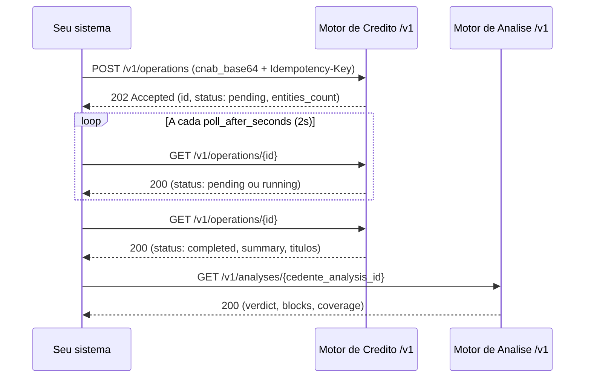

O **Motor de Crédito** é a API pública para analisar **borderôs CNAB 400** de operações de desconto de duplicatas. Você envia o arquivo remessa, o motor faz o parse dos títulos, roda uma análise de risco completa do **cedente** e de **cada sacado único**, valida cada título (com cruzamento opcional contra os XMLs de NFe) e devolve um veredito consolidado por título e da operação.

Foi feito para quem opera recebíveis e precisa da esteira de análise dentro do próprio fluxo:

- **FIDCs** — análise do borderô completo antes de aprovar a operação
- **Securitizadoras e factorings** — triagem automática de remessas de cedentes
- **Backoffices de crédito** — automação da conferência título a título

<Warning>
  O Motor de Crédito está em **beta**. O acesso é liberado por workspace através da feature `analysis_engine` — a mesma do Motor de Análise. Sem a feature, as chamadas retornam `403 feature_not_enabled`. [Solicite acesso aqui](/credito/acesso).
</Warning>

## Como funciona

A API é assíncrona, com apenas dois endpoints:

1. `POST /v1/operations` cria a operação com o arquivo CNAB 400 em base64 e retorna `202 Accepted` com o `id`, a contagem de títulos (`titulos_count`) e de entidades únicas (`entities_count`). Os tokens do workspace são debitados nesse momento, logo após o parse do arquivo.
2. Você faz polling com `GET /v1/operations/{id}`, respeitando o `poll_after_seconds` da resposta, até o status chegar a `completed` ou `failed`.
3. No resultado, `summary` resume a operação (aprovados, alertas, reprovados, valores) e `titulos[]` traz o veredito de cada título — cada um com `cedente_analysis_id` e `sacado_analysis_id`, que são análises normais do [Motor de Análise](/motor-analise/introducao), consultáveis via `GET /v1/analyses/{id}`.

```mermaid
sequenceDiagram
    participant C as Seu sistema
    participant S as Motor de Credito /v1
    participant A as Motor de Analise /v1
    C->>S: POST /v1/operations (cnab_base64 + Idempotency-Key)
    S-->>C: 202 Accepted (id, status: pending, entities_count)
    loop A cada poll_after_seconds (2s)
        C->>S: GET /v1/operations/{id}
        S-->>C: 200 (status: pending ou running)
    end
    C->>S: GET /v1/operations/{id}
    S-->>C: 200 (status: completed, summary, titulos)
    C->>A: GET /v1/analyses/{cedente_analysis_id}
    A-->>C: 200 (verdict, blocks, coverage)
```

Todos os endpoints usam a base `https://<API_HOST>/v1` e autenticação pelo header `Authorization: Bearer slhk_sua_chave_aqui` — a **mesma base, a mesma chave e a mesma feature** do Motor de Análise.

<Note>
  Durante o beta, substitua `<API_HOST>` pelo host fornecido pelo time Sherlocker. O host definitivo será publicado quando a API for promovida a produção.
</Note>

A cobrança é por **entidade única** do borderô (cedente + sacados únicos), não por título: um borderô de 42 títulos com 1 cedente e 11 sacados únicos cobra 12 análises. Operações que terminam em `failed` têm os tokens reembolsados automaticamente. Veja [Cobrança](/credito/cobranca). A API é polling-only por enquanto: não há webhooks nem listagem de operações.

## Motor de Crédito vs Motor de Análise

São produtos complementares que **compõem**: o Motor de Crédito orquestra o borderô e delega o risco de cada entidade ao Motor de Análise. Mesma base `/v1`, mesma chave `slhk_`, mesma feature `analysis_engine`:

| | Motor de Análise | Motor de Crédito |
|---|---|---|
| O que analisa | Um CNPJ ou CPF individual (cadastro, sanções, risco) | Um borderô completo em CNAB 400 (cedente, sacados, títulos e NFe) |
| Endpoints | `POST /v1/analyses` e `GET /v1/analyses/{id}` | `POST /v1/operations` e `GET /v1/operations/{id}` |
| Cobrança | Por análise | Por entidade única do borderô (cedente + sacados únicos) |
| Resultado | `verdict` + `blocks` + `coverage` | `summary` + veredito por título, com `cedente_analysis_id`/`sacado_analysis_id` apontando para análises completas |

Se o seu caso é avaliar o risco de um CNPJ ou CPF específico, use o Motor de Análise. Se é analisar uma operação de desconto de duplicatas a partir de um arquivo CNAB 400, esta é a API certa — e o detalhamento de cada entidade continua a um `GET /v1/analyses/{id}` de distância.

## Próximos passos

<CardGroup cols={2}>
  <Card title="Quickstart" icon="rocket" href="/credito/quickstart">
    Analise seu primeiro borderô em minutos
  </Card>
  <Card title="Autenticação" icon="key" href="/credito/autenticacao">
    Chaves de API, header Bearer e rastreamento de requisições
  </Card>
  <Card title="Ciclo de vida" icon="arrows-rotate" href="/credito/ciclo-de-vida">
    Status da operação, verdicts por título e as análises-filhas
  </Card>
  <Card title="Títulos e NFe" icon="file-invoice" href="/credito/titulos-e-nfe">
    O shape de cada título e a validação cruzada com XMLs de NFe
  </Card>
</CardGroup>
