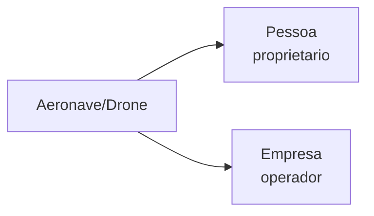

Uma **Aeronave** representa uma aeronave (aviao, helicoptero) ou drone registrado na Agencia Nacional de Aviacao Civil. Sao dois subtipos com estruturas diferentes.

## Tipagem — Aeronave

```json
{
  "marca": "PT-ABC",
  "fabricante": "EMBRAER",
  "modelo": "EMB-110",
  "ano_fabricacao": "2015",
  "categoria": "TPX",
  "tipo": "AVIAO",
  "proprietario": "JOAO DA SILVA",
  "operador": "TAXI AEREO LTDA",
  "uf": "SP"
}
```

| Campo | Tipo | Descricao |
|-------|------|-----------|
| `marca` | string | Matricula da aeronave (PT-XXX, PR-XXX, PP-XXX) |
| `fabricante` | string | Fabricante |
| `modelo` | string | Modelo |
| `ano_fabricacao` | string | Ano |
| `categoria` | string | Categoria de registro |
| `tipo` | string | `AVIAO`, `HELICOPTERO`, `PLANADOR`, etc. |
| `proprietario` | string | Nome do proprietario |
| `operador` | string | Nome do operador |

## Tipagem — Drone

```json
{
  "codigo_aeronave": "DR12345",
  "fabricante": "DJI",
  "modelo": "MAVIC 3",
  "operador": "MARIA SANTOS",
  "tipo_uso": "RECREATIVO",
  "peso_maximo": "0.9",
  "ramo_atividade": "FOTOGRAFIA"
}
```

| Campo | Tipo | Descricao |
|-------|------|-----------|
| `codigo_aeronave` | string | Codigo de registro |
| `fabricante` | string | Fabricante |
| `modelo` | string | Modelo |
| `operador` | string | Operador registrado |
| `tipo_uso` | string | `RECREATIVO`, `EXPERIMENTAL`, `COMERCIAL` |
| `peso_maximo` | string | Peso maximo de decolagem (kg) |
| `ramo_atividade` | string | Atividade declarada |

## Conexoes



- **Pessoa** — como proprietario ou operador
- **Empresa** — como operador comercial

## Endpoints

| Rota | Descricao |
|------|-----------|
| `GET /aeronaves/cpf/{cpf}` | Aeronaves e drones por CPF |
| `GET /aeronaves/cnpj/{cnpj}` | Aeronaves e drones por CNPJ |
