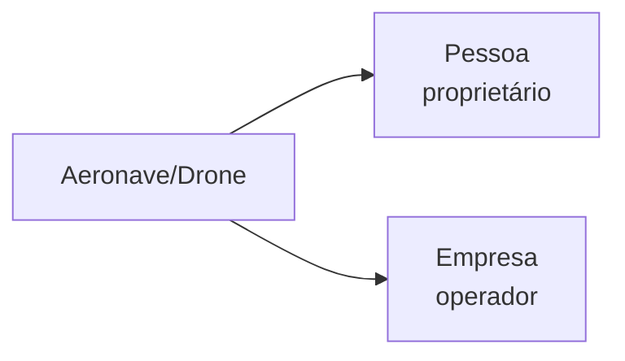

Uma **Aeronave** representa uma aeronave (avião, helicóptero) ou drone registrado na Agência Nacional de Aviação Civil. São dois subtipos com estruturas diferentes.

## Tipagem — Aeronave

```json
{
  "documento": "123.XXX.XXX-01",
  "tipo": "PF",
  "marca": "PT-ABC",
  "fabricante": "EMBRAER",
  "modelo": "EMB-110",
  "ano_fabricacao": "2015",
  "categoria": "TPX",
  "tipo_aeronave": "AVIAO",
  "proprietario": "JOAO DA SILVA",
  "operador": "TAXI AEREO LTDA",
  "uf": "SP"
}
```

| Campo | Tipo | Descrição |
|-------|------|-----------|
| `documento` | string | CPF (mascarado, ex: `123.XXX.XXX-01`) ou CNPJ do proprietário |
| `tipo` | string | Tipo de pessoa do documento: `PF` ou `PJ` |
| `marca` | string | Matrícula da aeronave (PT-XXX, PR-XXX, PP-XXX) |
| `fabricante` | string | Fabricante |
| `modelo` | string | Modelo |
| `ano_fabricacao` | string | Ano |
| `categoria` | string | Categoria de registro |
| `tipo_aeronave` | string | Tipo da aeronave: `AVIAO`, `HELICOPTERO`, `PLANADOR`, etc. |
| `proprietario` | string | Nome do proprietário |
| `operador` | string | Nome do operador |
| `uf` | string | UF de registro |

Campos adicionais retornados: `outros_proprietarios`, `outros_operadores`, `uf_operador`, `cpf_cgc`, `certificado_matricula`, `numero_serie`, `classe`, `pmd`, `tipo_icao`, `tripulacao_minima`, `passageiros_maximo`, `numero_assentos`, `validade_cva`, `validade_ca`, `data_cancelamento`, `motivo_cancelamento`, `interdicao`, `marca_nacional_1/2/3`, `marca_estrangeira`, `data_matricula`, `tipo_motor`, `quantidade_motores`, `tipo_pouso` e `preco_estimado` (USD, apenas quando há estimativa).

## Tipagem — Drone

```json
{
  "documento": "***.456.789-**",
  "tipo": "PF",
  "codigo_aeronave": "DR12345",
  "fabricante": "DJI",
  "modelo": "MAVIC 3",
  "operador": "MARIA SANTOS",
  "tipo_uso": "RECREATIVO",
  "peso_maximo": "0.9",
  "ramo_atividade": "FOTOGRAFIA"
}
```

| Campo | Tipo | Descrição |
|-------|------|-----------|
| `documento` | string | CPF (mascarado, ex: `***.456.789-**`) ou CNPJ do operador |
| `tipo` | string | Tipo de pessoa do documento: `PF` ou `PJ` |
| `codigo_aeronave` | string | Código de registro |
| `data_validade` | string | Validade do registro |
| `operador` | string | Operador registrado |
| `tipo_uso` | string | `RECREATIVO`, `EXPERIMENTAL`, `COMERCIAL` |
| `fabricante` | string | Fabricante |
| `modelo` | string | Modelo |
| `numero_serie` | string | Número de série |
| `peso_maximo` | string | Peso máximo de decolagem (kg) |
| `ramo_atividade` | string | Atividade declarada |
| `preco_estimado` | number | Preço estimado em USD (apenas quando há estimativa) |

## Conexões


```mermaid
graph LR
  A[Aeronave/Drone] --> P[Pessoa<br/>proprietário]
  A --> E[Empresa<br/>operador]
```

- **Pessoa** — como proprietário ou operador
- **Empresa** — como operador comercial

## Endpoints

| Rota | Descrição |
|------|-----------|
| `GET /aeronaves/cpf/{cpf}` | Aeronaves e drones por CPF |
| `GET /aeronaves/cnpj/{cnpj}` | Aeronaves e drones por CNPJ |
