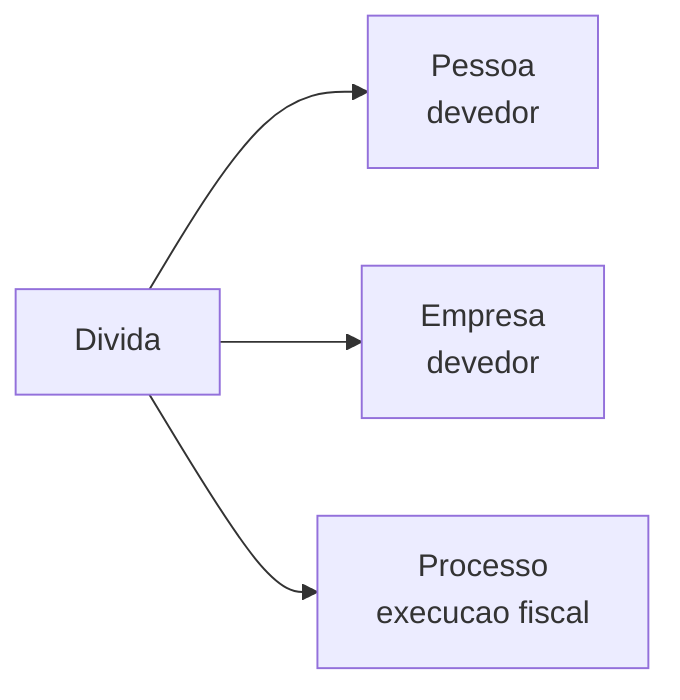

Uma **Divida** representa uma inscricao na divida ativa federal. Existem tres tipos: Divida Ativa da Uniao, FGTS e Previdenciaria. Inscricoes com o mesmo `numero_inscricao` sao agrupadas como historico de uma unica divida.

## Tipagem

```json
{
  "documento": "12345678901",
  "nome": "JOAO DA SILVA",
  "total": 1,
  "valor_total": 15420.50,
  "ajuizado": true,
  "dividas": [
    {
      "numero_inscricao": "80000000000001",
      "fonte": "ativa_uniao",
      "receita": "IRPF",
      "ajuizado": true,
      "data_inscricao": "2020-03-15",
      "valor_atual": 15420.50,
      "uf": "SP",
      "unidade_responsavel": "DRF CAMPINAS",
      "historico": [
        {
          "situacao": "Ativa Ajuizada",
          "valor": 15420.50,
          "data_inscricao": "2020-03-15"
        }
      ]
    }
  ]
}
```

### Campos da resposta

| Campo | Tipo | Descricao |
|-------|------|-----------|
| `documento` | string | CPF ou CNPJ consultado |
| `nome` | string\|null | Nome ou razao social do devedor |
| `total` | integer | Total de inscricoes encontradas |
| `valor_total` | number | Soma dos valores atuais em R$ |
| `ajuizado` | boolean | True se ao menos uma divida foi ajuizada |
| `dividas` | array | Lista de dividas (ver abaixo) |

### Campos de cada divida

| Campo | Tipo | Descricao |
|-------|------|-----------|
| `numero_inscricao` | string | Numero da inscricao na divida ativa |
| `fonte` | string | `ativa_uniao`, `fgts` ou `previdenciaria` |
| `receita` | string\|null | Tipo de tributo (IRPF, CSLL, FGTS, etc.) |
| `ajuizado` | boolean | Se foi ajuizado judicialmente |
| `data_inscricao` | string\|null | Data da inscricao mais recente |
| `valor_atual` | number\|null | Valor consolidado mais recente em R$ |
| `uf` | string\|null | UF do devedor |
| `unidade_responsavel` | string\|null | Unidade responsavel pela inscricao |
| `entidade_responsavel` | string\|null | Entidade responsavel (somente FGTS) |
| `historico` | array | Historico de situacoes para o mesmo numero de inscricao |

## Tipos

| Tipo | Descricao |
|------|-----------|
| **Ativa da Uniao** | Tributos federais (IR, CSLL, PIS, COFINS) |
| **FGTS** | Dividas do Fundo de Garantia |
| **Previdenciaria** | Contribuicoes previdenciarias (INSS) |

## Conexoes



- **Pessoa** — como devedor (CPF)
- **Empresa** — como devedor (CNPJ)
- **Processo** — dividas ajuizadas geram execucoes fiscais

## Endpoints

| Rota | Descricao |
|------|-----------|
| `GET /dividas/cpf/{cpf}` | Dividas por CPF |
| `GET /dividas/cnpj/{cnpj}` | Dividas por CNPJ |
