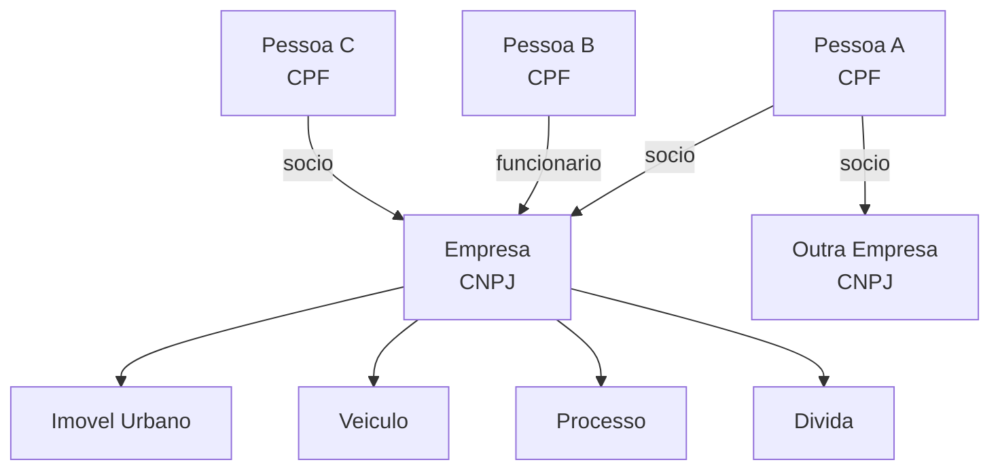

Uma **Empresa** e identificada pelo CNPJ e representa uma pessoa juridica registrada na Receita Federal. Alem dos dados cadastrais proprios, a empresa se conecta a **Pessoas** por meio de relacoes:

- **Socio** — relacao societaria (CPF ↔ CNPJ)
- **Funcionario** — relacao trabalhista (CPF ↔ CNPJ)

## Tipagem

```json
{
  "cnpj": "12345678000195",
  "razao_social": "TECHNOVACAO DIGITAL LTDA",
  "nome_fantasia": "TECHNOVACAO",
  "cnaes": [
    { "codigo": "6209100", "descricao": "Suporte tecnico em TI" }
  ],
  "situacao": "ATIVA",
  "data_abertura": "2016-01-20",
  "capital_social": 50000.00,
  "natureza_juridica": "Sociedade Limitada",
  "endereco": {
    "logradouro": "AVENIDA PAULISTA",
    "numero": "1000",
    "complemento": "SALA 1201",
    "bairro": "BELA VISTA",
    "cidade": "SAO PAULO",
    "uf": "SP",
    "cep": "01310-100"
  },
  "telefones": [...],
  "emails": [...],
  "socios": [...],
  "funcionarios": [...]
}
```

| Campo | Tipo | Descricao |
|-------|------|-----------|
| `cnpj` | string | CNPJ (14 digitos) |
| `razao_social` | string | Razao social |
| `nome_fantasia` | string | Nome fantasia |
| `cnaes` | array | CNAEs (primario + secundarios) |
| `situacao` | string | `ATIVA`, `BAIXADA`, `SUSPENSA`, `INAPTA` |
| `data_abertura` | string | Data de inicio das atividades |
| `capital_social` | number | Capital social em R$ |
| `natureza_juridica` | string | Tipo juridico (Ltda, S.A., MEI, etc.) |
| `endereco` | object | Endereco cadastral |

## Relacoes

Uma empresa nao existe isolada — ela se conecta a pessoas e a outras entidades por meio de relacoes:



### Relacao: Socio

Um **socio** e a relacao entre uma Pessoa (CPF) e uma Empresa (CNPJ). Representa vinculo societario ou administrativo.

```json
{
  "cpf": "12345678901",
  "nome": "MARIA DA SILVA",
  "qualificacao": "Socio-Administrador",
  "data_entrada": "2016-01-20"
}
```

| Campo | Tipo | Descricao |
|-------|------|-----------|
| `cpf` | string | CPF do socio |
| `nome` | string | Nome do socio |
| `qualificacao` | string | Tipo de participacao (Socio, Administrador, Diretor) |
| `data_entrada` | string | Data de entrada na sociedade |

A partir do CPF de um socio, voce pode expandir a investigacao para a entidade **Pessoa** (`GET /pessoas/cpf/{cpf}`) e descobrir outros vinculos, patrimonio, processos, etc.

### Relacao: Funcionario

Um **funcionario** e a relacao trabalhista entre uma Pessoa (CPF) e uma Empresa (CNPJ). Os dados vem de RAIS, CAGED e portais de transparencia.

```json
{
  "cpf": "98765432100",
  "nome_funcionario": "JOAO PEREIRA",
  "cargo": "ANALISTA DE SISTEMAS",
  "data_admissao": "2020-03-15",
  "data_desligamento": ""
}
```

| Campo | Tipo | Descricao |
|-------|------|-----------|
| `cpf` | string | CPF do funcionario — identificador que conecta a entidade Pessoa |
| `nome_funcionario` | string | Nome |
| `cargo` | string | Cargo ou funcao |
| `data_admissao` | string | Data de admissao |
| `data_desligamento` | string | Data de desligamento (vazio se ativo) |

Cada funcionario tem um `cpf` que e o identificador da entidade **Pessoa**. Use `GET /pessoas/cpf/{cpf}` para expandir os dados de qualquer funcionario.

## Pontos de entrada

| Dado disponivel | Endpoint | Resultado |
|----------------|----------|-----------|
| CNPJ | `GET /empresas/cnpj/{cnpj}` | Perfil completo (cadastro + socios + funcionarios + patrimonio + juridico) |
| CPF do socio | `GET /empresas/cpf/{cpf}` | Empresas onde a pessoa e socia |
| Email | `GET /empresas/email/{email}` | Empresas com esse email |
| Telefone | `GET /empresas/telefone/{telefone}` | Empresas com esse telefone |

## Dados agregados

O perfil completo (`GET /empresas/cnpj/{cnpj}`) agrega tudo em uma chamada:

| Categoria | Campos | Entidades relacionadas |
|-----------|--------|----------------------|
| Cadastral | razao_social, cnae, situacao, endereco | — |
| Relacoes | socios[], funcionarios[] | Pessoa (CPF) |
| Patrimonio | imoveis[], veiculos[], aeronaves, patentes[], rural | Imovel, Veiculo, Aeronave, Patente |
| Juridico | processos[], dividas, compliance, trabalhista | Processo, Divida |
| Financeiro | beneficios_fiscais | Beneficio |

## Fluxo investigativo

<Steps>
  <Step title="Cadastro">
    `GET /empresas/cnpj/{cnpj}` — dados cadastrais, socios e funcionarios
  </Step>
  <Step title="Expandir socios">
    Para cada socio, consultar `GET /pessoas/cpf/{cpf}` e investigar patrimonio pessoal
  </Step>
  <Step title="Cruzar empresas">
    Verificar se socios participam de outras empresas (`GET /empresas/cpf/{cpf}`)
  </Step>
  <Step title="Patrimonio da empresa">
    Imoveis, veiculos, aeronaves, patentes em nome do CNPJ
  </Step>
  <Step title="Juridico">
    Processos, dividas, compliance trabalhista
  </Step>
</Steps>

<Tip>
  O campo `cpf` em cada socio e funcionario e o **identificador** que conecta a entidade Pessoa. Use ele para navegar entre entidades.
</Tip>
