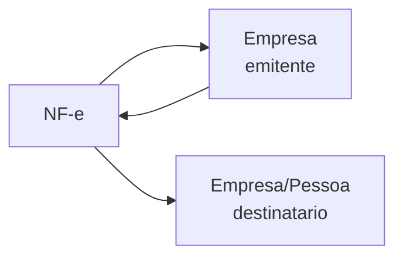

Uma **Nota Fiscal Eletrônica (NF-e)** representa um documento fiscal emitido eletronicamente, consultado através da chave de acesso de 44 dígitos junto à SEFAZ.

## Tipagem

```json
{
  "chave": "35210312345678000195550010000001231123456789",
  "numero": "123",
  "serie": "1",
  "data_emissao": "2023-03-15",
  "valor_total": 1500.00,
  "emitente": {
    "cnpj": "12345678000195",
    "razao_social": "EMPRESA LTDA",
    "uf": "SP"
  },
  "destinatario": {
    "cnpj": "98765432000110",
    "razao_social": "CLIENTE LTDA",
    "uf": "RJ"
  },
  "itens": [
    {
      "descricao": "PRODUTO X",
      "quantidade": 10,
      "valor_unitario": 150.00,
      "ncm": "84713012"
    }
  ],
  "situacao": "AUTORIZADA"
}
```

| Campo | Tipo | Descrição |
|-------|------|-----------|
| `chave` | string | Chave de acesso (44 dígitos) |
| `numero` | string | Número da NF-e |
| `serie` | string | Série |
| `data_emissao` | string | Data de emissão |
| `valor_total` | number | Valor total em R$ |
| `emitente` | object | CNPJ e razão social do emissor |
| `destinatario` | object | CNPJ/CPF e nome do destinatário |
| `itens` | array | Produtos/serviços da nota |
| `situacao` | string | `AUTORIZADA`, `CANCELADA`, `DENEGADA` |

## Conexões



- **Empresa emitente** — quem emitiu a nota (CNPJ)
- **Destinatário** — quem recebeu (CNPJ ou CPF)

## Endpoints

| Rota | Descrição |
|------|-----------|
| `GET /nfe/chave/{chave}` | Consultar NF-e por chave de acesso |
| `POST /nfe/lote` | Consultar múltiplas NF-e em lote |
