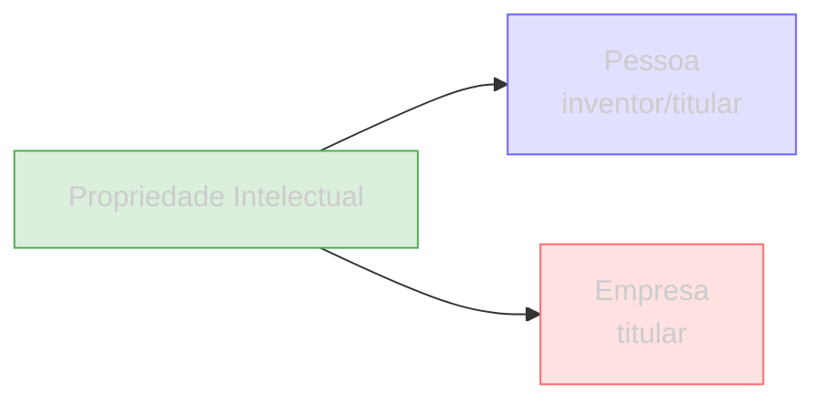

Uma **Propriedade Intelectual** representa um registro no INPI (Instituto Nacional da Propriedade Industrial). O campo `natureza` diferencia o tipo de registro.

## Tipagem

```json
{
  "numero_inpi": "BR102020012345",
  "titulo": "DISPOSITIVO PARA FILTRAGEM DE AGUA",
  "natureza": "PATENTE DE INVENCAO",
  "data_deposito": "2020-06-15",
  "data_publicacao": "2021-12-21"
}
```

| Campo | Tipo | Descricao |
|-------|------|-----------|
| `numero_inpi` | string | Numero do pedido no INPI |
| `titulo` | string | Titulo da invencao, marca ou desenho |
| `natureza` | string | Tipo do registro (ver tabela abaixo) |
| `data_deposito` | string | Data do deposito |
| `data_publicacao` | string | Data da publicacao |

## Tipos de registro

| Natureza | Descricao |
|----------|-----------|
| `PATENTE DE INVENCAO` | Invencao nova com aplicacao industrial |
| `MODELO DE UTILIDADE` | Melhoria funcional em objeto de uso pratico |
| `MARCA` | Sinal distintivo de produto ou servico |
| `DESENHO INDUSTRIAL` | Forma ornamental de um objeto |

## Conexoes



- **Pessoa** — como inventor ou titular
- **Empresa** — como titular (depositante)

## Endpoints

| Rota | Descricao |
|------|-----------|
| `GET /patentes/cpf/{cpf}` | Propriedade intelectual por CPF |
| `GET /patentes/cnpj/{cnpj}` | Propriedade intelectual por CNPJ |
