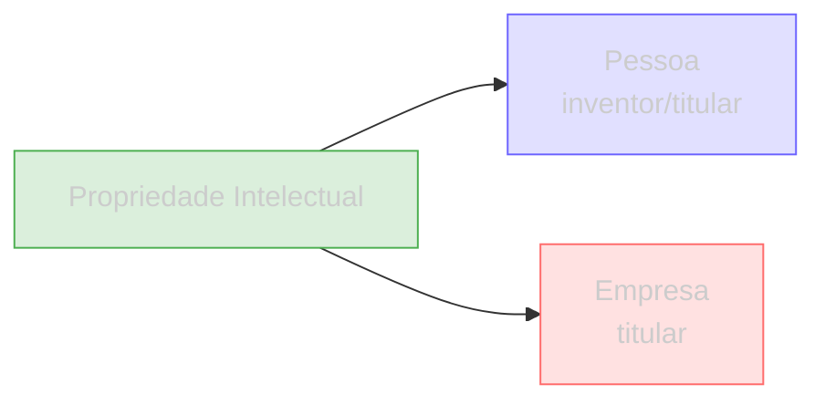

<Frame>
  
</Frame>

Uma **Patente** representa um registro de patente no INPI (Instituto Nacional da Propriedade Industrial) vinculado a um CPF ou CNPJ.

## Tipagem

```json
{
  "numero_inpi": "102015028792",
  "titulo": "EQUIPAMENTO VEICULAR COM INDICADORES DE INFORMACOES VISUAIS E SONORAS",
  "resumo": "Equipamento eletronico para veiculos automotivos...",
  "depositante": "FULANO DE TAL",
  "documento": "12345678901",
  "tipo_pessoa": "Pessoa Física",
  "pais": "BR",
  "estado": "PR",
  "data_inicio": "2015-11-17",
  "data_fim": null,
  "data_deposito": "2015-11-17",
  "data_publicacao": "2016-07-19",
  "classificacao_ipc": "F16H 61/00",
  "ultimo_despacho": { "codigo": "25.12", "data": "2025-12-23", "complemento": null },
  "inventores": [{ "nome": "Giovani Benedetti Penha", "documento": null }],
  "procuradores": ["P. A. PRODUTORES ASSOCIADOS MARCAS E PATENTES LTDA."]
}
```

| Campo | Tipo | Descrição |
|-------|------|-----------|
| `numero_inpi` | string | Número do processo no INPI |
| `titulo` | string \| null | Título da patente |
| `resumo` | string \| null | Resumo do conteúdo |
| `depositante` | string | Nome do titular/depositante |
| `documento` | string | CPF ou CNPJ do depositante |
| `tipo_pessoa` | string | `Pessoa Física` ou `Pessoa Jurídica` |
| `pais` | string | País do depositante (ex: `BR`) |
| `estado` | string \| null | UF do depositante |
| `data_inicio` | string \| null | Início da titularidade (YYYY-MM-DD) |
| `data_fim` | string \| null | Fim da titularidade (null se vigente) |
| `data_deposito` | string \| null | Data de depósito no INPI |
| `data_publicacao` | string \| null | Data de publicação na RPI |
| `classificacao_ipc` | string \| null | Classificação IPC (ex: `H04N 7/18`) |
| `ultimo_despacho` | object \| null | Último despacho: `codigo`, `data`, `complemento` |
| `inventores` | array | Inventores: `nome` e `documento` (CPF quando encontrado) |
| `procuradores` | array | Nomes dos procuradores/escritórios |

A resposta dos endpoints envolve a patente em um objeto `{ sucesso, documento, tipo, total, patentes }`. Em caso de erro o corpo é `{ sucesso: false, documento, tipo, total: 0, patentes: [], error }`.

## Conexões


```mermaid
graph LR
  PI[Propriedade Intelectual] --> P[Pessoa<br/>inventor/titular]
  PI --> E[Empresa<br/>titular]

  style PI fill:#4CAF5033,stroke:#4CAF50,color:#ccc
  style P fill:#6C63FF33,stroke:#6C63FF,color:#ccc
  style E fill:#FF6B6B33,stroke:#FF6B6B,color:#ccc
```

- **Pessoa** — como inventor ou titular
- **Empresa** — como titular (depositante)

## Endpoints

| Rota | Descrição |
|------|-----------|
| `GET /patentes/cpf/{cpf}` | Patentes por CPF |
| `GET /patentes/cnpj/{cnpj}` | Patentes por CNPJ |
