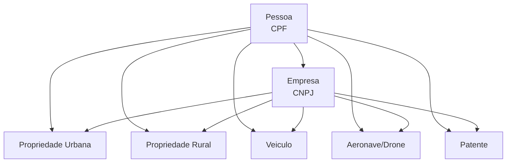

O modulo de **Patrimonio** agrega cinco tipos de entidades que representam bens registrados em nome de pessoas fisicas e juridicas.

## Entidades patrimoniais

<CardGroup cols={2}>
  <Card title="Propriedade Urbana" icon="house" href="/entidades/propriedade-urbana">
    Propriedade urbana com IPTU, area, valor venal e proprietario. Cobertura de 1.400+ municipios.
  </Card>
  <Card title="Propriedade Rural" icon="tractor" href="/entidades/propriedade-rural">
    Propriedade rural com dados fundiarios (INCRA), fiscais (Receita Federal) e ambientais (IBAMA).
  </Card>
  <Card title="Veiculo" icon="car" href="/entidades/veiculo">
    Veiculo automotor registrado no DENATRAN — carro, moto, caminhao, onibus.
  </Card>
  <Card title="Aeronave & Drone" icon="plane" href="/entidades/aeronave">
    Aeronave (aviao, helicoptero) ou drone registrado na ANAC.
  </Card>
  <Card title="Propriedade Intelectual" icon="lightbulb" href="/entidades/patente">
    Patente de invencao, modelo de utilidade ou marca registrada no INPI.
  </Card>
</CardGroup>

## Como acessar

Cada entidade pode ser consultada de duas formas:

1. **Via perfil completo** — `GET /pessoas/cpf/{cpf}` retorna todos os bens nos campos `imoveis`, `veiculos`, `aeronaves`, `patentes` e `rural`
2. **Via rota direta** — cada entidade tem sua propria rota para consultas isoladas:

| Entidade | Por CPF | Por CNPJ | Busca direta |
|----------|---------|----------|-------------|
| Propriedade Urbana | `/imoveis/cpf/{cpf}` | `/imoveis/cnpj/{cnpj}` | — |
| Propriedade Rural | `/rural/cpf/{cpf}` | `/rural/cnpj/{cnpj}` | `/rural/imovel/{codigo}` |
| Veiculo | `/veiculos/cpf/{cpf}` | `/veiculos/cnpj/{cnpj}` | `/veiculos/placa/{placa}` |
| Aeronave | `/aeronaves/cpf/{cpf}` | `/aeronaves/cnpj/{cnpj}` | — |
| Patente | `/patentes/cpf/{cpf}` | `/patentes/cnpj/{cnpj}` | — |

## Relacoes entre entidades

Todas as entidades patrimoniais se vinculam a **Pessoa** (CPF) ou **Empresa** (CNPJ) como proprietario, detentor ou titular.

## Estrategia de levantamento patrimonial

Para um levantamento completo:

<Steps>
  <Step title="Pessoa alvo">
    Consultar todos os bens por CPF: `GET /pessoas/cpf/{cpf}` (retorna tudo em uma chamada)
  </Step>
  <Step title="Parentes">
    Repetir para conjuge, pais e filhos — bens podem estar em nome de familiares
  </Step>
  <Step title="Empresas">
    Buscar sociedades (`/empresas/cpf/{cpf}`) e depois patrimonio de cada CNPJ
  </Step>
  <Step title="Socios cruzados">
    Verificar socios das empresas encontradas e repetir o levantamento para cada um
  </Step>
</Steps>

<Tip>
  O perfil completo (`GET /pessoas/cpf/{cpf}`) ja retorna imoveis, veiculos, aeronaves, patentes e rural em uma unica chamada — ideal para um levantamento rapido.
</Tip>
