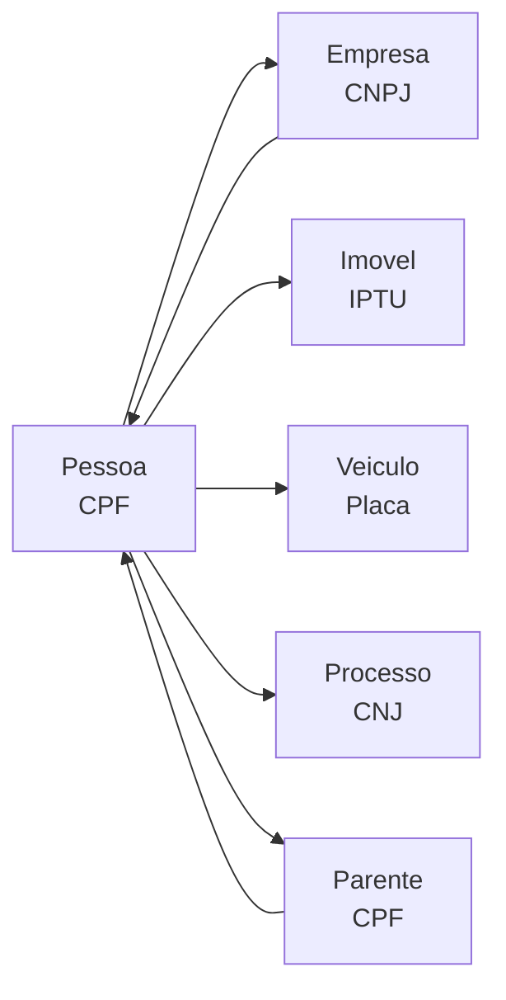

Uma **Pessoa** é a entidade central do Sherlocker. A partir de um CPF, você acessa identidade, localização, rede familiar, histórico profissional, patrimônio, situação financeira e presença digital.

## Pontos de entrada

| Dado disponível | Endpoint | Resultado |
|----------------|----------|-----------|
| CPF | `GET /pessoas/cpf/{cpf}` | Perfil completo |
| Telefone | `GET /pessoas/telefone/{telefone}` | CPFs associados |
| Email | `GET /perfis/email/{email}` | Perfis digitais |
| Email | `GET /empresas/email/{email}` | Empresas associadas |

<Tip>
  Se você tem apenas um telefone ou email, use a **busca reversa** para descobrir o CPF e então expandir a investigação.
</Tip>

## Dados disponíveis

### Identidade & Contatos

O endpoint principal `GET /pessoas/cpf/{cpf}` retorna em uma única chamada:

- **Dados pessoais**: nome completo, RG, data de nascimento, sexo, CNS
- **Óbito**: indica se a pessoa consta como falecida, com data e cartório
- **Endereços**: histórico completo de endereços associados ao CPF
- **Telefones**: fixos e móveis com DDD
- **Emails**: com score de confiabilidade (0-100)
- **Parentes**: pais, cônjuge, filhos e outros vínculos familiares (mãe extraída do registro de óbito quando ausente)
- **IRPF**: histórico de declarações com rendimento total e imposto devido

Também é possível consultar cada dimensão isoladamente para chamadas mais rápidas:

<CardGroup cols={2}>
  <Card title="Nome rápido" icon="id-card" href="/api-reference/pessoas/identificacao-rapida-por-cpf">
    Apenas nome, nascimento e sexo
  </Card>
  <Card title="Endereços" icon="location-dot" href="/api-reference/pessoas/historico-de-enderecos-de-uma-pessoa">
    Histórico de endereços
  </Card>
  <Card title="Telefones" icon="phone" href="/api-reference/pessoas/telefones-de-uma-pessoa">
    Telefones fixos e móveis
  </Card>
  <Card title="Emails" icon="envelope" href="/api-reference/pessoas/emails-de-uma-pessoa">
    Emails com score de confiabilidade
  </Card>
  <Card title="Parentes" icon="people-arrows" href="/api-reference/pessoas/rede-familiar-de-uma-pessoa">
    Rede familiar completa
  </Card>
</CardGroup>

### Vínculos empresariais

<CardGroup cols={2}>
  <Card title="Sociedades" icon="building" href="/api-reference/empresas/vinculos-societarios-de-uma-pessoa">
    Empresas onde a pessoa é sócia ou administradora
  </Card>
  <Card title="Empregos" icon="briefcase" href="/api-reference/empregos/historico-profissional-de-uma-pessoa">
    Histórico profissional via RAIS, CAGED e servidores públicos
  </Card>
</CardGroup>

### Patrimônio

<CardGroup cols={2}>
  <Card title="Imóveis urbanos" icon="house" href="/api-reference/imoveis/imoveis-urbanos-de-uma-pessoa">
    Imóveis em 1.400+ municípios
  </Card>
  <Card title="Perfil rural" icon="tractor" href="/api-reference/rural/perfil-rural-de-uma-pessoa">
    Imóveis rurais, CAFIR, IBAMA, transportes florestais
  </Card>
  <Card title="Veículos" icon="car" href="/api-reference/veiculos/veiculos-de-uma-pessoa">
    Veículos registrados no DENATRAN
  </Card>
  <Card title="Aeronaves" icon="plane" href="/api-reference/aeronaves/aeronaves-de-uma-pessoa">
    Aeronaves e drones registrados na ANAC
  </Card>
  <Card title="Propriedade Intelectual" icon="lightbulb" href="/api-reference/patentes/patentes-e-marcas-de-uma-pessoa">
    Propriedade intelectual no INPI
  </Card>
</CardGroup>

### Financeiro & Compliance

<CardGroup cols={2}>
  <Card title="Benefícios" icon="hand-holding-dollar" href="/api-reference/beneficios/beneficios-sociais-de-uma-pessoa">
    Auxílio Brasil, BPC, Bolsa Família, Auxílio Emergencial
  </Card>
  <Card title="Dívidas" icon="file-invoice-dollar" href="/api-reference/dividas/dividas-federais-de-uma-pessoa">
    Dívida Ativa da União, FGTS, Previdenciária
  </Card>
  <Card title="Regularidade" icon="shield-check" href="/api-reference/regularidade/restricoes-e-sancoes-de-uma-pessoa">
    IBAMA, sanções nacionais e internacionais, Banco Central
  </Card>
</CardGroup>

### Presença digital

<Card title="Perfis online" icon="globe" href="/api-reference/perfis/presenca-digital-por-email">
  GitHub, Gravatar, Duolingo, Medium, Nike, Apple, Google, Pinterest e mais
</Card>

### Processos judiciais

<Card title="Processos" icon="gavel" href="/api-reference/processos/processos-judiciais-de-uma-pessoa">
  Todos os tribunais disponíveis, com movimentações e participantes
</Card>

## Relações com outras entidades

Uma pessoa se conecta a:
- **Empresas** — como sócia, administradora ou funcionária
- **Imóveis** — como proprietária (urbano e rural)
- **Veículos e aeronaves** — como proprietária ou operadora
- **Processos** — como parte (autor, réu, interessado)
- **Outras pessoas** — via vínculos familiares (parentes)

## Fluxo investigativo típico

1. **Identificar** — `GET /pessoas/cpf/{cpf}` para perfil completo
2. **Expandir família** — verificar parentes e seus patrimônios
3. **Mapear empresas** — sociedades e empregos
4. **Levantar patrimônio** — imóveis, veículos, aeronaves, rural
5. **Verificar jurídico** — processos e regularidade
6. **Presença digital** — perfis online via email
