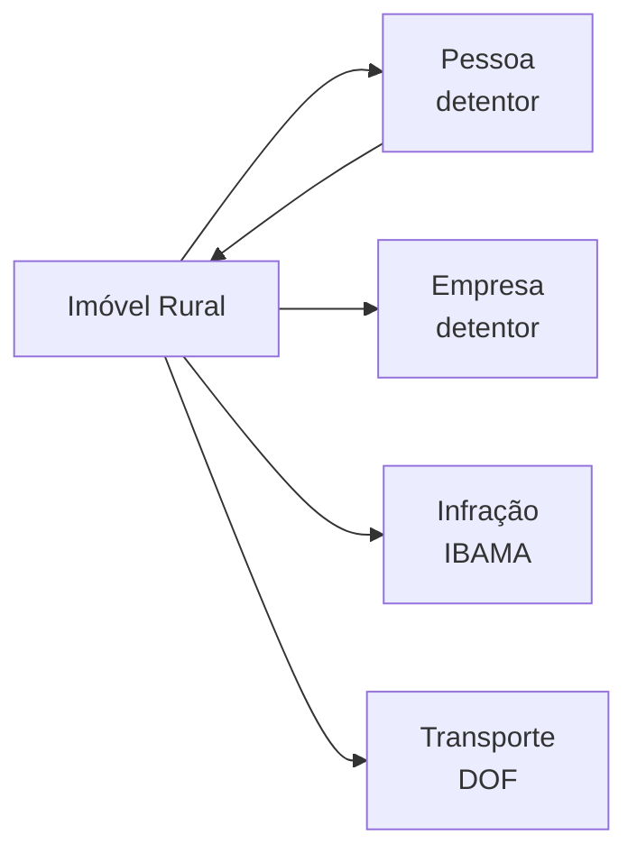

Uma **Propriedade Rural** representa uma propriedade rural registrada nos cadastros federais. Os dados são agregados de múltiplas fontes (INCRA, Receita Federal, IBAMA) em uma única entidade.

## Tipagem

```json
{
  "codigo_imovel": "9301234",
  "nome_imovel": "FAZENDA SAO JOSE",
  "municipio": "UBERABA",
  "uf": "MG",
  "area_total": 150.5,
  "modulos_fiscais": 4.2,
  "nome_detentor": "JOAO DA SILVA",
  "cpf_cnpj": "12345678901",
  "fracao": 100.0,
  "condicao_detentor": "PROPRIETARIO",
  "nirf": "1234567",
  "situacao_fiscal": "ATIVO"
}
```

| Campo | Tipo | Descrição |
|-------|------|-----------|
| `codigo_imovel` | string | Código no SNCR (INCRA) |
| `nome_imovel` | string | Nome da propriedade |
| `municipio` / `uf` | string | Localização |
| `area_total` | number | Área em hectares |
| `modulos_fiscais` | number | Tamanho em módulos fiscais do município |
| `nome_detentor` | string | Nome do proprietário/detentor |
| `cpf_cnpj` | string | Documento do detentor |
| `fracao` | number | Percentual de participação (%) |
| `condicao_detentor` | string | `PROPRIETARIO`, `ARRENDATARIO`, `POSSEIRO`, etc. |
| `nirf` | string | Número na Receita Federal (CAFIR) |
| `situacao_fiscal` | string | Status fiscal (`ATIVO`, `CANCELADO`) |

## Dados ambientais vinculados

Imóveis rurais podem ter vinculados:

- **Infrações ambientais** — multas, embargos e apreensões do IBAMA
- **Autorizações florestais** — licenças de exploração (AUTEX)
- **Transportes florestais** — guias de transporte de madeira/carvão (DOF)

## Conexões



- **Pessoa** — como detentor (CPF)
- **Empresa** — como detentor (CNPJ)
- **Infrações** — multas e embargos ambientais vinculados ao imóvel ou detentor
- **Transportes** — operações de transporte florestal vinculadas ao detentor

## Endpoints

| Rota | Descrição |
|------|-----------|
| `GET /rural/cpf/{cpf}` | Perfil rural completo (todos os imóveis + infrações + transportes) |
| `GET /rural/cnpj/{cnpj}` | Perfil rural da empresa |
| `GET /rural/imovel/{codigo}` | Imóvel por código SNCR |
| `GET /rural/municipio/{codIbge}` | Imóveis de um município |
| `GET /rural/cafir/{nirf}` | Imóvel por NIRF |
| `GET /rural/fiscalizacao/{cpf}` | Infrações ambientais |
| `GET /rural/transportes/{cpf}` | Transportes florestais |
