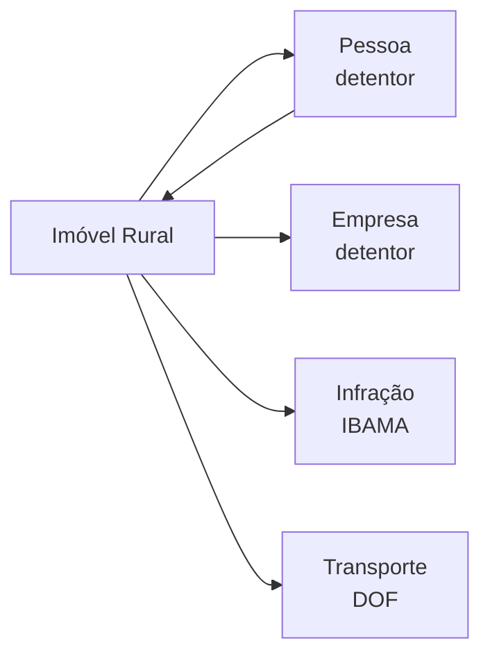

Uma **Propriedade Rural** representa uma propriedade rural registrada nos cadastros federais. O perfil rural retorna os imóveis em **dois arrays separados**: `propriedades_sncr` (INCRA) e `propriedades_cafir` (Receita Federal). Cada fonte tem seu próprio conjunto de campos.

## SNCR (INCRA) — `propriedades_sncr[]`

```json
{
  "codigo_imovel": "9301234",
  "nome_imovel": "FAZENDA SAO JOSE",
  "municipio": "UBERABA",
  "uf": "MG",
  "area_total": 150.5,
  "modulos_fiscais": 4.2,
  "cod_ibge": "3170206",
  "nome_detentor": "JOAO DA SILVA",
  "cpf_cnpj_mask": "123.***.***-01",
  "documento": "12345678901",
  "tipo": "PF",
  "tipo_detentor": "PROPRIETARIO",
  "fracao": 100.0,
  "condicao_detentor": "PROPRIETARIO",
  "pais": "BRASIL"
}
```

| Campo | Tipo | Descrição |
|-------|------|-----------|
| `codigo_imovel` | string | Código no SNCR (INCRA) |
| `nome_imovel` | string | Nome da propriedade |
| `municipio` / `uf` | string | Localização |
| `area_total` | number | Área em hectares |
| `modulos_fiscais` | number | Tamanho em módulos fiscais do município |
| `cod_ibge` | string | Código IBGE do município |
| `nome_detentor` | string | Nome do proprietário/detentor |
| `cpf_cnpj_mask` | string | Documento mascarado do detentor |
| `documento` | string | CPF/CNPJ do detentor (somente dígitos) |
| `tipo` | string | `PF` ou `PJ` |
| `tipo_detentor` | string | Tipo de detentor |
| `fracao` | number | Percentual de participação (%) |
| `condicao_detentor` | string | `PROPRIETARIO`, `ARRENDATARIO`, `POSSEIRO`, etc. |
| `pais` | string | País do detentor |

## CAFIR (Receita Federal) — `propriedades_cafir[]`

```json
{
  "nirf": "1234567",
  "area_total": 150.5,
  "codigo_incra": "9301234",
  "nome_imovel": "FAZENDA SAO JOSE",
  "situacao": "ATIVO",
  "logradouro": "ESTRADA RURAL KM 5",
  "distrito": "DISTRITO RURAL",
  "uf": "MG",
  "municipio": "UBERABA",
  "cep": "38000000",
  "data_atualizacao": "2023-01-15",
  "imune_isento": "Não",
  "codigo_sncr": "9301234"
}
```

| Campo | Tipo | Descrição |
|-------|------|-----------|
| `nirf` | string | Número do Imóvel na Receita Federal |
| `area_total` | number | Área em hectares |
| `codigo_incra` | string | Código INCRA |
| `nome_imovel` | string | Nome da propriedade |
| `situacao` | string | Status (`ATIVO`, `CANCELADO`, etc.) |
| `logradouro` / `distrito` | string | Endereço |
| `municipio` / `uf` | string | Localização |
| `cep` | string | CEP |
| `data_atualizacao` | string | Data da última atualização |
| `imune_isento` | string | Se é imune ou isento de ITR |
| `codigo_sncr` | string | Vínculo com o SNCR |

## Dados ambientais vinculados

Imóveis rurais podem ter vinculados:

- **Infrações ambientais** — multas, embargos e apreensões do IBAMA
- **Autorizações florestais** — licenças de exploração (AUTEX)
- **Transportes florestais** — guias de transporte de madeira/carvão (DOF)

## Conexões


```mermaid
graph LR
  IR[Imóvel Rural] --> P[Pessoa<br/>detentor]
  IR --> E[Empresa<br/>detentor]
  IR --> F[Infração<br/>IBAMA]
  IR --> T[Transporte<br/>DOF]
  P --> IR
```

- **Pessoa** — como detentor (CPF)
- **Empresa** — como detentor (CNPJ)
- **Infrações** — multas e embargos ambientais vinculados ao imóvel ou detentor
- **Transportes** — operações de transporte florestal vinculadas ao detentor

## Endpoints

| Rota | Descrição |
|------|-----------|
| `GET /rural/cpf/{cpf}` | Perfil rural completo (imóveis SNCR + CAFIR, infrações, autorizações, transportes, produtor orgânico) |
| `GET /rural/cnpj/{cnpj}` | Perfil rural da empresa (mesma estrutura) |
| `GET /rural/jobs/{jobId}` | Status de um job assíncrono |
