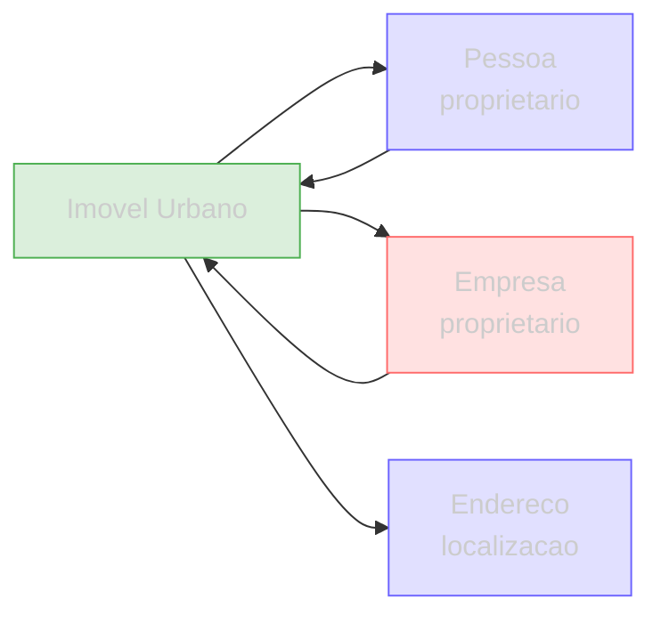

Uma **Propriedade Urbana** representa uma propriedade registrada em cadastro municipal. Os dados podem vir de diferentes fontes tributarias — o campo `fonte` indica a origem e o campo `uf` o estado.

## Tipagem

```json
{
  "id": "a1b2c3d4e5f6",
  "fonte": "iptu",
  "sql_iptu": "0123456789",
  "inscricao": "0123456789",
  "localizacao": {
    "logradouro": "R HENRIQUE PASSINI",
    "numero": "748",
    "complemento": "401",
    "bairro": "SERRA",
    "cidade": "BELO HORIZONTE",
    "uf": "MG",
    "cep": "30220-380"
  },
  "area_terreno": 360.00,
  "area_construida": 180.00,
  "ano_construcao": 1995,
  "tipo_uso": "RESIDENCIAL",
  "valor_venal": 450000.00,
  "valor_iptu": 2400.00,
  "proprietario": {
    "nome": "MARIA SILVA",
    "documento": "12345678901",
    "tipoDocumento": "CPF"
  }
}
```

| Campo | Tipo | Descricao |
|-------|------|-----------|
| `id` | string | Identificador unico interno |
| `fonte` | string | Tipo de fonte tributaria (ver tabela abaixo) |
| `sql_iptu` | string | Inscricao municipal / SQL IPTU |
| `localizacao` | object | Endereco completo do imovel |
| `localizacao.uf` | string | Estado — combinar com `fonte` para saber a origem (ex: fonte `iptu` + uf `SP` = IPTU de Sao Paulo) |
| `area_terreno` | number | Area do terreno em m² |
| `area_construida` | number | Area construida em m² |
| `ano_construcao` | number | Ano de construcao |
| `tipo_uso` | string | `RESIDENCIAL`, `COMERCIAL`, `INDUSTRIAL`, `TERRITORIAL` |
| `valor_venal` | number | Valor venal em R$ (base para calculo do IPTU) |
| `valor_iptu` | number | Valor do IPTU anual em R$ |
| `proprietario` | object | Nome, documento (CPF/CNPJ) do proprietario |

## Fontes de dados

O campo `fonte` indica de qual tributo/cadastro os dados foram extraidos:

| Fonte | Descricao | Dados tipicos |
|-------|-----------|---------------|
| `iptu` | Imposto Predial e Territorial Urbano | Area, valor venal, tipo de uso, proprietario |
| `itbi` | Imposto de Transmissao de Bens Imoveis | Valor de transacao, comprador, vendedor |

Para saber a **origem especifica**, combine `fonte` + `localizacao.uf`:

| Exemplo | Significa |
|---------|-----------|
| `fonte: "iptu"` + `uf: "SP"` | IPTU de Sao Paulo |
| `fonte: "iptu"` + `uf: "MG"` | IPTU de Minas Gerais |
| `fonte: "itbi"` + `uf: "RJ"` | ITBI do Rio de Janeiro |

## Cobertura

Dados de **1.400+ municipios** brasileiros via integracao com portais municipais.

## Conexoes



- **Pessoa** — como proprietario (CPF)
- **Empresa** — como proprietario (CNPJ)
- **Endereco** — localizacao do imovel pode ser cruzada com enderecos de moradia

## Endpoints

| Rota | Descricao |
|------|-----------|
| `GET /imoveis/cpf/{cpf}` | Imoveis por proprietario (CPF) |
| `GET /imoveis/cnpj/{cnpj}` | Imoveis por proprietario (CNPJ) |
| `GET /imoveis/cpf/{cpf}?uf=SP` | Filtrado por estado |
