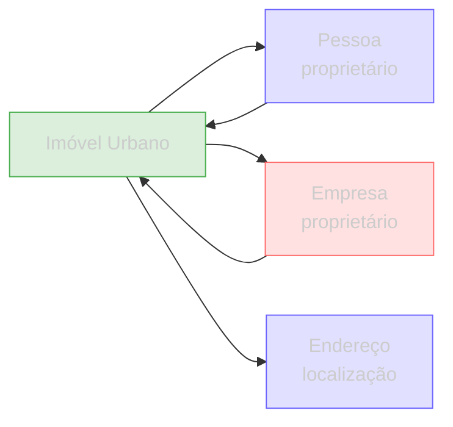

Uma **Propriedade Urbana** representa uma propriedade registrada em cadastro municipal de IPTU. O campo `fonte` indica a plataforma/origem do dado e o campo `localizacao.uf` o estado.

## Tipagem

```json
{
  "id": "a1b2c3d4e5f6",
  "fonte": "betha",
  "sql_iptu": "0123456789",
  "inscricao": "0123456789",
  "localizacao": {
    "logradouro": "R HENRIQUE PASSINI",
    "numero": "748",
    "complemento": "401",
    "bairro": "SERRA",
    "cidade": "BELO HORIZONTE",
    "uf": "MG",
    "cep": "30220-380"
  },
  "area_terreno": 360.00,
  "area_construida": 180.00,
  "ano_construcao": 1995,
  "tipo_uso": "RESIDENCIAL",
  "valor_venal": 450000.00,
  "valor_iptu": 2400.00,
  "proprietario": {
    "nome": "MARIA SILVA",
    "documento": "12345678901",
    "tipoDocumento": "CPF"
  }
}
```

| Campo | Tipo | Descrição |
|-------|------|-----------|
| `id` | string | Identificador único interno |
| `fonte` | string | Plataforma/origem do dado IPTU municipal (ver abaixo) |
| `sql_iptu` | string | Inscrição municipal / SQL IPTU |
| `inscricao` | string | Inscrição municipal |
| `localizacao` | object | Endereço completo do imóvel (inclui `complemento`) |
| `localizacao.uf` | string | Estado do imóvel |
| `area_terreno` | number | Área do terreno em m² |
| `area_construida` | number | Área construída em m² |
| `ano_construcao` | number | Ano de construção |
| `tipo_uso` | string | `RESIDENCIAL`, `COMERCIAL`, `INDUSTRIAL`, `TERRITORIAL` |
| `valor_venal` | number | Valor venal em R$ (base para cálculo do IPTU) |
| `valor_iptu` | number | Valor do IPTU anual em R$ |
| `proprietario` | object | Proprietário: `nome`, `documento` (CPF/CNPJ formatado ou `null`), `tipoDocumento` |

## Fontes de dados

O campo `fonte` identifica a plataforma/sistema do portal de IPTU municipal de onde o registro foi extraído — por exemplo `betha`, `elotech`, `sia`. A estrutura do registro é **idêntica** independentemente da `fonte`.

## Cobertura

Dados de **1.400+ municípios** brasileiros via integração com portais municipais.

## Conexões


```mermaid
graph LR
  IU[Imóvel Urbano] --> P[Pessoa<br/>proprietário]
  IU --> E[Empresa<br/>proprietário]
  IU --> EN[Endereço<br/>localização]
  P --> IU
  E --> IU

  style IU fill:#4CAF5033,stroke:#4CAF50,color:#ccc
  style P fill:#6C63FF33,stroke:#6C63FF,color:#ccc
  style E fill:#FF6B6B33,stroke:#FF6B6B,color:#ccc
  style EN fill:#6C63FF33,stroke:#6C63FF,color:#ccc
```

- **Pessoa** — como proprietário (CPF)
- **Empresa** — como proprietário (CNPJ)
- **Endereço** — localização do imóvel pode ser cruzada com endereços de moradia

## Endpoints

| Rota | Descrição |
|------|-----------|
| `GET /imoveis/cpf/{cpf}` | Imóveis por proprietário (CPF) |
| `GET /imoveis/cnpj/{cnpj}` | Imóveis por proprietário (CNPJ) |
