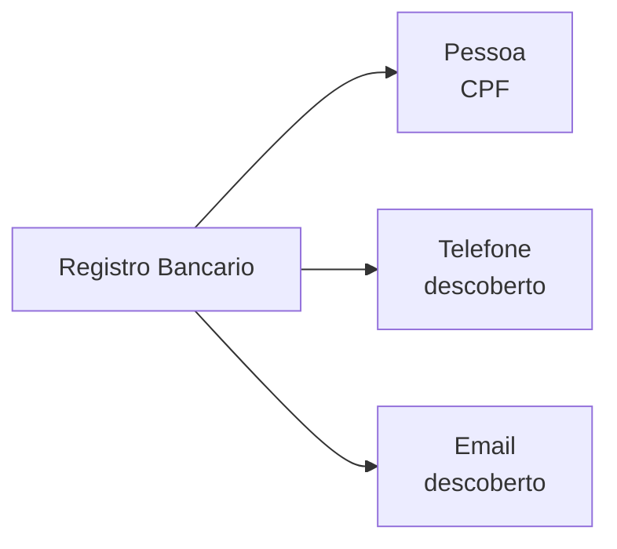

Um **Registro Bancario** representa a existencia de uma conta em uma instituicao financeira vinculada a um CPF.

## Tipagem

```json
{
  "banco": "Banco do Brasil",
  "tipo": "bancario",
  "existe": true,
  "email": "mar***@gmail.com",
  "telefones": ["5511987654321"],
  "metadata": {
    "tipo_conta": "corrente"
  }
}
```

| Campo | Tipo | Descricao |
|-------|------|-----------|
| `banco` | string | Nome da instituicao financeira |
| `tipo` | string | Sempre `bancario` |
| `existe` | boolean | Se a conta foi encontrada |
| `email` | string | Email vinculado a conta (mascarado) |
| `telefones` | array | Telefones vinculados a conta |
| `metadata` | object | Dados adicionais (tipo de conta, etc.) |

## Bancos verificados

Banco do Brasil, Caixa Economica Federal, Caixa Tem, Bradesco.

## Conexoes



- **Pessoa** — contas verificadas por CPF
- **Telefone / Email** — bancos revelam contatos vinculados a conta

## Endpoint

| Rota | Descricao |
|------|-----------|
| `GET /bancos/cpf/{cpf}` | Verificar contas bancarias por CPF |
