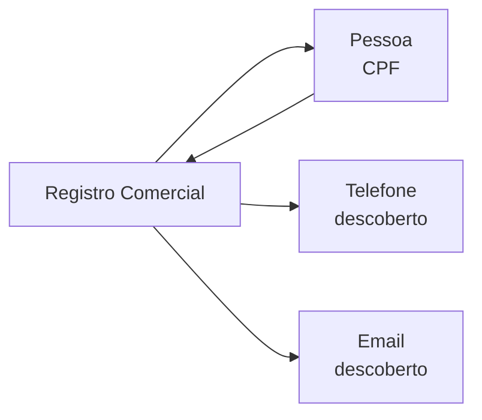

Um **Registro Comercial** representa a existência de cadastro ou atividade de consumo vinculada a um CPF — inclui contas em lojas, farmácias, programas de fidelidade e histórico de encomendas.

## Tipagem — Cadastro

```json
{
  "plataforma": "drogasil",
  "existe": true,
  "telefone": "5511987654321",
  "email": "mar***@gmail.com",
  "metadata": {
    "programa_fidelidade": true
  }
}
```

| Campo | Tipo | Descrição |
|-------|------|-----------|
| `plataforma` | string | Nome da loja ou serviço |
| `existe` | boolean | Se o cadastro foi encontrado |
| `telefone` | string | Telefone vinculado (pode ser mascarado) |
| `email` | string | Email vinculado (pode ser mascarado) |
| `metadata` | object | Dados adicionais (fidelidade, preferências, etc.) |

## Plataformas verificadas

Drogasil, Drogaraia, Carrefour, Atacadão, Petz, Fastshop, Livelo.

## Identificador de busca

O **CPF** é o identificador — verificamos cadastros e encomendas vinculadas ao documento.

## Conexões



- **Pessoa** — cadastros verificados por CPF
- **Telefone / Email** — registros comerciais frequentemente revelam contatos não encontrados em outras fontes

## Valor investigativo

- **Descobrir contatos ocultos** — farmácias e lojas guardam telefones e emails de cadastro
- **Confirmar atividade** — encomendas recentes confirmam endereço e atividade da pessoa
- **Mapear hábitos** — tipo de loja indica perfil de consumo

## Endpoints

| Rota | Descrição |
|------|-----------|
| `GET /cadastros/cpf/{cpf}` | Cadastros em 7 lojas e farmácias |
| `GET /encomendas/cpf/{cpf}` | Histórico de encomendas |
