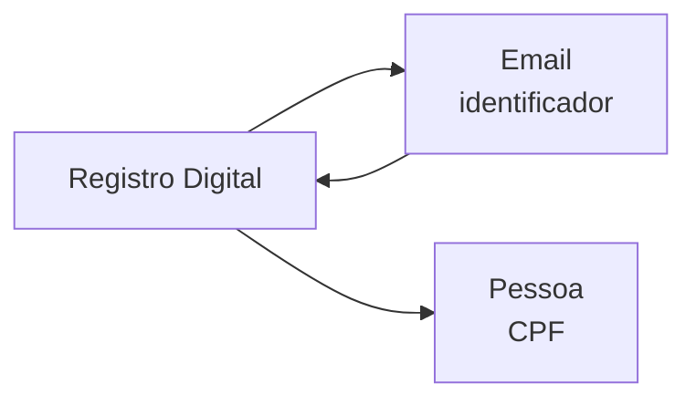

Um **Registro Digital** representa a existencia de uma conta vinculada a um email em plataformas online, redes sociais e servicos digitais.

## Tipagem

```json
{
  "plataforma": "github",
  "existe": true,
  "username": "mariasilva",
  "nome": "Maria Silva",
  "foto": "https://avatars.githubusercontent.com/u/12345",
  "email_recuperacao": "mar***@gmail.com",
  "telefone": "55119****4321",
  "metadata": {
    "repos": 15,
    "followers": 42
  }
}
```

| Campo | Tipo | Descricao |
|-------|------|-----------|
| `plataforma` | string | Nome da plataforma |
| `existe` | boolean | Se a conta foi encontrada |
| `username` | string | Nome de usuario |
| `nome` | string | Nome de exibicao |
| `foto` | string | URL da foto de perfil |
| `email_recuperacao` | string | Email vinculado (mascarado) |
| `telefone` | string | Telefone vinculado (mascarado) |
| `metadata` | object | Dados especificos da plataforma |

## Plataformas verificadas

GitHub, Gravatar, Duolingo, Medium, Nike, Apple, Google, Pinterest, Vivino, Trello, Protonmail, Runkeeper, USP.

## Identificador de busca

O **email** e o identificador — a partir dele verificamos a existencia de conta em cada plataforma.

## Conexoes



- **Email** — identificador usado para busca
- **Pessoa** — o email conecta ao CPF via entidade Email

## Endpoint

| Rota | Descricao |
|------|-----------|
| `GET /perfis/email/{email}` | Registros digitais em 13 plataformas |
