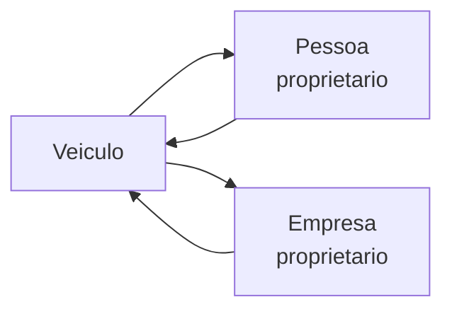

Um **Veiculo** representa um veiculo automotor (carro, moto, caminhao, onibus) registrado no sistema nacional de transito.

## Tipagem

```json
{
  "placa": "ABC1D23",
  "marca": "VW/VOLKSWAGEN",
  "modelo": "GOL 1.0",
  "ano_modelo": "2020",
  "ano_fabricacao": "2019",
  "cor": "PRATA",
  "municipio": "SAO PAULO",
  "uf": "SP",
  "tipo_veiculo": "AUTOMOVEL",
  "situacao_veiculo": "CIRCULACAO"
}
```

| Campo | Tipo | Descricao |
|-------|------|-----------|
| `placa` | string | Placa (Mercosul ou antiga) |
| `marca` | string | Fabricante |
| `modelo` | string | Modelo do veiculo |
| `ano_modelo` | string | Ano do modelo |
| `ano_fabricacao` | string | Ano de fabricacao |
| `cor` | string | Cor predominante |
| `municipio` / `uf` | string | Local de registro |
| `tipo_veiculo` | string | `AUTOMOVEL`, `MOTOCICLETA`, `CAMINHAO`, `ONIBUS`, etc. |
| `situacao_veiculo` | string | `CIRCULACAO`, `BAIXADO`, `FURTADO`, etc. |

### Campos adicionais (busca por placa)

| Campo | Descricao |
|-------|-----------|
| `renavam` | Codigo RENAVAM |
| `chassi` | Numero do chassi |
| `combustivel` | Gasolina, Flex, Diesel, Eletrico |
| `restricao_1..4` | Restricoes ativas (roubo, alienacao, judicial) |

## Conexoes



- **Pessoa** — como proprietario (CPF)
- **Empresa** — como proprietario/frota (CNPJ)

## Endpoints

| Rota | Descricao |
|------|-----------|
| `GET /veiculos/cpf/{cpf}` | Veiculos por proprietario |
| `GET /veiculos/cnpj/{cnpj}` | Frota da empresa |
| `GET /veiculos/placa/{placa}` | Identificar veiculo por placa |
