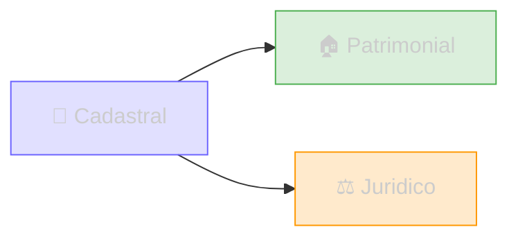
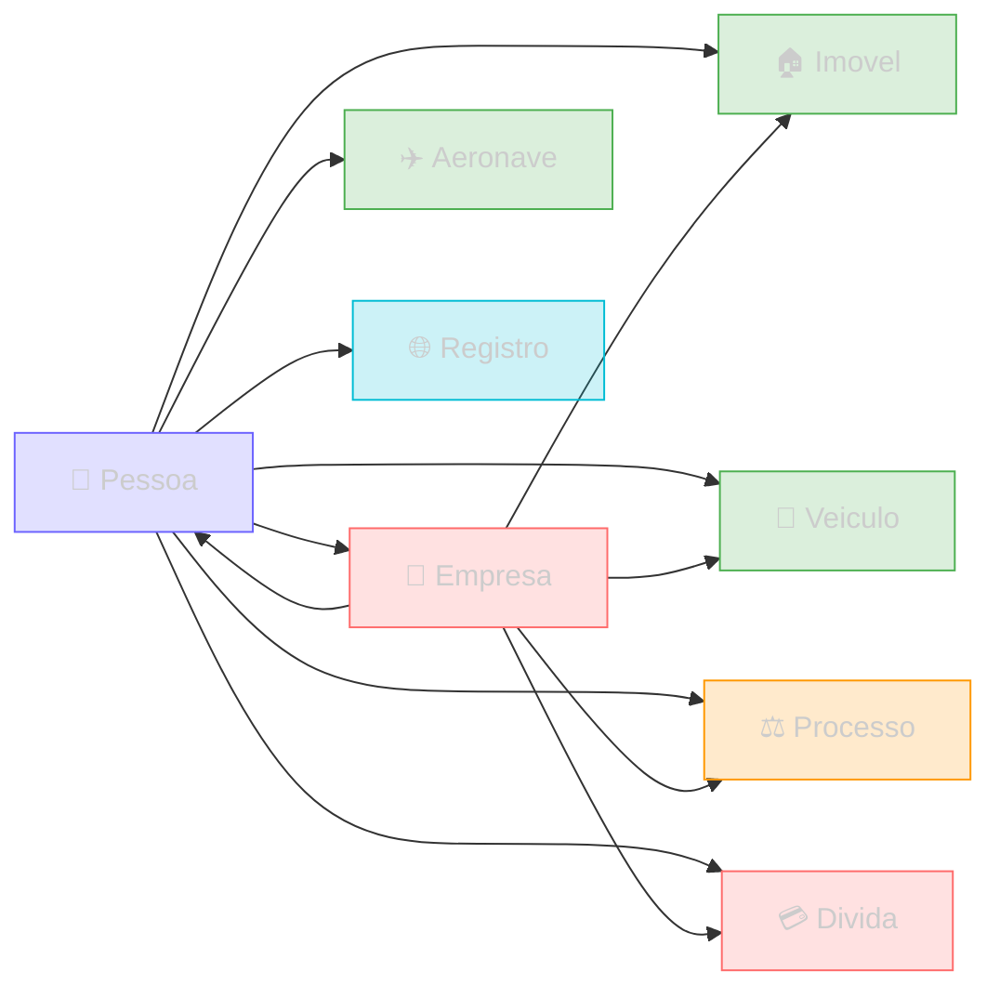

Plataforma de inteligencia investigativa que conecta dados de pessoas, empresas, patrimonio, processos judiciais e dezenas de outras fontes em uma API unificada.

## Tipos de entidade

Os dados do Sherlocker sao organizados em **3 categorias**. Cada categoria agrupa entidades do mesmo dominio:



| Categoria | Entidades | Identificadores |
|-----------|-----------|----------------|
| **Cadastral** | Pessoa, Empresa, Telefone, Email, Endereco, Divida, Beneficio Social, Nota Fiscal | CPF, CNPJ, Chave NF-e |
| **Patrimonial** | Propriedade Urbana, Propriedade Rural, Veiculo, Aeronave, Patente | CPF, CNPJ, Placa, NIRF |
| **Juridico** | Processo | CPF, CNPJ, Numero CNJ |

## Entidades

Cada entidade representa um tipo de registro com sua propria estrutura. Clique para ver a tipagem completa:

### Cadastrais

<CardGroup cols={3}>
  <Card title="Pessoa" icon="user" href="/entidades/pessoa">
    Identidade, contatos, familia
  </Card>
  <Card title="Empresa" icon="building" href="/entidades/empresa">
    Cadastro, socios, funcionarios
  </Card>
  <Card title="Telefone" icon="phone" href="/entidades/telefone">
    DDD, operadora, estado
  </Card>
  <Card title="Email" icon="envelope" href="/entidades/email">
    Dominio, corporativo
  </Card>
  <Card title="Endereco" icon="location-dot" href="/entidades/endereco">
    Logradouro, cidade, CEP
  </Card>
  <Card title="Divida" icon="file-invoice-dollar" href="/entidades/divida">
    Divida Ativa, FGTS
  </Card>
  <Card title="Beneficio" icon="hand-holding-dollar" href="/entidades/beneficio">
    Auxilio Brasil, BPC
  </Card>
  <Card title="Nota Fiscal" icon="file-invoice" href="/entidades/nfe">
    NF-e por chave de acesso
  </Card>
</CardGroup>

### Patrimoniais

<CardGroup cols={3}>
  <Card title="Propriedade Urbana" icon="house" href="/entidades/propriedade-urbana">
    IPTU, area, valor venal
  </Card>
  <Card title="Propriedade Rural" icon="tractor" href="/entidades/propriedade-rural">
    SNCR, CAFIR, IBAMA
  </Card>
  <Card title="Veiculo" icon="car" href="/entidades/veiculo">
    Placa, marca, modelo
  </Card>
  <Card title="Aeronave" icon="plane" href="/entidades/aeronave">
    Avioes e drones
  </Card>
  <Card title="Propriedade Intelectual" icon="lightbulb" href="/entidades/patente">
    Propriedade intelectual
  </Card>
</CardGroup>

### Juridicas

<CardGroup cols={2}>
  <Card title="Processo" icon="gavel" href="/entidades/processo">
    Numero CNJ, tribunal, partes
  </Card>
  <Card title="Documento Publico" icon="file-lines" href="/entidades/documento">
    Diario Oficial, publicacoes
  </Card>
</CardGroup>


## Perfis agregados

Os **perfis** sao endpoints que combinam multiplas entidades de uma categoria em uma unica chamada. Em vez de consultar veiculos, imoveis e patentes separadamente, use o perfil patrimonial para obter tudo de uma vez:

<CardGroup cols={2}>
  <Card title="Perfil Cadastral" icon="users" href="/areas/contatos">
    `GET /perfil/cadastral/cpf/{cpf}` — identidade + contatos + vinculos + dividas + beneficios + dominios
  </Card>
  <Card title="Perfil Patrimonial" icon="landmark" href="/areas/patrimonio">
    `GET /perfil/patrimonial/cpf/{cpf}` — todos os bens
  </Card>
  <Card title="Perfil Juridico" icon="scale-balanced" href="/areas/juridico">
    `GET /perfil/juridico/cpf/{cpf}` — processos + regularidade
  </Card>
</CardGroup>

Todos os perfis tambem aceitam CNPJ para consultas de empresas.

## Como as entidades se conectam

A **Pessoa** (CPF) e a **Empresa** (CNPJ) sao as entidades centrais — todas as outras se vinculam a elas:



### Buscas reversas

| Dado inicial | Resultado | Rota |
|---|---|---|
| Telefone | CPFs associados | `GET /pessoas/telefone/{telefone}` |
| Email | CPFs associados | `GET /emails/email/{email}` |
| Placa | Proprietario | `GET /veiculos/placa/{placa}` |
| CPF do socio | Empresas | `GET /empresas/cpf/{cpf}` |

## Casos de uso

<CardGroup cols={2}>
  <Card title="Background Check" icon="shield-check" href="/casos-de-uso/background-check">
    Verificacao de antecedentes cruzando 7 dimensoes
  </Card>
  <Card title="Enriquecimento de Leads" icon="bullseye-arrow" href="/casos-de-uso/enriquecimento-leads">
    Telefone ou email para perfil completo
  </Card>
  <Card title="Due Diligence" icon="building-magnifying-glass" href="/casos-de-uso/due-diligence">
    Investigacao completa antes de fechar negocio
  </Card>
  <Card title="Levantamento Patrimonial" icon="landmark" href="/casos-de-uso/levantamento-patrimonial">
    Localizar bens para penhora e execucao judicial
  </Card>
  <Card title="Localizacao de Partes" icon="magnifying-glass-location" href="/casos-de-uso/localizacao-partes">
    Encontrar endereco e telefone para citacao judicial
  </Card>
  <Card title="Scoring de Renda" icon="chart-pyramid" href="/casos-de-uso/segmentacao-patrimonial">
    Classificar contatos por faixa de renda
  </Card>
</CardGroup>

## Comecando

### Base URL

```
https://221b-api.sherlocker.com.br/api/v1
```

Consulte [Autenticacao](/authentication) para configurar seu token.

### Importar no Postman

<Steps>
  <Step title="Importar no Postman">
    Abra o Postman, clique **Import**, cole a URL abaixo:
    ```
    https://221b-api.sherlocker.com.br/api/v1/postman/collection.json
    ```
    Ou veja o guia completo em [Testando com Postman](/guias/postman).
  </Step>
  <Step title="Configurar token">
    Collection Sherlocker API, aba Variables, preencha `token`
  </Step>
</Steps>

A collection esta organizada em 4 pastas: Perfis Agregados, Cadastro, Patrimonio e Juridico.
