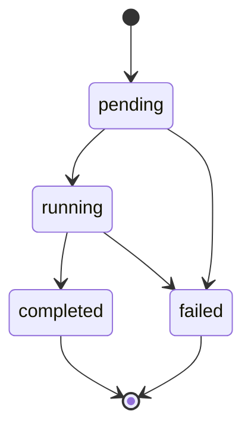

Toda análise criada via `POST /v1/analyses` é processada de forma assíncrona. Esta página explica a máquina de estados de uma análise, o que cada `verdict` significa, como interpretar `blocks` e `coverage`, e como consultar o resultado com polling.

<Note>
  Durante o beta, substitua `<API_HOST>` pelo host fornecido pelo time Sherlocker. O host definitivo será publicado na promoção a produção.
</Note>

## Máquina de estados

Uma análise passa por estes estados, no campo `status`:



Trate `failed` como possível a partir de qualquer estado não-terminal: uma análise que expira ainda em `pending` (sem chegar a `running`) também termina em `failed`.

| Status | Terminal? | Significado |
|--------|-----------|-------------|
| `pending` | Não | Análise aceita (202) e aguardando processamento |
| `running` | Não | Motor executando os blocos da engine |
| `completed` | Sim | Motor terminou; `verdict`, `blocks` e `coverage` disponíveis |
| `failed` | Sim | O motor não conseguiu concluir a análise; `verdict`, `blocks` e `coverage` permanecem `null` e os tokens são reembolsados |

Quando uma análise termina em `failed`, os tokens debitados na criação são reembolsados automaticamente. Veja [Cobrança](/motor-analise/cobranca).

Respostas de análises terminais (`completed`/`failed`) são estáveis — o resultado não muda depois de pronto.

## Verdicts

O `verdict` resume o resultado da análise. Ele só existe quando a análise termina em `completed`; em `pending`, `running` e `failed` ele é `null`.

| Verdict | Significado |
|---------|-------------|
| `aprovado` | Nenhum bloco resultou em alerta ou bloqueio |
| `alerta` | Pelo menos um bloco resultou em `alert` |
| `reprovado` | Pelo menos um bloco resultou em `blocked` |
| `incompleto` | O motor terminou, mas pelo menos um bloco ficou `unavailable` porque a fonte de dados falhou |

<Warning>
  `incompleto` não é uma reprovação. Significa que parte das fontes de dados não respondeu e o motor não teve como avaliar todos os blocos. Confira o campo `coverage` para ver qual fonte ficou indisponível antes de decidir o que fazer com a análise.
</Warning>

## Status de bloco

Cada item de `blocks[]` traz o resultado de uma verificação individual (ex.: `SITUACAO_CADASTRAL_CNPJ`, `SANCAO_NACIONAL`). O catálogo completo está em [Blocos](/motor-analise/blocos).

| `blocks[].status` | Significado |
|-------------------|-------------|
| `pass` | Verificação passou sem ressalvas |
| `alert` | Verificação encontrou um ponto de atenção |
| `blocked` | Verificação encontrou um impeditivo |
| `unavailable` | A fonte de dados do bloco falhou; o bloco não foi avaliado |

Cada bloco pode trazer `evidence[]` com itens no formato `{field, value, expected, result}` (ex.: `result` igual a `divergent` ou `match`).

## Coverage

O campo `coverage[]` mostra, por fonte de dados consultada, se a busca funcionou:

| `coverage[].status` | Significado |
|---------------------|-------------|
| `fetched` | Dados obtidos da fonte nesta análise |
| `cached` | Dados reaproveitados de uma consulta recente |
| `failed` | A fonte falhou; blocos que dependem dela ficam `unavailable` |

## Quando os campos deixam de ser `null`

Enquanto a análise está em `pending` ou `running`:

- `verdict`, `blocks` e `coverage` são `null`;
- `finished_at` é `null`.

Os campos de resultado são preenchidos de uma vez quando a análise chega a `completed`. Não há resultado parcial: ou a análise está em andamento (campos `null`), ou está pronta (campos completos).

Em `failed`, `verdict`, `blocks` e `coverage` permanecem `null` — apenas `finished_at` é preenchido — e os tokens debitados na criação são reembolsados automaticamente. Veja [Cobrança](/motor-analise/cobranca).

## Polling

Consulte o resultado com `GET /v1/analyses/{id}`. Enquanto a análise não é terminal, a resposta traz duas indicações equivalentes de quando consultar de novo:

- o campo `poll_after_seconds: 2` no body;
- o header `Retry-After: 2` na resposta.

Quando o status é terminal, esse campo e esse header deixam de aparecer — é o sinal de que não há mais o que aguardar.

<CodeGroup>
```bash cURL
curl "https://<API_HOST>/v1/analyses/a1b2c3d4-0000-0000-0000-000000000001" \
  -H "Authorization: Bearer slhk_sua_chave_aqui"
```

```python Python
import requests
import time

API_HOST = "<API_HOST>"
HEADERS = {"Authorization": "Bearer slhk_sua_chave_aqui"}
analysis_id = "a1b2c3d4-0000-0000-0000-000000000001"

while True:
    resp = requests.get(
        f"https://{API_HOST}/v1/analyses/{analysis_id}",
        headers=HEADERS,
    )
    data = resp.json()

    if data["status"] in ("completed", "failed"):
        break

    time.sleep(data.get("poll_after_seconds", 2))

if data["status"] == "completed":
    print("verdict:", data["verdict"])
else:
    # failed: verdict/blocks/coverage sao null e os tokens sao reembolsados
    print("analise falhou")
```

```javascript Node.js
const API_HOST = "<API_HOST>";
const headers = { Authorization: "Bearer slhk_sua_chave_aqui" };
const analysisId = "a1b2c3d4-0000-0000-0000-000000000001";

let data;
while (true) {
  const resp = await fetch(
    `https://${API_HOST}/v1/analyses/${analysisId}`,
    { headers }
  );
  data = await resp.json();

  if (data.status === "completed" || data.status === "failed") break;

  const waitSeconds = data.poll_after_seconds ?? 2;
  await new Promise((r) => setTimeout(r, waitSeconds * 1000));
}

if (data.status === "completed") {
  console.log("verdict:", data.verdict);
} else {
  // failed: verdict/blocks/coverage sao null e os tokens sao reembolsados
  console.log("analise falhou");
}
```
</CodeGroup>

<Tip>
  Consultar mais rápido que o intervalo indicado não acelera o resultado. Sempre honre `Retry-After`/`poll_after_seconds`.
</Tip>

### Boas práticas

- **Respeite o rate limit**: 100 requisições por minuto por IP. Exceder retorna `429`.
- **Use o intervalo indicado** (2 segundos) entre consultas, em vez de um valor fixo próprio.
- **Pare no estado terminal**: `completed` e `failed` são finais; não há transição depois deles.
- Consultar uma análise inexistente ou de outro workspace retorna `404 not_found` — veja [Erros](/motor-analise/erros).

## Exemplo: resposta em andamento

`GET /v1/analyses/{id}` com a análise ainda em `running` retorna `200` com header `Retry-After: 2`:

```json
{
  "id": "a1b2c3d4-0000-0000-0000-000000000001",
  "status": "running",
  "subject_type": "pj",
  "document": "12345678000195",
  "verdict": null,
  "blocks": null,
  "coverage": null,
  "created_at": "2026-06-30T10:00:00Z",
  "finished_at": null,
  "poll_after_seconds": 2,
  "request_id": "req-uuid"
}
```

## Exemplo: resposta concluída

Quando a análise termina, a resposta traz o resultado completo, sem `poll_after_seconds` nem `Retry-After`:

```json
{
  "id": "a1b2c3d4-0000-0000-0000-000000000001",
  "status": "completed",
  "subject_type": "pj",
  "document": "12345678000195",
  "verdict": "aprovado",
  "blocks": [
    { "id": "SITUACAO_CADASTRAL_CNPJ", "status": "pass", "detail": "CNPJ ativo na Receita Federal.", "evidence": [] },
    { "id": "SANCAO_NACIONAL", "status": "pass", "detail": "Não encontrado em listas de sanções nacionais.", "evidence": [] }
  ],
  "coverage": [
    { "source": "company", "status": "fetched", "fetched_at": "2026-06-30T10:00:00Z" },
    { "source": "serasa", "status": "fetched", "fetched_at": "2026-06-30T10:00:05Z" }
  ],
  "created_at": "2026-06-30T10:00:00Z",
  "finished_at": "2026-06-30T10:00:30Z",
  "request_id": "req-uuid"
}
```

Os campos `tokens_charged` e `balance` aparecem na resposta quando disponíveis.

## Próximos passos

<CardGroup cols={2}>
  <Card title="Quickstart" icon="rocket" href="/motor-analise/quickstart">
    Crie sua primeira análise do início ao fim
  </Card>
  <Card title="Blocos" icon="cubes" href="/motor-analise/blocos">
    Catálogo dos blocos de verificação e seus grupos
  </Card>
  <Card title="Cobrança" icon="coins" href="/motor-analise/cobranca">
    Quando os tokens são debitados e quando há reembolso
  </Card>
</CardGroup>
