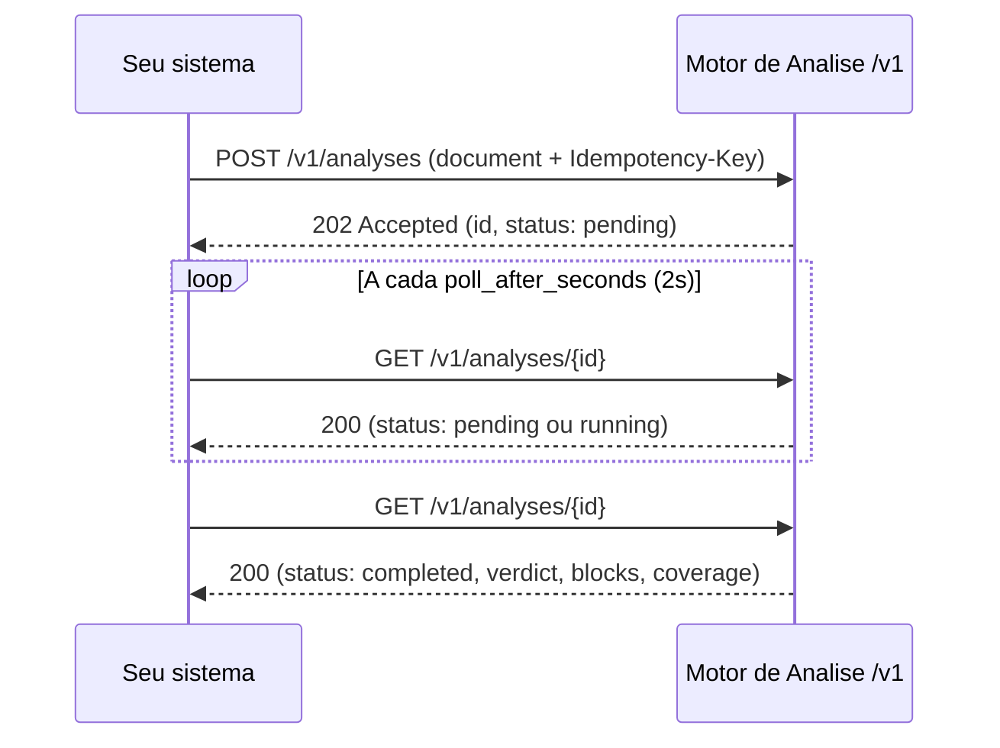

O **Motor de Análise** é a API pública para rodar análises de risco automatizadas de **CNPJ** e **CPF** — o mesmo motor usado na interface web do Sherlocker. Você envia um documento, o motor consulta as fontes de dados configuradas na sua engine e devolve um veredito consolidado com o detalhamento de cada verificação.

Foi feito para quem precisa de análise cadastral e de risco dentro do próprio fluxo:

- **FIDCs** — análise de cedentes e sacados antes da operação
- **Fintechs** — verificação de contrapartes no onboarding
- **Backoffices de crédito** — automação da esteira de cadastro

<Warning>
  O Motor de Análise está em **beta**. O acesso é liberado por workspace através da feature `analysis_engine` (necessária para qualquer chamada `/v1`) e, adicionalmente, `analysis_engine_pf` para análises de CPF. Sem a feature, as chamadas retornam `403 feature_not_enabled`. [Solicite acesso aqui](/api/access).
</Warning>

## Como funciona

A API é assíncrona, com apenas dois endpoints:

1. `POST /v1/analyses` cria a análise com o documento (CNPJ ou CPF) e retorna `202 Accepted` com o `id`. Os tokens do workspace são debitados nesse momento.
2. Você faz polling com `GET /v1/analyses/{id}`, respeitando o `poll_after_seconds` da resposta, até o status chegar a `completed` ou `failed`.
3. No resultado, o `verdict` (`aprovado`, `alerta`, `reprovado` ou `incompleto`) resume a análise; `blocks` detalha cada verificação e `coverage` mostra o que foi consultado em cada fonte de dados.

Todos os endpoints usam a base `https://<API_HOST>/v1` e autenticação pelo header `Authorization: Bearer slhk_sua_chave_aqui`.

<Note>
  Durante o beta, substitua `<API_HOST>` pelo host fornecido pelo time Sherlocker. O host definitivo será publicado quando a API for promovida a produção.
</Note>

Análises que terminam em `failed` têm os tokens reembolsados automaticamente. A API é polling-only por enquanto: não há webhooks nem listagem de análises.

## Motor de Análise vs Motor de Crédito

Não confunda com o **Motor de Crédito** (rotas `/credito/*`), também documentado neste site. São produtos diferentes, com hosts e autenticação diferentes:

| | Motor de Análise | Motor de Crédito |
|---|---|---|
| O que analisa | Um CNPJ ou CPF individual (cadastro, sanções, risco) | Um borderô completo em CNAB 400 (cedente, sacados, títulos) |
| Endpoints | `POST /v1/analyses` e `GET /v1/analyses/{id}` em `https://<API_HOST>` | `/api/v1/credito/*` no `221b-api.sherlocker.com.br` |
| Autenticação | Header `Authorization: Bearer slhk_sua_chave_aqui` | Query param `?token=` |

Se o seu caso é analisar uma operação de desconto de duplicatas a partir de um arquivo CNAB, use o Motor de Crédito. Se é avaliar o risco de um CNPJ ou CPF específico, esta é a API certa.

## Próximos passos

<CardGroup cols={2}>
  <Card title="Quickstart" icon="rocket" href="/motor-analise/quickstart">
    Crie sua primeira análise em minutos
  </Card>
  <Card title="Autenticação" icon="key" href="/motor-analise/autenticacao">
    Chaves de API, header Bearer e rastreamento de requisições
  </Card>
  <Card title="Ciclo de vida" icon="rotate" href="/motor-analise/ciclo-de-vida">
    Status, polling, verdict e o que cada campo do resultado significa
  </Card>
</CardGroup>
