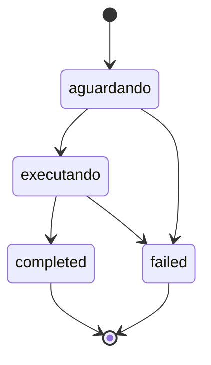

Tudo que os motores criam — uma análise (`POST /analyses`) ou uma operação de borderô (`POST /operations`) — é processado de forma assíncrona e passa pela **mesma forma de máquina de estados**: aguardando → executando → terminal. O que muda é o vocabulário público de cada motor. Esta página explica os estados, o polling e, por motor, o que cada campo do resultado significa.

<Note>
  Os Motores usam a **mesma base** da API 221b (`https://221b-api.sherlocker.com.br/api/v1`), mas autenticam via `Authorization: Bearer slhk_…` — **não** via `?token=`.
</Note>

## Máquina de estados

O campo `status` passa por dois estados não-terminais e um terminal, com nomes diferentes em cada motor:

| Fase | CPF/CNPJ (`/analyses`) | Borderô (`/operations`) | Terminal? | Significado |
|------|---------------------------|----------------------------|-----------|-------------|
| Aguardando | `pending` | `queued` | Não | Aceito (202) e aguardando processamento |
| Executando | `running` | `processing` | Não | Motor executando as verificações |
| Concluído | `completed` | `completed` | Sim | Motor terminou; resultado disponível |
| Falhou | `failed` | `failed` | Sim | O motor não conseguiu concluir; sem resultado e **tokens estornados automaticamente** |



Trate `failed` como possível a partir de qualquer estado não-terminal: um run que expira ainda aguardando (sem chegar a executar) também termina em `failed`.

Respostas terminais (`completed`/`failed`) são estáveis — o resultado não muda depois de pronto. O estorno em `failed` é automático nos dois motores (veja [Cobrança](/motores/cobranca)).

## Polling

Consulte o resultado com `GET /analyses/{id}` ou `GET /operations/{id}`. A indicação de intervalo difere por motor:

- **CPF/CNPJ**: enquanto o run não é terminal, a resposta traz o campo `poll_after_seconds: 2` no body e o header `Retry-After: 2`. Quando o status é terminal, campo e header deixam de aparecer.
- **Borderô**: não há campo de intervalo nem header `Retry-After` — consulte a cada **~2 segundos** até `completed` ou `failed`.

<CodeGroup>
```python Python
import requests
import time

API_HOST = "221b-api.sherlocker.com.br/api/v1"
HEADERS = {"Authorization": "Bearer slhk_sua_chave_aqui"}

# Para o Motor de Bordero, troque "analyses" por "operations"
# (la nao ha poll_after_seconds: use um sleep fixo de 2s)
run_id = "a1b2c3d4-0000-0000-0000-000000000001"

while True:
    resp = requests.get(
        f"https://{API_HOST}/analyses/{run_id}",
        headers=HEADERS,
    )
    data = resp.json()

    if data["status"] in ("completed", "failed"):
        break

    time.sleep(data.get("poll_after_seconds", 2))
```

```javascript Node.js
const API_HOST = "221b-api.sherlocker.com.br/api/v1";
const headers = { Authorization: "Bearer slhk_sua_chave_aqui" };

// Para o Motor de Bordero, troque "analyses" por "operations"
// (la nao ha poll_after_seconds: use um sleep fixo de 2s)
const runId = "a1b2c3d4-0000-0000-0000-000000000001";

let data;
while (true) {
  const resp = await fetch(
    `https://${API_HOST}/analyses/${runId}`,
    { headers }
  );
  data = await resp.json();

  if (data.status === "completed" || data.status === "failed") break;

  const waitSeconds = data.poll_after_seconds ?? 2;
  await new Promise((r) => setTimeout(r, waitSeconds * 1000));
}
```
</CodeGroup>

<Tip>
  Consultar mais rápido que o intervalo indicado não acelera o resultado. No CPF/CNPJ, honre `Retry-After`/`poll_after_seconds`; no borderô, mantenha o intervalo de ~2 segundos.
</Tip>

### Boas práticas

- **Respeite o rate limit**: 100 requisições por minuto por IP. Exceder retorna `429`.
- **Use o intervalo indicado** (2 segundos) entre consultas, em vez de um valor fixo próprio.
- **Pare no estado terminal**: `completed` e `failed` são finais; não há transição depois deles.
- Consultar um `id` inexistente ou de outro workspace retorna `404 not_found` — veja [Erros](/motor-analise/erros).

## O resultado de cada motor

<Tabs>
<Tab title="CPF/CNPJ">

### Verdicts

O `verdict` resume o resultado da análise. Ele só existe quando a análise termina em `completed`; em `pending`, `running` e `failed` ele é `null`.

| Verdict | Significado |
|---------|-------------|
| `aprovado` | Nenhum bloco resultou em alerta ou bloqueio |
| `alerta` | Pelo menos um bloco resultou em `alert` |
| `reprovado` | Pelo menos um bloco resultou em `blocked` |
| `incompleto` | O motor terminou, mas pelo menos um bloco ficou `unavailable` porque a fonte de dados falhou |

<Warning>
  `incompleto` não é uma reprovação. Significa que parte das fontes de dados não respondeu e o motor não teve como avaliar todos os blocos. Confira o campo `coverage` para ver qual fonte ficou indisponível antes de decidir o que fazer com a análise.
</Warning>

### Status de bloco

Cada item de `blocks[]` traz o resultado de uma verificação individual (ex.: `SITUACAO_CADASTRAL_CNPJ`, `SANCAO_NACIONAL`). O catálogo completo está em [Blocos](/motor-analise/blocos).

| `blocks[].status` | Significado |
|-------------------|-------------|
| `pass` | Verificação passou sem ressalvas |
| `alert` | Verificação encontrou um ponto de atenção |
| `blocked` | Verificação encontrou um impeditivo |
| `unavailable` | A fonte de dados do bloco falhou; o bloco não foi avaliado |

Cada bloco pode trazer `evidence[]` com itens no formato `{field, value, expected, result}` (ex.: `result` igual a `divergent` ou `match`).

### Coverage

O campo `coverage[]` mostra, por fonte de dados consultada, se a busca funcionou:

| `coverage[].status` | Significado |
|---------------------|-------------|
| `fetched` | Dados obtidos da fonte nesta análise |
| `cached` | Dados reaproveitados de uma consulta recente |
| `failed` | A fonte falhou; blocos que dependem dela ficam `unavailable` |

### Quando os campos deixam de ser `null`

Enquanto a análise está em `pending` ou `running`, `verdict`, `blocks`, `coverage` e `finished_at` são `null`. Os campos de resultado são preenchidos de uma vez quando a análise chega a `completed` — não há resultado parcial. Em `failed`, `verdict`, `blocks` e `coverage` permanecem `null` (apenas `finished_at` é preenchido) e os tokens são reembolsados.

### Exemplo: em andamento

`GET /analyses/{id}` com a análise ainda em `running` retorna `200` com header `Retry-After: 2`:

```json
{
  "id": "a1b2c3d4-0000-0000-0000-000000000001",
  "status": "running",
  "subject_type": "pj",
  "document": "12345678000195",
  "verdict": null,
  "blocks": null,
  "coverage": null,
  "created_at": "2026-06-30T10:00:00Z",
  "finished_at": null,
  "poll_after_seconds": 2,
  "request_id": "req-uuid"
}
```

### Exemplo: concluída

```json
{
  "id": "a1b2c3d4-0000-0000-0000-000000000001",
  "status": "completed",
  "subject_type": "pj",
  "document": "12345678000195",
  "verdict": "aprovado",
  "blocks": [
    { "id": "SITUACAO_CADASTRAL_CNPJ", "status": "pass", "detail": "CNPJ ativo na Receita Federal.", "evidence": [] },
    { "id": "SANCAO_NACIONAL", "status": "pass", "detail": "Não encontrado em listas de sanções nacionais.", "evidence": [] }
  ],
  "coverage": [
    { "source": "company", "status": "fetched", "fetched_at": "2026-06-30T10:00:00Z" },
    { "source": "serasa", "status": "fetched", "fetched_at": "2026-06-30T10:00:05Z" }
  ],
  "created_at": "2026-06-30T10:00:00Z",
  "finished_at": "2026-06-30T10:00:30Z",
  "request_id": "req-uuid"
}
```

Os campos `tokens_charged` e `balance` aparecem na resposta quando disponíveis.

</Tab>
<Tab title="Borderô">

### Envelope de status × resultado

No borderô, status e resultado moram em endpoints diferentes:

- `GET /operations/{id}` — o **envelope de status** (camelCase), sempre com todos os campos.
- `GET /operations/{id}/result` — o **resultado hierárquico** (árvore cedente → sacados → títulos), disponível apenas quando `completed`. Antes disso, retorna [`409 conflict`](/problems/conflict).

### Status de entidade

Cada nó da árvore do `/result` (cedente, sacado, título) tem um `status` público em inglês:

| `status` | Significado |
|----------|-------------|
| `approved` | Nenhuma issue no nó (nem abaixo dele) |
| `alerted` | Pelo menos uma issue de alerta, sem nenhum bloqueio — inclui análise incompleta por fonte indisponível |
| `blocked` | Pelo menos uma issue bloqueante |

O rollup é **worst-of**: o status do título deriva das issues do título; o do sacado é o pior entre as issues próprias e os títulos; o do cedente é o pior entre as issues próprias e os sacados. Como o cedente é a contraparte de todos os títulos, um cedente `blocked` compromete o borderô inteiro, independentemente dos sacados.

### Issues, coverage e degraded_rules

Cada violação de regra vira uma **issue** no nó correspondente: `{rule_id, rule_name, category, status, message, detail, data_sources}` — `category` é `blocking` ou `alert`. Quando uma fonte de dados fica indisponível, a regra afetada **não vira issue**: ela aparece em `degraded_rules[]` (`rule_id`, `provider`, `titulos_affected`) e a cobertura por provider em `coverage[]` (`requested`, `succeeded`, `failed_keys`). No `summary`, os títulos afetados contam como `alerted`.

O `summary` do `/result` sempre reflete o **dataset completo** (não muda com `?filter`): `total_titulos`, `approved`/`blocked`/`alerted`, `total_value`/`approved_value`/`blocked_value`/`alerted_value`, `sacados.total`/`sacados.with_issues` e `cedente.status`.

### O que cada estado retorna

O envelope de status traz **sempre todos os campos**; o que muda é o preenchimento:

- `titulo_count`, `approved_count`, `blocked_count` e `alert_count` são `null` até `completed`. Quando preenchidos, `approved_count + blocked_count + alert_count = titulo_count` — `alert_count` inclui os títulos com análise incompleta.
- `completed_at` só é preenchido em `completed`; `error` (string) só em `failed`, com os tokens estornados automaticamente.
- `processing_at` é `null` enquanto `queued`; `file_size` pode ser `null` em operações antigas.

### Exemplo: em processamento

`GET /operations/{id}` com a operação ainda em `processing` (sem header `Retry-After` — consulte a cada ~2s):

```json
{
  "id": "b2c3d4e5-0000-0000-0000-000000000001",
  "status": "processing",
  "file_name": "bordero.rem",
  "file_size": 4440,
  "engine_id": "0b3c6c7e-9d2a-4f1b-8e5d-2a1b3c4d5e6f",
  "titulo_count": null,
  "approved_count": null,
  "blocked_count": null,
  "alert_count": null,
  "created_at": "2026-07-09T12:00:00.000Z",
  "queued_at": "2026-07-09T12:00:00.000Z",
  "processing_at": "2026-07-09T12:00:02.000Z",
  "completed_at": null,
  "error": null
}
```

### Exemplo: concluída

```json
{
  "id": "b2c3d4e5-0000-0000-0000-000000000001",
  "status": "completed",
  "file_name": "bordero.rem",
  "file_size": 4440,
  "engine_id": "0b3c6c7e-9d2a-4f1b-8e5d-2a1b3c4d5e6f",
  "titulo_count": 12,
  "approved_count": 9,
  "blocked_count": 2,
  "alert_count": 1,
  "created_at": "2026-07-09T12:00:00.000Z",
  "queued_at": "2026-07-09T12:00:00.000Z",
  "processing_at": "2026-07-09T12:00:02.000Z",
  "completed_at": "2026-07-09T12:02:15.000Z",
  "error": null
}
```

A partir daí, busque a árvore completa em `GET /operations/{id}/result` — por padrão só os nós com problemas (`?filter=issues`); com `?filter=all`, todos. O shape de cada título, incluindo `nfe_chave` e as issues de NFe, está em [Títulos e NFe](/credito/titulos-e-nfe); o fluxo completo, no [Quickstart](/credito/quickstart).

</Tab>
</Tabs>

## Próximos passos

<CardGroup cols={2}>
  <Card title="Cobrança" icon="coins" href="/motores/cobranca">
    Débito na criação e estorno automático em failed
  </Card>
  <Card title="Idempotência" icon="repeat" href="/motores/idempotencia">
    Retries seguros e resolução de conflitos 409
  </Card>
  <Card title="Blocos (CPF/CNPJ)" icon="cubes" href="/motor-analise/blocos">
    Catálogo dos blocos de verificação e seus grupos
  </Card>
  <Card title="Títulos e NFe (Borderô)" icon="file-invoice" href="/credito/titulos-e-nfe">
    O shape do título na árvore do resultado e o campo nfe_chave
  </Card>
</CardGroup>
