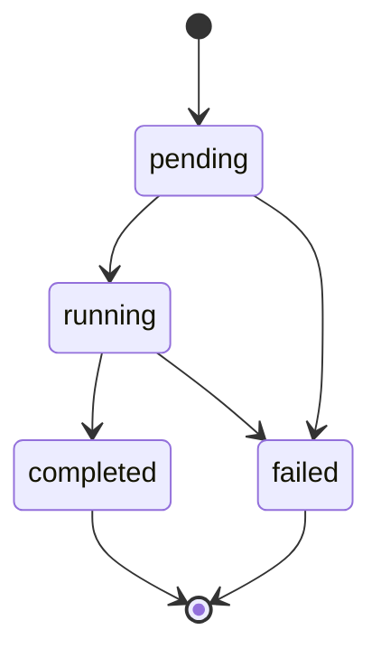

Tudo que os motores criam — uma análise (`POST /v1/analyses`) ou uma operação de borderô (`POST /v1/operations`) — é processado de forma assíncrona e passa pela **mesma máquina de estados**. Esta página explica os estados, o polling e, por motor, o que cada campo do resultado significa.

<Note>
  Durante o beta, substitua `<API_HOST>` pelo host fornecido pelo time Sherlocker. O host definitivo será publicado na promoção a produção.
</Note>

## Máquina de estados (os dois motores)

O campo `status` passa por estes estados:



Trate `failed` como possível a partir de qualquer estado não-terminal: um run que expira ainda em `pending` (sem chegar a `running`) também termina em `failed`.

| Status | Terminal? | Significado |
|--------|-----------|-------------|
| `pending` | Não | Aceito (202) e aguardando processamento |
| `running` | Não | Motor executando as verificações |
| `completed` | Sim | Motor terminou; campos de resultado disponíveis |
| `failed` | Sim | O motor não conseguiu concluir; sem resultado e **tokens estornados automaticamente** |

Respostas terminais (`completed`/`failed`) são estáveis — o resultado não muda depois de pronto. O estorno em `failed` é automático nos dois motores (veja [Cobrança](/motores/cobranca)).

## Polling (os dois motores)

Consulte o resultado com `GET /v1/analyses/{id}` ou `GET /v1/operations/{id}`. Enquanto o run não é terminal, a resposta traz duas indicações equivalentes de quando consultar de novo:

- o campo `poll_after_seconds: 2` no body;
- o header `Retry-After: 2` na resposta.

Quando o status é terminal, esse campo e esse header deixam de aparecer — é o sinal de que não há mais o que aguardar.

<CodeGroup>
```python Python
import requests
import time

API_HOST = "<API_HOST>"
HEADERS = {"Authorization": "Bearer slhk_sua_chave_aqui"}

# Para o Motor de Bordero, troque "analyses" por "operations"
run_id = "a1b2c3d4-0000-0000-0000-000000000001"

while True:
    resp = requests.get(
        f"https://{API_HOST}/v1/analyses/{run_id}",
        headers=HEADERS,
    )
    data = resp.json()

    if data["status"] in ("completed", "failed"):
        break

    time.sleep(data.get("poll_after_seconds", 2))
```

```javascript Node.js
const API_HOST = "<API_HOST>";
const headers = { Authorization: "Bearer slhk_sua_chave_aqui" };

// Para o Motor de Bordero, troque "analyses" por "operations"
const runId = "a1b2c3d4-0000-0000-0000-000000000001";

let data;
while (true) {
  const resp = await fetch(
    `https://${API_HOST}/v1/analyses/${runId}`,
    { headers }
  );
  data = await resp.json();

  if (data.status === "completed" || data.status === "failed") break;

  const waitSeconds = data.poll_after_seconds ?? 2;
  await new Promise((r) => setTimeout(r, waitSeconds * 1000));
}
```
</CodeGroup>

<Tip>
  Consultar mais rápido que o intervalo indicado não acelera o resultado. Sempre honre `Retry-After`/`poll_after_seconds`.
</Tip>

### Boas práticas

- **Respeite o rate limit**: 100 requisições por minuto por IP. Exceder retorna `429`.
- **Use o intervalo indicado** (2 segundos) entre consultas, em vez de um valor fixo próprio.
- **Pare no estado terminal**: `completed` e `failed` são finais; não há transição depois deles.
- Consultar um `id` inexistente ou de outro workspace retorna `404 not_found` — veja [Erros](/motor-analise/erros).

## O resultado de cada motor

<Tabs>
<Tab title="CPF/CNPJ">

### Verdicts

O `verdict` resume o resultado da análise. Ele só existe quando a análise termina em `completed`; em `pending`, `running` e `failed` ele é `null`.

| Verdict | Significado |
|---------|-------------|
| `aprovado` | Nenhum bloco resultou em alerta ou bloqueio |
| `alerta` | Pelo menos um bloco resultou em `alert` |
| `reprovado` | Pelo menos um bloco resultou em `blocked` |
| `incompleto` | O motor terminou, mas pelo menos um bloco ficou `unavailable` porque a fonte de dados falhou |

<Warning>
  `incompleto` não é uma reprovação. Significa que parte das fontes de dados não respondeu e o motor não teve como avaliar todos os blocos. Confira o campo `coverage` para ver qual fonte ficou indisponível antes de decidir o que fazer com a análise.
</Warning>

### Status de bloco

Cada item de `blocks[]` traz o resultado de uma verificação individual (ex.: `SITUACAO_CADASTRAL_CNPJ`, `SANCAO_NACIONAL`). O catálogo completo está em [Blocos](/motor-analise/blocos).

| `blocks[].status` | Significado |
|-------------------|-------------|
| `pass` | Verificação passou sem ressalvas |
| `alert` | Verificação encontrou um ponto de atenção |
| `blocked` | Verificação encontrou um impeditivo |
| `unavailable` | A fonte de dados do bloco falhou; o bloco não foi avaliado |

Cada bloco pode trazer `evidence[]` com itens no formato `{field, value, expected, result}` (ex.: `result` igual a `divergent` ou `match`).

### Coverage

O campo `coverage[]` mostra, por fonte de dados consultada, se a busca funcionou:

| `coverage[].status` | Significado |
|---------------------|-------------|
| `fetched` | Dados obtidos da fonte nesta análise |
| `cached` | Dados reaproveitados de uma consulta recente |
| `failed` | A fonte falhou; blocos que dependem dela ficam `unavailable` |

### Quando os campos deixam de ser `null`

Enquanto a análise está em `pending` ou `running`, `verdict`, `blocks`, `coverage` e `finished_at` são `null`. Os campos de resultado são preenchidos de uma vez quando a análise chega a `completed` — não há resultado parcial. Em `failed`, `verdict`, `blocks` e `coverage` permanecem `null` (apenas `finished_at` é preenchido) e os tokens são reembolsados.

### Exemplo: em andamento

`GET /v1/analyses/{id}` com a análise ainda em `running` retorna `200` com header `Retry-After: 2`:

```json
{
  "id": "a1b2c3d4-0000-0000-0000-000000000001",
  "status": "running",
  "subject_type": "pj",
  "document": "12345678000195",
  "verdict": null,
  "blocks": null,
  "coverage": null,
  "created_at": "2026-06-30T10:00:00Z",
  "finished_at": null,
  "poll_after_seconds": 2,
  "request_id": "req-uuid"
}
```

### Exemplo: concluída

```json
{
  "id": "a1b2c3d4-0000-0000-0000-000000000001",
  "status": "completed",
  "subject_type": "pj",
  "document": "12345678000195",
  "verdict": "aprovado",
  "blocks": [
    { "id": "SITUACAO_CADASTRAL_CNPJ", "status": "pass", "detail": "CNPJ ativo na Receita Federal.", "evidence": [] },
    { "id": "SANCAO_NACIONAL", "status": "pass", "detail": "Não encontrado em listas de sanções nacionais.", "evidence": [] }
  ],
  "coverage": [
    { "source": "company", "status": "fetched", "fetched_at": "2026-06-30T10:00:00Z" },
    { "source": "serasa", "status": "fetched", "fetched_at": "2026-06-30T10:00:05Z" }
  ],
  "created_at": "2026-06-30T10:00:00Z",
  "finished_at": "2026-06-30T10:00:30Z",
  "request_id": "req-uuid"
}
```

Os campos `tokens_charged` e `balance` aparecem na resposta quando disponíveis.

</Tab>
<Tab title="Borderô">

### Verdicts por título

Cada item de `titulos[]` traz um `verdict` que consolida, para aquele título, o resultado da análise do cedente, da análise do sacado e das validações do próprio título (dados do CNAB e cruzamento com NFe):

| `titulos[].verdict` | Significado |
|---------------------|-------------|
| `aprovado` | Nenhuma verificação do título resultou em alerta ou bloqueio |
| `alerta` | Pelo menos uma verificação resultou em alerta, sem nenhum bloqueio |
| `reprovado` | Pelo menos uma verificação resultou em bloqueio |
| `incompleto` | Alguma verificação do título ficou indisponível (fonte de dados falhou), sem nenhum bloqueio |

O `summary` agrega as contagens em `aprovados`, `alertas`, `reprovados` e `incompletos` (os quatro somam `titulos`), junto com `valor_total`, `valor_aprovado` e `valor_incompleto` para a decisão financeira da operação. `incompletos` são títulos que o motor não conseguiu avaliar por completo porque alguma fonte de dados ficou indisponível — não são reprovações.

### Verdict do cedente

O campo `summary.cedente_verdict` carrega o veredito da análise de risco do **cedente** — a mesma semântica de `verdict` do Motor de CPF/CNPJ (`aprovado` | `alerta` | `reprovado` | `incompleto`), ou `null` se o veredito não estiver disponível (campo preenchido em melhor esforço). Como o cedente é a contraparte de todos os títulos, um `cedente_verdict` de `reprovado` compromete o borderô inteiro, independentemente dos sacados.

### Operação e análises-filhas

Ao processar o borderô, o motor cria **uma análise por entidade única**: uma para o cedente e uma para cada sacado distinto. São análises normais do Motor de CPF/CNPJ, e é isso que os campos `cedente_analysis_id` e `sacado_analysis_id` de cada título referenciam:

- O mesmo sacado em vários títulos aponta para a **mesma** análise (e é cobrado uma única vez — veja [Cobrança](/motores/cobranca)).
- Todos os títulos compartilham o mesmo `cedente_analysis_id`.
- Os campos podem ser `null` quando a análise da entidade não está disponível — preenchidos em melhor esforço.
- O detalhamento completo (verdict, `blocks`, `coverage`) de qualquer entidade está em `GET /v1/analyses/{id}`, no formato da aba CPF/CNPJ.

### O que cada estado retorna

Enquanto a operação está em `pending` ou `running`, o `GET` retorna o essencial: `id`, `status`, `engine_id`, `file_name`, `tokens_charged`, `created_at`, o `request_id` e a instrução de polling (`poll_after_seconds`) — `titulos_count` e `entities_count` aparecem quando disponíveis. A resposta **não traz** `summary`, `titulos` nem `finished_at`.

Os campos de resultado chegam de uma vez quando a operação atinge `completed`: `finished_at`, `summary` e `titulos[]`. Em `failed`, a resposta ganha apenas `finished_at` — sem `summary` nem `titulos` — e os tokens são estornados.

### Exemplo: em andamento

`GET /v1/operations/{id}` com a operação ainda em `running` retorna `200` com header `Retry-After: 2`:

```json
{
  "id": "b2c3d4e5-0000-0000-0000-000000000001",
  "status": "running",
  "engine_id": "0b3c6c7e-9d2a-4f1b-8e5d-2a1b3c4d5e6f",
  "file_name": "remessa-0605.rem",
  "titulos_count": 42,
  "entities_count": 12,
  "tokens_charged": 12,
  "created_at": "2026-07-06T10:00:00Z",
  "poll_after_seconds": 2,
  "request_id": "req-uuid"
}
```

### Exemplo: concluída

```json
{
  "id": "b2c3d4e5-0000-0000-0000-000000000001",
  "status": "completed",
  "engine_id": "0b3c6c7e-9d2a-4f1b-8e5d-2a1b3c4d5e6f",
  "file_name": "remessa-0605.rem",
  "titulos_count": 42,
  "entities_count": 12,
  "created_at": "2026-07-06T10:00:00Z",
  "finished_at": "2026-07-06T10:02:15Z",
  "summary": {
    "titulos": 42,
    "aprovados": 29,
    "alertas": 8,
    "reprovados": 4,
    "incompletos": 1,
    "valor_total": 123456.78,
    "valor_aprovado": 100000.00,
    "valor_incompleto": 3456.78,
    "cedente_verdict": "aprovado",
    "entities_count": 12
  },
  "titulos": [
    {
      "seu_numero": "DUP-0001",
      "sacado_document": "12345678000190",
      "valor": 1234.56,
      "vencimento": "2026-08-01",
      "verdict": "aprovado",
      "nfe_status": "pass",
      "cedente_analysis_id": "a1b2c3d4-0000-0000-0000-000000000010",
      "sacado_analysis_id": "a1b2c3d4-0000-0000-0000-000000000011"
    }
  ],
  "tokens_charged": 12,
  "request_id": "req-uuid"
}
```

O shape completo de cada título, incluindo os estados de `nfe_status`, está em [Títulos e NFe](/credito/titulos-e-nfe).

</Tab>
</Tabs>

## Próximos passos

<CardGroup cols={2}>
  <Card title="Cobrança" icon="coins" href="/motores/cobranca">
    Débito na criação e estorno automático em failed
  </Card>
  <Card title="Idempotência" icon="repeat" href="/motores/idempotencia">
    Retries seguros e resolução de conflitos 409
  </Card>
  <Card title="Blocos (CPF/CNPJ)" icon="cubes" href="/motor-analise/blocos">
    Catálogo dos blocos de verificação e seus grupos
  </Card>
  <Card title="Títulos e NFe (Borderô)" icon="file-invoice" href="/credito/titulos-e-nfe">
    O shape de cada título e os estados de nfe_status
  </Card>
</CardGroup>
