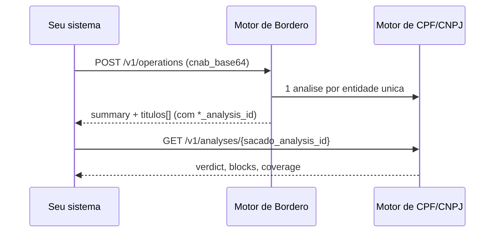

O Sherlocker expõe **dois motores de análise** pela mesma API `/v1` — mesma base, mesma chave `slhk_` e mesma feature de acesso:

- **[Motor de CPF/CNPJ](/motor-analise/introducao)** — análise de risco de um documento individual: você envia um CNPJ ou CPF e recebe um veredito consolidado (`verdict`) com o detalhamento de cada verificação (`blocks`) e das fontes consultadas (`coverage`).
- **[Motor de Borderô](/credito/introducao)** — análise de uma operação de desconto de duplicatas a partir de um arquivo **CNAB 400**: o motor faz o parse dos títulos, analisa o cedente e cada sacado único, valida cada título (com cruzamento opcional contra XMLs de NFe) e devolve um veredito por título e da operação.

<Warning>
  Os dois motores estão em **beta**. O acesso é liberado por workspace através da feature `analysis_engine` (necessária para qualquer chamada `/v1`) e, adicionalmente, `analysis_engine_pf` para análises de CPF. Sem a feature, as chamadas retornam `403 feature_not_enabled`. [Solicite acesso aqui](/api/access).
</Warning>

## Qual motor usar?

| | Motor de CPF/CNPJ | Motor de Borderô |
|---|---|---|
| O que analisa | Um CNPJ ou CPF individual (cadastro, sanções, risco) | Um borderô completo em CNAB 400 (cedente, sacados, títulos e NFe) |
| Entrada | `document` (CNPJ ou CPF) | `cnab_base64` (arquivo remessa) + ZIP de NFe opcional |
| Endpoints | `POST /v1/analyses` e `GET /v1/analyses/{id}` | `POST /v1/operations` e `GET /v1/operations/{id}` |
| Cobrança | Por análise | Por entidade única do borderô (cedente + sacados únicos) |
| Resultado | `verdict` + `blocks` + `coverage` | `summary` + veredito por título, com links para as análises de cedente e sacados |
| Caso típico | Onboarding/KYC, due diligence de uma contraparte | Esteira de FIDC, securitizadora ou factoring analisando uma remessa |

Regra prática: se a pergunta é "**posso operar com esta empresa/pessoa?**", use o Motor de CPF/CNPJ. Se é "**o que fazer com cada título deste borderô?**", use o Motor de Borderô.

## Como os dois compõem

O Motor de Borderô usa o Motor de CPF/CNPJ por baixo: cada entidade única do arquivo (o cedente e cada sacado distinto) gera uma **análise normal**, e cada título do resultado traz `cedente_analysis_id` e `sacado_analysis_id`. O drill-down do veredito de um título até o detalhamento completo da entidade é um `GET /v1/analyses/{id}` de distância:

Ambos são assíncronos (polling com `poll_after_seconds`/`Retry-After`), exigem `Idempotency-Key` no POST, cobram tokens do mesmo pool do workspace (com estorno automático em `failed`) e retornam erros no mesmo formato RFC 7807 — veja a [referência comum de erros](/motor-analise/erros).

<Note>
  Durante o beta, substitua `<API_HOST>` pelo host fornecido pelo time Sherlocker. O host definitivo será publicado quando a API for promovida a produção.
</Note>

## Próximos passos

<CardGroup cols={2}>
  <Card title="Motor de CPF/CNPJ" icon="user-check" href="/motor-analise/introducao">
    Análise de risco de um CNPJ ou CPF individual
  </Card>
  <Card title="Motor de Borderô" icon="file-invoice-dollar" href="/credito/introducao">
    Análise de borderôs CNAB 400 com validação de NFe
  </Card>
  <Card title="Autenticação" icon="key" href="/motor-analise/autenticacao">
    Uma chave `slhk_`, os dois motores
  </Card>
  <Card title="Solicitar acesso" icon="unlock" href="/api/access">
    Peça acesso ao beta para o seu workspace
  </Card>
</CardGroup>
