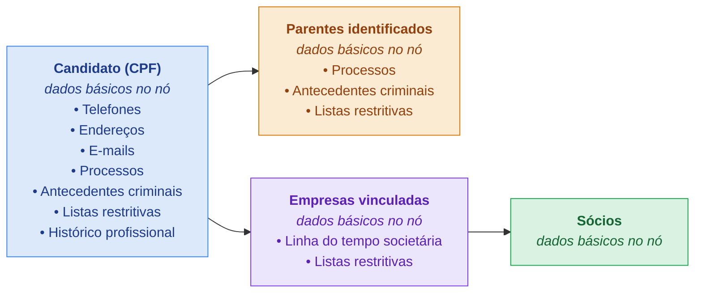

<Info>
Página **exclusiva** do seu contrato. Este perfil não é listado publicamente — use o `perfil_id` apenas nas suas integrações.
</Info>

O perfil **Candidato RH** investiga, numa única execução, um candidato para análise de contratação: o próprio candidato, seus parentes identificados, as empresas em que ele figura como sócio e os sócios dessas empresas. A execução é **assíncrona** — você dispara e busca o resultado quando fica pronto.

| | |
|---|---|
| **`perfil_id`** | `8f6b2e10-1c3a-4d5e-9a7b-2c4d6e8f0a1b` |
| **Entidade** | Pessoa (CPF) |
| **Custo** | 16 tokens por execução |
| **Execução** | Assíncrona (job) |

## O que ele investiga



### Módulos por entidade

Os **dados básicos** (nome, nascimento / razão social) vêm no campo `dados` do próprio nó de cada entidade. Os itens abaixo são os módulos de enriquecimento.

| Entidade | Módulos |
|----------|---------|
| **Candidato** | `telefones`, `enderecos`, `emails`, `processos`, `antecedentes_criminais`, `listas_restritivas`, `historico_profissional` |
| **Parentes** | `processos`, `antecedentes_criminais`, `listas_restritivas` |
| **Empresas** | `linha_do_tempo`, `listas_restritivas` |
| **Sócios** | — (só os dados básicos no nó) |

<Note>
Antecedentes criminais de parentes costumam voltar `indisponivel` com `motivo: "dados_insuficientes"` — a emissão exige dados que nem sempre estão disponíveis para terceiros (nome da mãe, data de nascimento).
</Note>

## Como usar

<Steps>
  <Step title="Execute o perfil">
    `POST /perfis` com o `documento` do candidato e o `perfil_id`. A resposta é `202` com um `job_id` (a cobrança de 16 tokens acontece aqui).
  </Step>
  <Step title="Consulte o resultado">
    `GET /perfis/jobs/{job_id}` — faça polling até o `status` do job ser terminal. O resultado vem crescendo enquanto processa.
  </Step>
</Steps>

## Executar

<ParamField body="documento" type="string" required>
  CPF do candidato (com ou sem máscara).
</ParamField>

<ParamField body="perfil_id" type="string" required>
  `8f6b2e10-1c3a-4d5e-9a7b-2c4d6e8f0a1b`
</ParamField>

<ParamField header="Idempotency-Key" type="string">
  Opcional. A mesma chave em até 24h retorna o **mesmo** job, sem executar nem cobrar de novo.
</ParamField>

<CodeGroup>
```bash cURL
curl -X POST "https://221b-api.sherlocker.com.br/api/v1/perfis?token=SEU_TOKEN" \
  -H "Content-Type: application/json" \
  -d '{
    "documento": "123.456.789-00",
    "perfil_id": "8f6b2e10-1c3a-4d5e-9a7b-2c4d6e8f0a1b"
  }'
```

```json Resposta 202
{
  "job_id": "9f1c2b3a-4d5e-6f70-8a9b-0c1d2e3f4a5b",
  "status": "processando",
  "perfil": { "perfil_id": "8f6b2e10-1c3a-4d5e-9a7b-2c4d6e8f0a1b", "label": "rh-candidato" },
  "criado_em": "2026-07-09T14:00:00Z"
}
```
</CodeGroup>

## Consultar

`GET /perfis/jobs/{job_id}` — faça polling até o `status` do job ser terminal.

```bash
curl "https://221b-api.sherlocker.com.br/api/v1/perfis/jobs/9f1c2b3a-...?token=SEU_TOKEN"
```

### Status do job

| Status | Terminal? | Significado |
|--------|:---------:|-------------|
| `processando` | não | Em execução — continue fazendo polling. |
| `concluida` | sim | Terminou; todos os dados resolveram. |
| `parcial` | sim | Terminou, mas alguma fonte ficou indisponível (ou estourou o tempo). |
| `falha` | sim | O CPF do candidato não resolveu (ex.: inexistente). |

### Exemplo de resultado

<Accordion title="Resposta completa (concluida)" icon="file-lines">
```json
{
  "job_id": "9f1c2b3a-4d5e-6f70-8a9b-0c1d2e3f4a5b",
  "status": "concluida",
  "perfil": { "perfil_id": "8f6b2e10-...", "label": "rh-candidato" },
  "criado_em": "2026-07-09T14:00:00Z",
  "concluido_em": "2026-07-09T14:03:42Z",
  "entidade": {
    "tipo": "pessoa",
    "documento": { "tipo": "cpf", "numero": "123.456.789-00" },
    "dados": { "nome_completo": "FULANO DA SILVA", "data_nascimento": "1990-05-10", "genero": "M" },
    "modulos": {
      "telefones": { "status": "ok", "consultado_em": "...", "motivo": null,
        "telefones": [ { "numero_completo": "..." } ] },
      "enderecos": { "status": "ok", "consultado_em": "...", "motivo": null,
        "enderecos": [ { "logradouro": "...", "cidade": "...", "uf": "SP" } ] },
      "emails": { "status": "nada_consta", "consultado_em": "...", "motivo": null, "emails": [] },
      "processos": { "status": "ok", "consultado_em": "...", "motivo": null,
        "total": 2, "itens": [ /* ... */ ] },
      "antecedentes_criminais": { "status": "ok", "consultado_em": "...", "motivo": null,
        "resultado": null, "pdf_url": "https://.../certidao.pdf", "nr_protocolo": "2026..." },
      "listas_restritivas": { "status": "nada_consta", "consultado_em": "...", "motivo": null,
        "resumo": { "tem_ocorrencia": false, "total_ocorrencias": 0 } },
      "historico_profissional": { "status": "ok", "consultado_em": "...", "motivo": null,
        "empregos": [ { "nome_empregador": "ACME LTDA", "cargo": "Analista" } ] }
    },
    "relacionados": {
      "parentes": [
        { "vinculo": { "codigo": "02", "nome": "MÃE" }, "tipo": "pessoa",
          "documento": { "tipo": "cpf", "numero": "111.222.333-44" },
          "dados": { "nome_completo": "MARIA DA SILVA" },
          "modulos": { "processos": { "status": "nada_consta", "...": "..." }, "...": "..." },
          "relacionados": {} }
      ],
      "empresas": [
        { "vinculo": { "razao_social": "ACME LTDA" }, "tipo": "empresa",
          "documento": { "tipo": "cnpj", "numero": "12.345.678/0001-90" },
          "dados": { "razao_social": "ACME LTDA", "nome_fantasia": "ACME" },
          "modulos": { "linha_do_tempo": { "status": "ok", "eventos": [ /* ... */ ] },
            "listas_restritivas": { "status": "nada_consta", "...": "..." } },
          "relacionados": {
            "socios": [
              { "vinculo": { "qualificacao": "Sócio" }, "tipo": "pessoa",
                "documento": { "tipo": "cpf", "numero": "987.654.321-00" },
                "dados": { "nome_completo": "CICLANO DE SOUZA", "faixa_etaria": "31-40" },
                "modulos": {},
                "relacionados": {} }
            ]
          } }
      ]
    }
  }
}
```
</Accordion>

## Como ler o resultado

O resultado é uma árvore **entidade → módulos → relacionados** (recursiva).

<ResponseField name="dados" type="object">
  Dados básicos da entidade (nome, nascimento / razão social) — no próprio nó, não é módulo.
</ResponseField>

<ResponseField name="modulos" type="object">
  Cada módulo tem um envelope `{ status, consultado_em, motivo, ...campos }`.
  <Expandable title="valores de status">
    <ResponseField name="ok">Consultado, com dados.</ResponseField>
    <ResponseField name="nada_consta">Consultado, sem ocorrências (≠ indisponível).</ResponseField>
    <ResponseField name="indisponivel">A fonte falhou — veja `motivo` (`timeout`, `fonte_indisponivel`, `dados_insuficientes`...).</ResponseField>
    <ResponseField name="pendente">Ainda resolvendo (só durante `processando`).</ResponseField>
    <ResponseField name="nao_aplicavel">O módulo não existe para o tipo daquela entidade.</ResponseField>
  </Expandable>
</ResponseField>

<ResponseField name="relacionados" type="object">
  Parentes, empresas e sócios. Uma entidade que já apareceu vem como referência (`ref: true`, com `ref_caminho`), não repetida.
</ResponseField>

## Tipagem da resposta

<CodeGroup>
```typescript Estrutura
type StatusJob = "processando" | "parcial" | "concluida" | "falha";

type StatusModulo =
  | "ok" | "nada_consta" | "indisponivel" | "pendente" | "nao_aplicavel";

type Motivo =
  | "timeout" | "fonte_indisponivel" | "dados_insuficientes"
  | "modulo_nao_disponivel_para_tipo" | "nao_localizado";

interface Resposta {          // GET /perfis/jobs/{job_id}
  job_id: string;
  status: StatusJob;
  perfil: { perfil_id: string | null; label: string | null };
  criado_em: string;          // ISO 8601
  concluido_em: string | null;
  entidade: Entidade;
}

interface CriarResposta {     // POST /perfis → 202
  job_id: string;
  status: "processando";
  perfil: { perfil_id: string | null; label: string | null };
  criado_em: string;
}

interface Entidade {
  tipo: "pessoa" | "empresa";
  documento: { tipo: "cpf" | "cnpj"; numero: string };
  dados?: Record<string, unknown>;                 // dados básicos (no nó)
  vinculo?: Record<string, unknown>;               // só em relacionados
  modulos?: Record<string, ModuloEnvelope>;
  relacionados?: Record<string, Entidade[]>;       // recursivo
  relacionados_truncados?: Record<string, number>; // relação → total real
  ref?: true;                                       // nó-referência (já expandido)
  ref_caminho?: string;
}

interface ModuloEnvelope {
  status: StatusModulo;
  consultado_em: string | null;
  motivo: Motivo | null;
  [campo: string]: unknown;   // payload específico do módulo (abaixo)
}
```

```typescript Módulos (payload)
// entidade.dados quando tipo = "pessoa"
interface DadosPessoa {
  nome_completo: string;
  genero: string;
  data_nascimento: string;
  falecido: boolean;
  obito: { data_obito: string; cartorio: string } | null;
  publicamente_exposta: boolean;
  cargos_publicos: unknown[];
}

// entidade.dados quando tipo = "empresa"
interface DadosEmpresa {
  razao_social: string;
  nome_fantasia: string | null;
  situacao: string;
  data_abertura: string;
  capital_social: number;
  natureza_juridica: { codigo: string; descricao: string };
  atividade_principal: { codigo: string; descricao: string } | null;
}

interface Telefones { telefones: { ddd: string; numero: string; numero_completo: string; operadora: string }[] }
interface Enderecos { enderecos: { logradouro: string; numero: string; bairro: string; cidade: string; uf: string; cep: string }[] }
interface Emails    { emails: { email: string; dominio: string; corporativo: boolean }[] }

interface Processos {
  total: number;
  itens: {
    numero_processo: string; numero_formatado: string; tribunal: string;
    classe_nome: string; data_ajuizamento: string; assuntos: string;
    valor_acao: number | null; polo_do_investigado: "ativo" | "passivo" | "ambos" | "indeterminado";
    partes: unknown[]; advogados: unknown[]; movimentacoes: unknown[];
  }[];
}

interface AntecedentesCriminais {
  resultado: "consta" | "nada_consta" | null;   // reservado (hoje null)
  pdf_url: string | null;
  nr_protocolo: string | null;
  emitido_em: string | null;
}

interface ListasRestritivas {
  resumo: { tem_ocorrencia: boolean; total_ocorrencias: number; confiabilidade: string };
  ocorrencias: unknown[];
  cobertura: unknown[];
}

interface HistoricoProfissional {
  empregos: { nome_empregador: string; cargo: string | null; data_admissao: string | null; data_desligamento: string | null }[];
}

interface LinhaDoTempo {   // módulo de empresa
  eventos: { data: string; evento: "entrada_socio" | "saida_socio"; pessoa: { nome: string; documento: string; qualificacao: string } }[];
}
```
</CodeGroup>

## Cobrança e erros

<CardGroup cols={2}>
  <Card title="16 tokens por execução" icon="coins">
    Cobrado no `POST /perfis`, independente do resultado (`concluida`, `parcial` ou `falha`). `Idempotency-Key` evita cobrança dupla em retry.
  </Card>
  <Card title="Erros" icon="triangle-exclamation">
    `400` documento/perfil_id inválido · `402` saldo insuficiente · `404` job inexistente · `429` rate limit · `503` indisponível. Corpo: `{ "erro": "..." }`.
  </Card>
</CardGroup>
