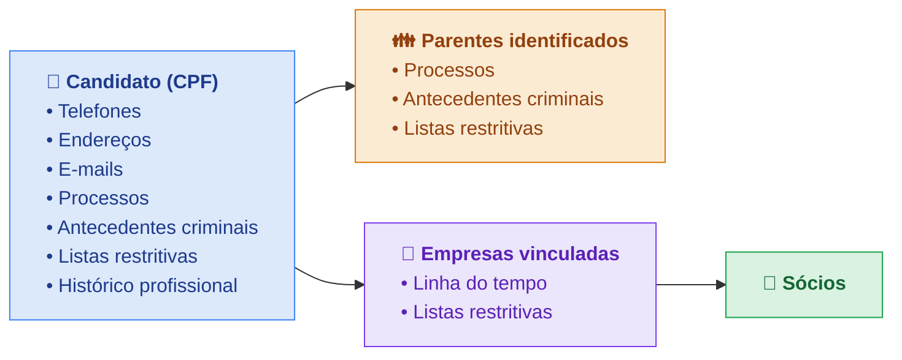

<Info>
Página **exclusiva** do seu contrato. Este perfil não é listado publicamente — use o `perfil_id` apenas nas suas integrações.
</Info>

O perfil **Candidato RH** investiga, numa única execução, um candidato para análise de contratação: o próprio candidato, seus parentes identificados, as empresas em que ele figura como sócio e os sócios dessas empresas. A execução é **assíncrona** — você dispara e busca o resultado quando fica pronto.

| | |
|---|---|
| **ID do Perfil** | `8f6b2e10-1c3a-4d5e-9a7b-2c4d6e8f0a1b` |
| **Entidade** | Pessoa (CPF) |
| **Custo** | 16 tokens por execução |
| **Execução** | Assíncrona (job) |

## O que ele investiga



### Módulos por entidade

Os **dados básicos** (nome, nascimento / razão social) vêm no campo `dados` do próprio nó de cada entidade. Os itens abaixo são os módulos de enriquecimento.

| Entidade | Módulos |
|----------|---------|
| **Candidato** | `telefones`, `enderecos`, `emails`, `processos`, `antecedentes_criminais`, `listas_restritivas`, `historico_profissional` |
| **Parentes** | `processos`, `antecedentes_criminais`, `listas_restritivas` |
| **Empresas** | `linha_do_tempo`, `listas_restritivas` |
| **Sócios** | — (só os dados básicos no nó) |

## Como usar

<Steps>
  <Step title="Execute o perfil">
    `POST /perfis` com o `documento` do candidato e o `perfil_id`. A resposta é `202` com um `job_id` (a cobrança de 16 tokens acontece aqui).
  </Step>
  <Step title="Consulte o resultado">
    `GET /perfis/jobs/{job_id}` — faça polling até o `status` do job ser terminal. O resultado vem crescendo enquanto processa.
  </Step>
</Steps>

## Executar

<ParamField body="documento" type="string" required>
  CPF do candidato (com ou sem máscara).
</ParamField>

<ParamField body="perfil_id" type="string" required>
  `8f6b2e10-1c3a-4d5e-9a7b-2c4d6e8f0a1b`
</ParamField>

<ParamField body="tipos_vinculo" type="string[]">
  Opcional. Tipos de vínculo aceitos no módulo `processos`: `documento` e
  `nome`. O padrão é `["documento"]`. Para incluir também processos associados
  apenas pelo nome, envie `["documento", "nome"]`.
</ParamField>

<Note>
  Por padrão, o perfil RH retorna somente processos vinculados pelo documento,
  tanto para o candidato quanto para os parentes. A associação por nome é
  opt-in e pode envolver homônimos.
</Note>

<ParamField header="Idempotency-Key" type="string">
  Opcional. A mesma chave em até 24h retorna o **mesmo** job, sem executar nem cobrar de novo.
</ParamField>

<CodeGroup>
```bash cURL
curl -X POST "https://221b-api.sherlocker.com.br/api/v1/perfis" \
  -H "Authorization: Bearer SEU_TOKEN" \
  -H "Content-Type: application/json" \
  -d '{
    "documento": "123.456.789-00",
    "perfil_id": "8f6b2e10-1c3a-4d5e-9a7b-2c4d6e8f0a1b"
  }'
```

```json Resposta 202
{
  "job_id": "9f1c2b3a-4d5e-6f70-8a9b-0c1d2e3f4a5b",
  "status": "processando",
  "perfil": { "perfil_id": "8f6b2e10-1c3a-4d5e-9a7b-2c4d6e8f0a1b", "label": "rh-candidato" },
  "criado_em": "2026-07-09T14:00:00Z"
}
```
</CodeGroup>

Para incluir também vínculos por nome:

```bash
curl -X POST "https://221b-api.sherlocker.com.br/api/v1/perfis" \
  -H "Authorization: Bearer SEU_TOKEN" \
  -H "Content-Type: application/json" \
  -d '{
    "documento": "123.456.789-00",
    "perfil_id": "8f6b2e10-1c3a-4d5e-9a7b-2c4d6e8f0a1b",
    "tipos_vinculo": ["documento", "nome"]
  }'
```

## Consultar

`GET /perfis/jobs/{job_id}` — faça polling até o `status` do job ser terminal.

```bash
curl "https://221b-api.sherlocker.com.br/api/v1/perfis/jobs/9f1c2b3a-..." \
  -H "Authorization: Bearer SEU_TOKEN"
```

### Status do job

| Status | Terminal? | Significado |
|--------|:---------:|-------------|
| `processando` | não | Em execução — continue fazendo polling. |
| `concluida` | sim | Terminou. Cada módulo carrega o próprio status; fontes que ficaram indisponíveis (ou estouraram o tempo) vêm sinalizadas no envelope do módulo, não no status do job. |
| `falha` | sim | O CPF do candidato não resolveu (ex.: inexistente). Nesse caso a execução é **reembolsada**. |

### Exemplo de resultado

Resposta quando `concluida`:

```json
{
  "job_id": "9f1c2b3a-4d5e-6f70-8a9b-0c1d2e3f4a5b",
  "status": "concluida",
  "perfil": {
    "perfil_id": "8f6b2e10-1c3a-4d5e-9a7b-2c4d6e8f0a1b",
    "label": "rh-candidato"
  },
  "criado_em": "2026-07-09T14:00:00Z",
  "concluido_em": "2026-07-09T14:03:42Z",
  "entidade": {
    "tipo": "pessoa",
    "documento": { "tipo": "cpf", "numero": "123.456.789-00" },
    "dados": {
      "nome_completo": "FULANO DA SILVA",
      "genero": "Masculino",
      "data_nascimento": "1990-05-10",
      "falecido": false,
      "obito": null,
      "publicamente_exposta": false,
      "cargos_publicos": []
    },
    "modulos": {
      "telefones": {
        "status": "ok",
        "consultado_em": "2026-07-09T14:01:02Z",
        "motivo": null,
        "telefones": [
          { "ddi": "55", "ddd": "11", "numero": "999998888", "numero_completo": "5511999998888", "estado": "SP", "operadora": "Vivo", "data": "2024-01-01" }
        ]
      },
      "enderecos": {
        "status": "ok",
        "consultado_em": "2026-07-09T14:01:02Z",
        "motivo": null,
        "enderecos": [
          { "logradouro": "Rua A", "numero": "100", "complemento": null, "bairro": "Centro", "cidade": "São Paulo", "uf": "SP", "cep": "01000-000" }
        ]
      },
      "emails": {
        "status": "nada_consta",
        "consultado_em": "2026-07-09T14:01:02Z",
        "motivo": null,
        "emails": []
      },
      "processos": {
        "status": "ok",
        "consultado_em": "2026-07-09T14:01:10Z",
        "motivo": null,
        "total": 1,
        "itens": [
          {
            "numero_processo": "00012345620248260100",
            "numero_formatado": "0001234-56.2024.8.26.0100",
            "tipo_vinculo": "documento",
            "tribunal": "tjsp",
            "classe_codigo": 1116,
            "classe_nome": "Execução Fiscal",
            "grau": "1",
            "data_ajuizamento": "2024-03-01",
            "orgao_julgador": "1ª Vara da Fazenda Pública",
            "assuntos": "Dívida Ativa",
            "valor_acao": null,
            "partes": [],
            "advogados": [],
            "movimentacoes": []
          }
        ]
      },
      "antecedentes_criminais": {
        "status": "ok",
        "consultado_em": "2026-07-09T14:02:30Z",
        "motivo": null,
        "resultado": "nada_consta",
        "pdf_url": "https://.../certidao.pdf",
        "nr_protocolo": "2026123456"
      },
      "listas_restritivas": {
        "status": "nada_consta",
        "consultado_em": "2026-07-09T14:01:05Z",
        "motivo": null,
        "resumo": {
          "tem_ocorrencia": false, "tem_sancao": false, "tem_alerta": false,
          "total_ocorrencias": 0,
          "por_grupo": { "sancoes": 0, "restritivas": 0, "alertas": 0 },
          "fontes_aplicaveis": 10, "fontes_consultadas": 10,
          "com_ocorrencia": 0, "indisponiveis": 1, "nao_aplicaveis": 3,
          "confiabilidade": "parcial"
        },
        "ocorrencias": [],
        "cobertura": [
          { "lista_id": "ceis", "nome": "CEIS — Empresas Inidôneas e Suspensas", "grupo": "sancoes",
            "fonte_oficial": "https://portaldatransparencia.gov.br", "resultado": "nada_consta",
            "ocorrencias": 0, "saude": "OK", "ultima_atualizacao": "2026-07-09 09:33:14" }
        ]
      },
      "historico_profissional": {
        "status": "ok",
        "consultado_em": "2026-07-09T14:01:02Z",
        "motivo": null,
        "empregos": [
          { "nome_empregador": "ACME LTDA", "cargo": "Analista" }
        ]
      }
    },
    "relacionados": {
      "parentes": [
        {
          "tipo": "pessoa",
          "documento": { "tipo": "cpf", "numero": "111.222.333-44" },
          "vinculo": { "codigo": "02", "nome": "MÃE" },
          "dados": { "nome_completo": "MARIA DA SILVA" },
          "modulos": {
            "processos": { "status": "nada_consta", "consultado_em": "...", "motivo": null, "total": 0, "itens": [] }
          },
          "relacionados": {}
        }
      ],
      "empresas": [
        {
          "tipo": "empresa",
          "documento": { "tipo": "cnpj", "numero": "12.345.678/0001-90" },
          "vinculo": { "qualificacao": "Sócio-Administrador", "data_entrada": "2019-08-01" },
          "dados": {
            "cnpj_basico": "12345678",
            "razao_social": "ACME LTDA",
            "nome_fantasia": "ACME",
            "situacao": "Ativa",
            "data_situacao": "2019-08-01",
            "motivo_situacao": "Sem Motivo",
            "data_abertura": "2019-08-01",
            "capital_social": 100000,
            "porte": "Médio ou Grande porte",
            "matriz_filial": "Matriz",
            "natureza_juridica": { "codigo": "2062", "descricao": "Sociedade Empresária Limitada" },
            "atividade_principal": { "codigo": "6201-5/01", "descricao": "Desenvolvimento de programas de computador sob encomenda" },
            "atividades_secundarias": [
              { "codigo": "6202-3/00", "descricao": "Desenvolvimento e licenciamento de programas de computador customizáveis" }
            ],
            "endereco": { "logradouro": "Av Paulista", "numero": "1000", "complemento": null, "bairro": "Bela Vista", "cidade": "São Paulo", "uf": "SP", "cep": "01310-100" },
            "telefones": [
              { "ddi": "55", "ddd": "11", "numero": "33330000", "numero_completo": "551133330000", "estado": "SP", "operadora": "Fixo" }
            ],
            "emails": [
              { "email": "contato@acme.com.br", "dominio": "acme.com.br", "corporativo": true }
            ],
            "situacao_especial": null,
            "data_situacao_especial": null
          },
          "modulos": {
            "linha_do_tempo": {
              "status": "ok",
              "consultado_em": "...",
              "motivo": null,
              "eventos": [
                { "data": "2022-05-10", "categoria": "cadastro", "origem": "alteracao",
                  "titulo": "Alteração de nome fantasia", "descricao": "ACME → ACME BR",
                  "campo": "nome_fantasia", "de": { "descricao": "ACME" }, "para": { "descricao": "ACME BR" } }
              ],
              "cobertura": { "dados_a_partir_de": "2019-01", "meses_disponiveis": ["2019-01", "..."] }
            }
          },
          "relacionados": {
            "socios": [
              {
                "tipo": "pessoa",
                "documento": { "tipo": "cpf", "numero": "987.654.321-00" },
                "vinculo": { "qualificacao": "Sócio" },
                "dados": { "nome_completo": "CICLANO DE SOUZA", "faixa_etaria": "31-40" },
                "modulos": {},
                "relacionados": {}
              }
            ]
          }
        }
      ]
    }
  }
}
```

## Como ler o resultado

O resultado é uma árvore **entidade → módulos → relacionados** (recursiva).

<ResponseField name="dados" type="object">
  Dados básicos da entidade (nome, nascimento / razão social) — no próprio nó, não é módulo.
</ResponseField>

<ResponseField name="modulos" type="object">
  Cada módulo tem um envelope `{ status, consultado_em, motivo, ...campos }`.
  <Expandable title="valores de status">
    <ResponseField name="ok">Consultado, com dados.</ResponseField>
    <ResponseField name="nada_consta">Consultado, sem ocorrências (≠ indisponível).</ResponseField>
    <ResponseField name="indisponivel">A fonte falhou — veja `motivo` (`timeout`, `fonte_indisponivel`, `dados_insuficientes`...).</ResponseField>
    <ResponseField name="pendente">Ainda resolvendo (só durante `processando`).</ResponseField>
    <ResponseField name="nao_aplicavel">O módulo não existe para o tipo daquela entidade.</ResponseField>
  </Expandable>
</ResponseField>

<ResponseField name="relacionados" type="object">
  Parentes, empresas e sócios. Uma entidade que já apareceu vem como referência (`ref: true`, com `ref_caminho`), não repetida.
</ResponseField>

## Tipagem da resposta

<CodeGroup>
```typescript Estrutura
type StatusJob = "processando" | "concluida" | "falha";

type StatusModulo =
  | "ok" | "nada_consta" | "indisponivel" | "pendente" | "nao_aplicavel";

type Motivo =
  | "timeout" | "fonte_indisponivel" | "dados_insuficientes"
  | "modulo_nao_disponivel_para_tipo" | "nao_localizado";

interface Resposta {          // GET /perfis/jobs/{job_id}
  job_id: string;
  status: StatusJob;
  perfil: { perfil_id: string | null; label: string | null };
  criado_em: string;          // ISO 8601
  concluido_em: string | null;
  entidade: Entidade;
}

interface CriarResposta {     // POST /perfis → 202
  job_id: string;
  status: "processando";
  perfil: { perfil_id: string | null; label: string | null };
  criado_em: string;
}

interface CriarRequisicao {   // POST /perfis
  documento: string;
  perfil_id: string;
  tipos_vinculo?: ("documento" | "nome")[]; // padrão: ["documento"]
}

interface Entidade {
  tipo: "pessoa" | "empresa";
  documento: { tipo: "cpf" | "cnpj"; numero: string };
  dados?: Record<string, unknown>;                 // dados básicos (no nó)
  vinculo?: Record<string, unknown>;               // só em relacionados
  modulos?: Record<string, ModuloEnvelope>;
  relacionados?: Record<string, Entidade[]>;       // recursivo
  relacionados_truncados?: Record<string, number>; // relação → total real
  ref?: true;                                       // nó-referência (já expandido)
  ref_caminho?: string;
}

interface ModuloEnvelope {
  status: StatusModulo;
  consultado_em: string | null;
  motivo: Motivo | null;
  [campo: string]: unknown;   // payload específico do módulo (abaixo)
}
```

```typescript Módulos (payload)
// entidade.dados quando tipo = "pessoa"
interface DadosPessoa {
  nome_completo: string;
  genero: string;
  data_nascimento: string;
  falecido: boolean;
  obito: { data_obito: string; cartorio: string } | null;
  publicamente_exposta: boolean;
  cargos_publicos: unknown[];
}

// entidade.dados quando tipo = "empresa"
// Mesmos dados da rota /empresas/cnpj (sem `documento`/`tipo_documento` — já no nó —
// nem `socios` — expandido na relação `socios`).
interface DadosEmpresa {
  cnpj_basico: string;
  razao_social: string;
  nome_fantasia: string | null;
  situacao: string;
  data_situacao: string;
  motivo_situacao: string | null;
  data_abertura: string;
  capital_social: number;
  porte: string | null;
  matriz_filial: string | null;
  natureza_juridica: { codigo: string; descricao: string };
  atividade_principal: { codigo: string; descricao: string } | null;
  atividades_secundarias: { codigo: string; descricao: string }[];
  endereco: { logradouro: string; numero: string; complemento: string | null; bairro: string; cidade: string; uf: string; cep: string };
  telefones: { ddi: string; ddd: string; numero: string; numero_completo: string; estado: string; operadora: string }[];
  emails: { email: string; dominio: string; corporativo: boolean }[];
  situacao_especial: string | null;
  data_situacao_especial: string | null;
}

interface Telefones { telefones: { ddi: string; ddd: string; numero: string; numero_completo: string; estado: string; operadora: string; data: string }[] }
interface Enderecos { enderecos: { logradouro: string; numero: string; complemento: string | null; bairro: string; cidade: string; uf: string; cep: string }[] }
interface Emails    { emails: { email: string; dominio: string; corporativo: boolean }[] }

interface Processos {
  total: number;
  itens: {
    numero_processo: string; numero_formatado: string; tribunal: string;
    tipo_vinculo: "documento" | "nome";
    classe_codigo: number; classe_nome: string; grau: string;
    data_ajuizamento: string; orgao_julgador: string; assuntos: string;
    valor_acao: number | null;
    partes: { nome: string; documento: string; polo: string; tipo: string }[];
    advogados: { nome: string; oab: string; polo: string; documento: string }[];
    movimentacoes: { data: string; descricao: string; complemento: string }[];
  }[];
}

interface AntecedentesCriminais {
  resultado: "consta" | "nada_consta" | null;   // possui/não possui (lido do PDF); null se não deu p/ ler
  pdf_url: string | null;
  nr_protocolo: string | null;
  emitido_em: string | null;
}

interface ListasRestritivas {
  resumo: {
    tem_ocorrencia: boolean; tem_sancao: boolean; tem_alerta: boolean;
    total_ocorrencias: number;
    por_grupo: { sancoes: number; restritivas: number; alertas: number };
    fontes_aplicaveis: number; fontes_consultadas: number;
    com_ocorrencia: number; indisponiveis: number; nao_aplicaveis: number;
    confiabilidade: "completa" | "parcial" | "indisponivel";
  };
  ocorrencias: unknown[];
  cobertura: {
    lista_id: string; nome: string; grupo: "sancoes" | "restritivas" | "alertas";
    fonte_oficial: string; resultado: string; ocorrencias: number;
    saude: string | null; ultima_atualizacao: string | null; motivo?: string;
  }[];
}

interface HistoricoProfissional {
  empregos: { nome_empregador: string; cargo: string | null; data_admissao: string | null; data_desligamento: string | null }[];
}

interface LinhaDoTempo {   // módulo de empresa — cadastral + societária
  eventos: {
    data: string;
    categoria: "socios" | "cadastro" | "atividade" | "situacao" | "tributario";
    origem: "alteracao" | "estado_inicial";
    titulo: string;
    descricao: string;
    campo?: string;
    de?: { codigo?: string; descricao: string } | null;
    para?: { codigo?: string; descricao: string } | null;
    pessoa?: { nome: string; documento: string | null; qualificacao: string } | null;
  }[];
  cobertura: { dados_a_partir_de: string | null; meses_disponiveis: string[] };
}
```
</CodeGroup>

## Cobrança

Cada execução custa **16 tokens**, cobrados no `POST /perfis`. Se o job terminar em `falha` (o CPF do candidato não resolveu), a execução é **reembolsada**. Use `Idempotency-Key` para evitar cobrança dupla em retry.

## Erros

Erros de validação retornam o status HTTP apropriado (não 202), com corpo `{ "erro": "...", "detalhes": [...] }`:

| Status | Quando |
|:------:|--------|
| `400` | `documento` ou `perfil_id` inválido. |
| `402` | Saldo insuficiente. |
| `404` | `job_id` inexistente. |
| `429` | Rate limit atingido. |
| `503` | Serviço temporariamente indisponível. |
