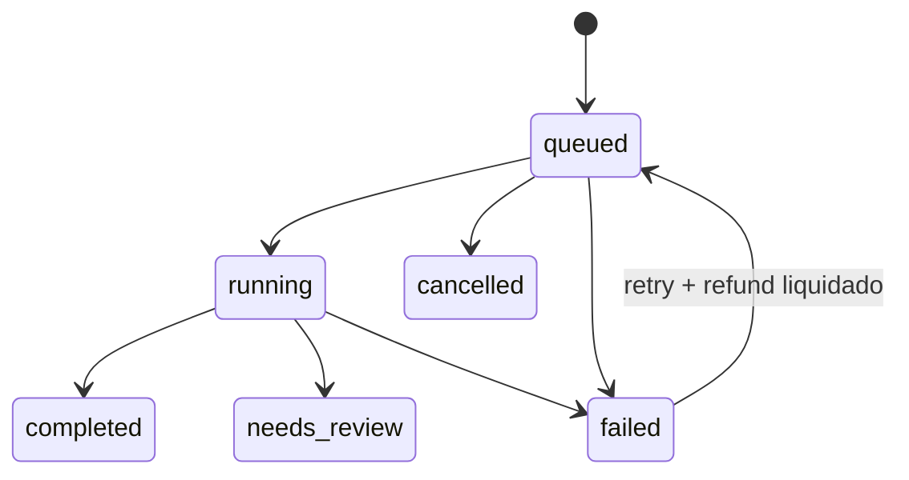

O Dossiê transforma um CPF ou CNPJ em um recurso investigativo durável. A API
preserva o mesmo `dossie_id` entre tentativas, informa a cobertura de cada fase e
entrega os relatórios como artefatos privados.

<Warning>
  **Implementação local em revisão.** As migrations não foram aplicadas, os
  workers permanecem desligados por padrão e não há disponibilidade observada em
  produção para estes endpoints.
</Warning>

## Visão rápida

| Item              | Contrato                                                                 |
| ----------------- | ------------------------------------------------------------------------ |
| Base externa      | `https://api.sherlocker.com.br/api/v1`                                   |
| Recurso           | `dossie`                                                                 |
| Scopes            | `dossies:write` para criar/cancelar/retry; `dossies:read` para consultar |
| Finalidade        | `purpose_id` obrigatório                                                 |
| Idempotência      | obrigatória em criação e retry                                           |
| Unidade faturável | criação aceita que não seja replay                                       |
| Recuperação       | polling autoritativo; eventos por cursor                                 |
| Outputs           | resultado estruturado, cobertura e PDF/DOCX privados                     |

## Endpoints implementados localmente

| Método | Path                            | Scope           | Resposta | Finalidade                                                    |
| ------ | ------------------------------- | --------------- | -------: | ------------------------------------------------------------- |
| `POST` | `/dossies`                      | `dossies:write` |    `202` | criar o Dossiê e a primeira tentativa                         |
| `GET`  | `/dossies`                      | `dossies:read`  |    `200` | listar recursos por cursor e status                           |
| `GET`  | `/dossies/{dossie_id}`          | `dossies:read`  |    `200` | ler estado, tentativa atual, resultado, cobertura e artefatos |
| `GET`  | `/dossies/{dossie_id}/status`   | `dossies:read`  |    `200` | leitura leve do estado persistido                             |
| `GET`  | `/dossies/{dossie_id}/attempts` | `dossies:read`  |    `200` | listar tentativas anteriores                                  |
| `GET`  | `/dossies/{dossie_id}/events`   | `dossies:read`  |    `200` | consumir eventos duráveis por cursor                          |
| `POST` | `/dossies/{dossie_id}/cancel`   | `dossies:write` |    `202` | cancelar somente enquanto `queued`                            |
| `POST` | `/dossies/{dossie_id}/retry`    | `dossies:write` |    `202` | criar nova tentativa após falha e refund liquidado            |

Os paths refletem o checkout local. O OpenAPI publicado na liberação do produto
será a referência final de campos e limites habilitados.

## Criar um Dossiê

`Idempotency-Key` e `purpose_id` são obrigatórios. O `document` aceita CPF ou
CNPJ; `subject_type` torna a intenção explícita.

```bash
curl -X POST https://api.sherlocker.com.br/api/v1/dossies \
  -H "Authorization: Bearer slhk_sua_chave_aqui" \
  -H "Idempotency-Key: 123e4567-e89b-42d3-a456-426614174001" \
  -H "Content-Type: application/json" \
  -d '{
    "document": "52998224725",
    "subject_type": "cpf",
    "purpose_id": "11111111-1111-4111-8111-111111111111"
  }'
```

Uma criação aceita retorna `202 Accepted`, `Location` e o recurso persistido:

```http
HTTP/1.1 202 Accepted
Location: /api/v1/dossies/aaaaaaaa-aaaa-4aaa-8aaa-aaaaaaaaaaaa
x-request-id: req_01JEXEMPLO
```

```json
{
  "id": "aaaaaaaa-aaaa-4aaa-8aaa-aaaaaaaaaaaa",
  "object": "dossie",
  "status": "queued",
  "subject_type": "cpf",
  "purpose_id": "11111111-1111-4111-8111-111111111111",
  "kind": "basic",
  "contract_version": "v1",
  "billing_policy_version": "v1-public",
  "current_attempt": {
    "id": "bbbbbbbb-bbbb-4bbb-8bbb-bbbbbbbbbbbb",
    "number": 1,
    "status": "queued",
    "queued_at": "2026-08-29T13:00:00Z",
    "billing": {
      "status": "charge_pending",
      "amount": 35,
      "unit": "tokens",
      "price_version": "dossie-basic-2026-08",
      "billing_policy_version": "v1-public"
    }
  },
  "artifacts": [],
  "stale": false,
  "poll_after_seconds": 3,
  "created_at": "2026-08-29T13:00:00Z",
  "updated_at": "2026-08-29T13:00:00Z"
}
```

<Note>
  `amount` é ilustrativo. Use sempre o valor e a `price_version` devolvidos pela
  API; preço e limites variam por plano e ambiente.
</Note>

### Replay seguro

Reenviar o mesmo body com a mesma key devolve a mesma resposta lógica e o header
`Idempotency-Replayed: true`, sem nova tentativa ou cobrança. A mesma key com
body diferente retorna `409 idempotency_conflict`.

## Lifecycle

O `dossie.status` espelha a tentativa atual. Uma tentativa terminal nunca é
reaberta; somente `/retry` cria outra tentativa sob o mesmo Dossiê.

| Status         | Terminal? | Significado                                                | Próximos estados                      |
| -------------- | --------: | ---------------------------------------------------------- | ------------------------------------- |
| `queued`       |       não | persistido e aguardando worker                             | `running`, `cancelled`, `failed`      |
| `running`      |       não | ao menos uma fase começou                                  | `completed`, `needs_review`, `failed` |
| `completed`    |       sim | cobertura integral e artefato válido                       | nenhum                                |
| `needs_review` |       sim | cobertura mínima útil e artefato disponível                | nenhum na v1                          |
| `failed`       |       sim | cobertura insuficiente, timeout ou falha sem artefato útil | `queued` por retry                    |
| `cancelled`    |       sim | cancelado antes do início irreversível                     | nenhum                                |

`needs_review` é terminal. Não continue polling esperando `completed`.



### Polling

Consulte `GET /dossies/{dossie_id}` ou o endpoint leve `/status` após o intervalo
de `poll_after_seconds`. O GET lê somente o estado persistido; não consulta
provider, não cria relatório e não altera cobrança.

Respostas não terminais podem incluir:

- `last_reconciled_at`: última reconciliação confirmada;
- `stale`: indica que o último estado pode estar atrasado;
- `poll_after_seconds`: intervalo recomendado antes da próxima leitura.

## Resultado e cobertura

Lifecycle, resultado e cobertura são campos separados:

| Lifecycle      | `result.outcome` | `coverage.status` | Interpretação                                        |
| -------------- | ---------------- | ----------------- | ---------------------------------------------------- |
| `completed`    | `full`           | `complete`        | todas as fases críticas produziram resultado útil    |
| `needs_review` | `partial_useful` | `partial`         | resultado utilizável, mas revisão humana recomendada |
| `failed`       | `unavailable`    | `insufficient`    | não atingiu o limiar mínimo do contrato              |

Cada item de `coverage.phases` usa um status próprio: `pending`, `running`,
`completed`, `unavailable`, `error`, `skipped` ou `unsupported`.

### Exemplo: resultado parcial útil

```json
{
  "id": "aaaaaaaa-aaaa-4aaa-8aaa-aaaaaaaaaaaa",
  "object": "dossie",
  "status": "needs_review",
  "subject_type": "cpf",
  "purpose_id": "11111111-1111-4111-8111-111111111111",
  "kind": "basic",
  "contract_version": "v1",
  "billing_policy_version": "v1-public",
  "current_attempt": {
    "id": "bbbbbbbb-bbbb-4bbb-8bbb-bbbbbbbbbbbb",
    "number": 1,
    "status": "needs_review",
    "queued_at": "2026-08-29T13:00:00Z",
    "started_at": "2026-08-29T13:00:03Z",
    "completed_at": "2026-08-29T13:11:42Z",
    "billing": {
      "status": "charged",
      "amount": 35,
      "unit": "tokens",
      "price_version": "dossie-basic-2026-08",
      "billing_policy_version": "v1-public"
    }
  },
  "result": {
    "outcome": "partial_useful",
    "timeline": [
      {
        "occurred_at": "2024-03-12T00:00:00Z",
        "category": "company_link",
        "summary": "Vínculo empresarial identificado"
      }
    ]
  },
  "coverage": {
    "status": "partial",
    "completed": 2,
    "eligible": 3,
    "phases": [
      { "name": "identity", "status": "completed" },
      { "name": "legal", "status": "completed" },
      { "name": "assets", "status": "unavailable" }
    ]
  },
  "artifacts": [
    {
      "id": "cccccccc-cccc-4ccc-8ccc-cccccccccccc",
      "type": "dossie_pdf",
      "media_type": "application/pdf",
      "status": "available",
      "size_bytes": 348210,
      "sha256": "4c8f26fda9b534092f1c67f579680b876b8022338ff462fdedba2cb6e09ea377",
      "download_url": "https://storage.example.invalid/signed/dossie.pdf",
      "expires_at": "2026-08-29T13:16:42Z",
      "available_until": null
    }
  ],
  "stale": false,
  "last_reconciled_at": "2026-08-29T13:11:42Z",
  "created_at": "2026-08-29T13:00:00Z",
  "updated_at": "2026-08-29T13:11:42Z"
}
```

Uma URL assinada é temporária; `expires_at` informa a validade da URL e
`available_until: null` informa que o artefato não tem expiração programada.

## Billing e refund

| Situação terminal                 | Billing esperado                        |
| --------------------------------- | --------------------------------------- |
| `completed` + `full`              | cobrança retida                         |
| `needs_review` + `partial_useful` | cobrança retida na política `v1-public` |
| `failed` + cobertura insuficiente | refund integral                         |
| `cancelled` enquanto `queued`     | refund integral quando já houve débito  |

O estado financeiro progride de forma independente:

```text
charged → refund_pending → refunded
```

Se a liquidação falhar, o recurso continua mostrando `refund_pending`; a dívida
não desaparece nem vira um lifecycle fictício.

### Retry após falha

O retry é permitido somente quando:

1. o status atual é `failed`;
2. `billing.status` da tentativa anterior é `refunded`;
3. a requisição usa uma nova `Idempotency-Key`.

```bash
curl -X POST \
  https://api.sherlocker.com.br/api/v1/dossies/aaaaaaaa-aaaa-4aaa-8aaa-aaaaaaaaaaaa/retry \
  -H "Authorization: Bearer slhk_sua_chave_aqui" \
  -H "Idempotency-Key: 123e4567-e89b-42d3-a456-426614174002"
```

O retry mantém o `dossie_id`, incrementa `attempt_number` e cria novo
`attempt_id`. Em `refund_pending`, retorna `409 refund_pending`.

Um novo `POST /dossies` equivalente também é bloqueado por
`409 prior_refund_pending` enquanto o refund anterior não estiver liquidado.

## Cancelamento

`POST /dossies/{id}/cancel` só é aceito em `queued`. Se o worker já moveu o
recurso para `running`, a API retorna `409 cancellation_not_allowed`. Repetir o
cancelamento de um recurso já `cancelled` retorna a representação atual sem
duplicar evento ou refund.

## Falhas terminais

Quando `status: "failed"`, `failure.code` usa um valor estável:

- `coverage_below_threshold`
- `provider_unavailable`
- `provider_timeout`
- `processing_timeout`
- `artifact_generation_failed`
- `dispatch_failed`
- `internal_error`

O GET continua retornando HTTP `200`; o código descreve a execução aceita. Erros
antes da criação usam Problem Details e não criam recurso nem cobrança.

## Eventos

Eventos incluem `attempt.id` e `attempt.number`, permitindo distinguir retries.
Entre os tipos emitidos localmente estão `dossie.created`, `dossie.started`,
`dossie.completed`, `dossie.completed_with_warnings`, `dossie.needs_review`,
`dossie.failed` e `dossie.cancelled`.

```json
{
  "id": "dddddddd-dddd-4ddd-8ddd-dddddddddddd",
  "object": "event",
  "type": "dossie.needs_review",
  "sequence": 17,
  "resource_id": "aaaaaaaa-aaaa-4aaa-8aaa-aaaaaaaaaaaa",
  "attempt_id": "bbbbbbbb-bbbb-4bbb-8bbb-bbbbbbbbbbbb",
  "data": {
    "status": "needs_review",
    "coverage_status": "partial"
  },
  "created_at": "2026-08-29T13:11:42Z"
}
```

## Relacionado

- [Autenticação e erros](/plataforma/autenticacao-erros)
- [Monitoramento](/plataforma/monitoramento)
- [Rastro](/plataforma/rastro)
- [Suporte e solicitações de privacidade](/support)
