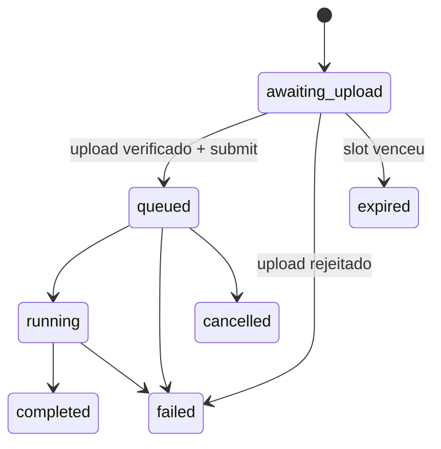

Lente analisa uma imagem em dois modos: inferência de localização (`geo`) e
busca por rosto (`face`). A API separa upload, execução, resultado e billing para
que uma conexão interrompida não cancele nem esconda o estado real da análise.

<Warning>
  **Implementação local em revisão.** A migration não foi aplicada, os workers
  permanecem desligados por padrão e não há disponibilidade observada em
  produção. O modo facial exige escopo próprio e finalidade baseada em
  consentimento.
</Warning>

## Visão rápida

| Item              | Contrato                                                            |
| ----------------- | ------------------------------------------------------------------- |
| Base externa      | `https://api.sherlocker.com.br/api/v1`                              |
| Recurso           | `lente_analysis`                                                    |
| Scopes            | `lente:geo` ou `lente:face` para criar; `lente:read` para consultar |
| Finalidade        | `purpose_id` obrigatório                                            |
| Idempotência      | obrigatória na criação e no `submit`                                |
| Unidade faturável | análise aceita por modo após upload verificado                      |
| Outputs           | localizações ou matches normalizados e artefatos privados           |

## Endpoints implementados localmente

| Método | Path                                   | Scope                       | Resposta | Finalidade                                            |
| ------ | -------------------------------------- | --------------------------- | -------: | ----------------------------------------------------- |
| `POST` | `/lente/analyses`                      | `lente:geo` ou `lente:face` |    `201` | criar análise e slot privado de upload                |
| `POST` | `/lente/analyses/{analysis_id}/submit` | scope do modo               |    `202` | verificar upload, cobrar e enfileirar                 |
| `GET`  | `/lente/analyses`                      | `lente:read`                |    `200` | listar análises por cursor                            |
| `GET`  | `/lente/analyses/{analysis_id}`        | `lente:read`                |    `200` | ler upload, lifecycle, resultado, billing e artefatos |
| `GET`  | `/lente/analyses/{analysis_id}/events` | `lente:read`                |    `200` | consumir eventos duráveis por cursor                  |
| `POST` | `/lente/analyses/{analysis_id}/cancel` | scope do modo               |    `202` | cancelar somente enquanto `queued`                    |

O recurso, os modos e os lifecycles acima refletem o checkout local e só se
tornam contrato público quando publicados no OpenAPI. O upload binário é feito
diretamente na URL assinada retornada pela criação; a URL não é um segundo
endpoint público permanente.

## Fluxo de upload

### 1. Crie a análise

Declare modo e metadata do arquivo. O checkout local aceita JPEG, PNG e WebP com
até 15 MiB e exige o SHA-256 exato dos bytes enviados.

```bash
curl -X POST https://api.sherlocker.com.br/api/v1/lente/analyses \
  -H "Authorization: Bearer slhk_sua_chave_aqui" \
  -H "Idempotency-Key: 123e4567-e89b-42d3-a456-426614174040" \
  -H "Content-Type: application/json" \
  -d '{
    "mode": "geo",
    "purpose_id": "11111111-1111-4111-8111-111111111111",
    "file": {
      "media_type": "image/jpeg",
      "size_bytes": 248612,
      "sha256": "2b8c0f8f9504122af183b8b95b5e7557fa59a7f89e96ca61be754c80828a2cf7"
    }
  }'
```

Uma criação aceita retorna `201 Created`, `Location` e o slot persistido:

```http
HTTP/1.1 201 Created
Location: /api/v1/lente/analyses/aaaaaaaa-aaaa-4aaa-8aaa-aaaaaaaaaaaa
x-request-id: req_01JEXEMPLO
```

```json
{
  "id": "aaaaaaaa-aaaa-4aaa-8aaa-aaaaaaaaaaaa",
  "object": "lente_analysis",
  "mode": "geo",
  "status": "awaiting_upload",
  "purpose_id": "11111111-1111-4111-8111-111111111111",
  "file": {
    "media_type": "image/jpeg",
    "size_bytes": 248612,
    "sha256": "2b8c0f8f9504122af183b8b95b5e7557fa59a7f89e96ca61be754c80828a2cf7",
    "upload_status": "pending"
  },
  "upload": {
    "method": "PUT",
    "url": "https://storage.example.invalid/signed/upload",
    "headers": {
      "content-type": "image/jpeg"
    },
    "expires_at": "2026-08-29T17:15:00Z"
  },
  "billing": {
    "id": null,
    "status": "not_charged",
    "amount": 0,
    "unit": "tokens",
    "price_version": "lente-geo-2026-08",
    "billing_policy_version": "v1-public"
  },
  "artifacts": [],
  "created_at": "2026-08-29T17:00:00Z",
  "updated_at": "2026-08-29T17:00:00Z"
}
```

### 2. Envie o arquivo

```bash
curl -X PUT "https://storage.example.invalid/signed/upload" \
  -H "Content-Type: image/jpeg" \
  --data-binary @foto.jpg
```

Não envie a chave `slhk_` para a URL de storage. Use somente os headers
retornados no objeto `upload`.

### 3. Submeta para análise

```bash
curl -X POST \
  https://api.sherlocker.com.br/api/v1/lente/analyses/aaaaaaaa-aaaa-4aaa-8aaa-aaaaaaaaaaaa/submit \
  -H "Authorization: Bearer slhk_sua_chave_aqui" \
  -H "Idempotency-Key: 123e4567-e89b-42d3-a456-426614174041"
```

Repetir o submit com a mesma key é idempotente. Depois que o arquivo é
verificado, a API persiste o job, aplica a cobrança e move o recurso para
`queued`.

- Mesma key e mesmo `analysis_id`: replay da submissão original, sem nova
  cobrança.
- Mesma key enquanto a primeira submissão ainda está em progresso:
  `409 request_in_progress` e `Retry-After`.

```http
HTTP/1.1 202 Accepted
Location: /api/v1/lente/analyses/aaaaaaaa-aaaa-4aaa-8aaa-aaaaaaaaaaaa
x-request-id: req_01JEXEMPLO
```

```json
{
  "id": "aaaaaaaa-aaaa-4aaa-8aaa-aaaaaaaaaaaa",
  "object": "lente_analysis",
  "mode": "geo",
  "status": "queued",
  "purpose_id": "11111111-1111-4111-8111-111111111111",
  "file": {
    "media_type": "image/jpeg",
    "size_bytes": 248612,
    "sha256": "2b8c0f8f9504122af183b8b95b5e7557fa59a7f89e96ca61be754c80828a2cf7",
    "upload_status": "verified"
  },
  "billing": {
    "id": "33333333-3333-4333-8333-333333333333",
    "status": "charge_pending",
    "amount": 35,
    "unit": "tokens",
    "price_version": "lente-geo-2026-08",
    "billing_policy_version": "v1-public"
  },
  "artifacts": [
    {
      "id": "input",
      "type": "input_image",
      "media_type": "image/jpeg",
      "status": "available",
      "available_until": null
    }
  ],
  "poll_after_seconds": 3,
  "submitted_at": "2026-08-29T17:01:12Z",
  "created_at": "2026-08-29T17:00:00Z",
  "updated_at": "2026-08-29T17:01:12Z"
}
```

`amount` é ilustrativo; use o valor devolvido pela API.

## Lifecycle da análise

| Status            | Terminal? | Significado                                   |
| ----------------- | --------: | --------------------------------------------- |
| `awaiting_upload` |       não | slot criado, aguardando upload e submit       |
| `queued`          |       não | upload verificado e job persistido            |
| `running`         |       não | análise visual em execução                    |
| `completed`       |       sim | resposta válida, inclusive resultado negativo |
| `failed`          |       sim | falha técnica ou validação pós-upload         |
| `cancelled`       |       sim | cancelamento aceito                           |
| `expired`         |       sim | upload não submetido dentro do TTL            |



O cancelamento público só é aceito em `queued`. Em `awaiting_upload`, deixe o
slot expirar; em `running` ou em qualquer estado terminal diferente de
`cancelled`, a API retorna `409 cancellation_not_allowed`.

## Lifecycle do upload

```text
pending → verified | rejected
pending → expired
```

`rejected` move a análise para `failed`. `failure.code` pode ser:

- `size_mismatch`
- `sha256_mismatch`
- `media_type_mismatch`

O slot é expirado automaticamente pelo worker mesmo quando o cliente não
consulta o recurso. Depois disso, o submit responde `410 upload_expired` e não
gera cobrança. Uma URL assinada vencida pode ser reemitida enquanto o slot ou
artefato continuar elegível.

## Resultado do modo `geo`

| `result.outcome` | Significado                                   | Billing         |
| ---------------- | --------------------------------------------- | --------------- |
| `located`        | uma localização atingiu o limiar de confiança | cobrança retida |
| `low_confidence` | existem candidatos úteis abaixo do limiar     | cobrança retida |
| `no_result`      | nenhuma localização foi produzida             | refund integral |

```json
{
  "id": "aaaaaaaa-aaaa-4aaa-8aaa-aaaaaaaaaaaa",
  "object": "lente_analysis",
  "mode": "geo",
  "status": "completed",
  "result": {
    "outcome": "located",
    "provenance": "visual_inference",
    "locations": [
      {
        "rank": 1,
        "latitude": -23.5505,
        "longitude": -46.6333,
        "confidence": 0.87,
        "address": "São Paulo, SP, Brasil"
      }
    ]
  },
  "billing": {
    "status": "charged",
    "amount": 35,
    "unit": "tokens",
    "price_version": "lente-geo-2026-08",
    "billing_policy_version": "v1-public"
  },
  "artifacts": [
    {
      "id": "input",
      "type": "input_image",
      "media_type": "image/jpeg",
      "status": "available",
      "url": "https://storage.example.invalid/signed/input.jpg",
      "url_expires_at": "2026-08-29T17:08:44Z",
      "available_until": null
    }
  ],
  "created_at": "2026-08-29T17:00:00Z",
  "updated_at": "2026-08-29T17:03:44Z"
}
```

`visual_inference` comunica que a localização é uma inferência, não coordenada
extraída como fato da imagem.

## Resultado do modo `face`

| `result.outcome` | Significado                           | Billing         |
| ---------------- | ------------------------------------- | --------------- |
| `match`          | ao menos um match acima do limiar     | cobrança retida |
| `low_confidence` | candidatos úteis abaixo do limiar     | cobrança retida |
| `no_match`       | busca executada sem correspondência   | refund integral |
| `no_face`        | nenhuma face utilizável foi detectada | refund integral |

```json
{
  "id": "bbbbbbbb-bbbb-4bbb-8bbb-bbbbbbbbbbbb",
  "object": "lente_analysis",
  "mode": "face",
  "status": "completed",
  "result": {
    "outcome": "no_match",
    "matches": []
  },
  "billing": {
    "status": "refunded",
    "amount": 35,
    "unit": "tokens",
    "price_version": "lente-face-2026-08",
    "billing_policy_version": "v1-public"
  },
  "created_at": "2026-08-29T17:10:00Z",
  "updated_at": "2026-08-29T17:11:36Z"
}
```

`no_match` e `no_face` são resultados de negócio, não erros HTTP. A análise
continua `completed`; o refund aparece apenas no eixo financeiro.

## Billing e falhas

| Situação                        | Lifecycle   | Billing                     |
| ------------------------------- | ----------- | --------------------------- |
| upload expira antes do submit   | `expired`   | `not_charged`               |
| resultado útil                  | `completed` | `charged`                   |
| resultado negativo              | `completed` | `refund_pending → refunded` |
| falha técnica após cobrança     | `failed`    | `refund_pending → refunded` |
| cancelamento aceito em `queued` | `cancelled` | refund integral             |

Falhas terminais usam códigos como:

- `provider_quota_unavailable`
- `provider_deadline_exhausted`
- `provider_execution_budget_exhausted`
- `invalid_command_payload`

O GET de uma análise aceita e falha responde HTTP `200`. Um `5xx` só representa
falha ao aceitar ou ler a requisição.

## Conteúdo durável e referências efêmeras

O input e os artefatos copiados/licenciados sob controle do Sherlocker seguem a
retenção indefinida do produto. URLs e thumbnails que permanecem hospedados por
uma fonte externa são metadados efêmeros:

```json
{
  "source_url": "https://example.invalid/publication/123",
  "thumbnail_url": "https://example.invalid/temporary/thumbnail.jpg",
  "availability": "ephemeral",
  "available_until": "2026-08-30T17:11:36Z"
}
```

Uma referência efêmera pode desaparecer sem mudar o lifecycle terminal. A API
nunca promete re-download de mídia que não foi preservada no storage privado.

## Eventos

Eventos emitidos localmente incluem `lente.upload_slot_created`, `lente.queued`,
`lente.upload_rejected`, `lente.started`, `lente.retry_scheduled`,
`lente.completed`, `lente.failed`, `lente.cancelled` e `lente.expired`.

SSE pode transportar os mesmos eventos como conveniência, mas a execução não
depende da conexão e o GET permanece autoritativo.

## Privacidade e biometria

- `purpose_id` e o scope `lente:face` são verificados antes do upload aceito.
- Input, resultado, artefatos e acessos são auditáveis por workspace.
- Logs, traces e métricas não carregam imagem, biometria ou URL assinada.
- Não existe endpoint público de purge na v1; solicitações definitivas usam o
  fluxo autenticado de [Suporte](/support).

## Relacionado

- [Autenticação e erros](/plataforma/autenticacao-erros)
- [Board e Mapa](/plataforma/board-mapa)
- [Dossiê](/plataforma/dossie)
- [Suporte e solicitações de privacidade](/support)
