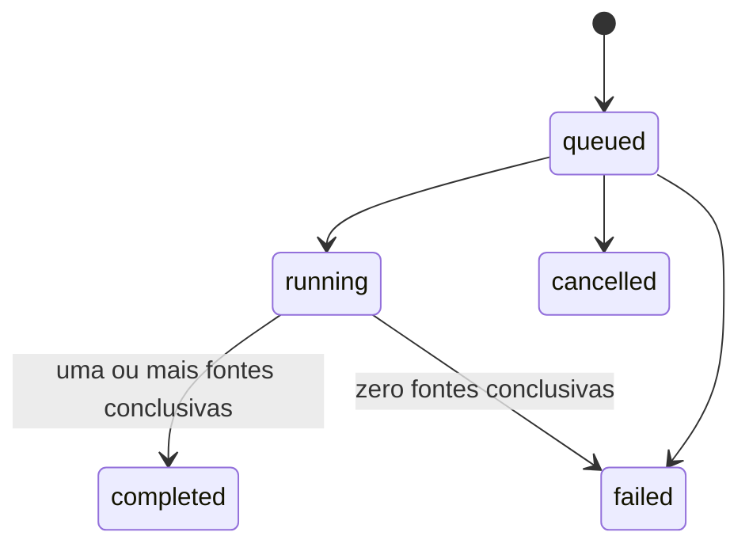

Rastro pesquisa um identificador em múltiplas fontes e preserva uma execução
imutável por solicitação. O contrato distingue uma ausência confirmada
(`not_found`) de bloqueio, indisponibilidade, erro ou resposta ambígua.

<Warning>
  **Implementação local em revisão.** As migrations não foram aplicadas, os
  workers permanecem desligados por padrão e não há disponibilidade observada em
  produção.
</Warning>

## Visão rápida

| Item              | Contrato                                                          |
| ----------------- | ----------------------------------------------------------------- |
| Base externa      | `https://api.sherlocker.com.br/api/v1`                            |
| Recurso           | `rastro_search` append-only                                       |
| Scopes            | `rastro:search` para criar/cancelar; `rastro:read` para consultar |
| Finalidade        | `purpose_id` obrigatório                                          |
| Idempotência      | obrigatória em cada criação faturável                             |
| Unidade faturável | busca aceita por tipo e alvo                                      |
| Outputs           | matches normalizados e coverage da execução                       |

## Endpoints implementados localmente

| Método | Path                                  | Scope           | Resposta | Finalidade                                      |
| ------ | ------------------------------------- | --------------- | -------: | ----------------------------------------------- |
| `POST` | `/rastro/searches`                    | `rastro:search` |    `202` | criar uma busca durável                         |
| `GET`  | `/rastro/searches`                    | `rastro:read`   |    `200` | listar buscas por cursor                        |
| `GET`  | `/rastro/searches/{search_id}`        | `rastro:read`   |    `200` | ler lifecycle, coverage, resultados e artefatos |
| `GET`  | `/rastro/searches/{search_id}/events` | `rastro:read`   |    `200` | consumir eventos duráveis por cursor            |
| `POST` | `/rastro/searches/{search_id}/cancel` | `rastro:search` |    `202` | cancelar somente enquanto `queued`              |

Não existe retry do mesmo recurso na v1. Depois de uma falha terminal, uma nova
observação exige outro `POST`, outra `Idempotency-Key` e cria outro `search_id`.

## Criar uma busca

Tipos iniciais de alvo incluem `email`, `phone`, `username` e `wallet`. O
OpenAPI do release define formato e tamanho de cada tipo.

`strategy` controla o fan-out:

- `all`: tenta todas as fontes elegíveis;
- `first_match`: encerra a estratégia após um match válido e marca o restante
  como `skipped` com `reason: "first_match_satisfied"`.

```bash
curl -X POST https://api.sherlocker.com.br/api/v1/rastro/searches \
  -H "Authorization: Bearer slhk_sua_chave_aqui" \
  -H "Idempotency-Key: 123e4567-e89b-42d3-a456-426614174020" \
  -H "Content-Type: application/json" \
  -d '{
    "type": "email",
    "target": "contato@example.com",
    "strategy": "all",
    "purpose_id": "11111111-1111-4111-8111-111111111111"
  }'
```

Uma criação aceita retorna `202 Accepted`, `Location` e o recurso persistido:

```http
HTTP/1.1 202 Accepted
Location: /api/v1/rastro/searches/aaaaaaaa-aaaa-4aaa-8aaa-aaaaaaaaaaaa
x-request-id: req_01JEXEMPLO
```

```json
{
  "id": "aaaaaaaa-aaaa-4aaa-8aaa-aaaaaaaaaaaa",
  "object": "rastro_search",
  "status": "queued",
  "type": "email",
  "target": "contato@example.com",
  "strategy": "all",
  "purpose_id": "11111111-1111-4111-8111-111111111111",
  "partial": false,
  "coverage": {
    "eligible": 1,
    "attempted": 0,
    "conclusive": 0,
    "by_outcome": {}
  },
  "billing": {
    "id": "bbbbbbbb-bbbb-4bbb-8bbb-bbbbbbbbbbbb",
    "status": "charge_pending",
    "amount": 25,
    "unit": "tokens",
    "price_version": "rastro-osint-2026-08",
    "billing_policy_version": "v1-public"
  },
  "artifacts": [],
  "poll_after_seconds": 3,
  "created_at": "2026-08-29T15:00:00Z",
  "updated_at": "2026-08-29T15:00:00Z"
}
```

`amount` é ilustrativo. O valor retornado e sua `price_version` são
autoritativos para aquela criação.

### Sem reutilização entre requests

- Mesma key e mesmo fingerprint: replay do recurso original, sem nova cobrança.
- Mesma key e outro alvo, tipo, estratégia ou finalidade:
  `409 idempotency_conflict`.
- Duas keys diferentes: duas buscas, dois IDs e duas cobranças, mesmo com body
  idêntico.

Cache de fonte pode reduzir custo interno, mas não substitui a nova observação e
deve aparecer com provenance e freshness quando afetar o resultado.

## Lifecycle

| Status      | Terminal? | Significado                                        | Próximos estados                 |
| ----------- | --------: | -------------------------------------------------- | -------------------------------- |
| `queued`    |       não | persistido e aguardando worker                     | `running`, `failed`, `cancelled` |
| `running`   |       não | fontes sendo executadas                            | `completed`, `failed`            |
| `completed` |       sim | ao menos uma fonte concluiu `found` ou `not_found` | nenhum                           |
| `failed`    |       sim | nenhuma fonte teve resultado conclusivo            | nenhum                           |
| `cancelled` |       sim | cancelado antes do início irreversível             | nenhum                           |



`POST /cancel` só é aceito em `queued`. Em `running`, retorna
`409 cancellation_not_allowed`.

## Outcome por fonte

Cada fonte elegível termina com um outcome explícito:

| Outcome       | Conclusivo? | Significado                                                     |
| ------------- | ----------: | --------------------------------------------------------------- |
| `found`       |         sim | evidência correspondente encontrada                             |
| `not_found`   |         sim | a fonte executou e respondeu negativamente de forma reconhecida |
| `blocked`     |         não | anti-bot, autenticação ou bloqueio de acesso                    |
| `unavailable` |         não | serviço indisponível ou circuit breaker aberto                  |
| `error`       |         não | transporte, execução ou parser falhou                           |
| `unknown`     |         não | resposta ambígua; não prova ausência                            |
| `skipped`     |         não | não executado pela estratégia/configuração                      |
| `unsupported` |         não | fonte não suporta o alvo ou tipo                                |

<Warning>
  Resposta vazia, bloqueio ou parse duvidoso nunca vira `not_found`. A ausência
  só é conclusiva quando a fonte realmente executou e produziu uma resposta
  negativa reconhecida.
</Warning>

`skipped` e `unsupported` aparecem na coverage, mas não entram no denominador de
fontes efetivamente tentadas.

## Resultado e coverage

`partial: true` significa que alguma fonte efetivamente tentada não concluiu. A
busca ainda pode ser `completed` quando outra fonte foi conclusiva.

### Exemplo: busca parcial com match

```json
{
  "id": "aaaaaaaa-aaaa-4aaa-8aaa-aaaaaaaaaaaa",
  "object": "rastro_search",
  "status": "completed",
  "type": "email",
  "target": "contato@example.com",
  "strategy": "all",
  "purpose_id": "11111111-1111-4111-8111-111111111111",
  "partial": true,
  "coverage": {
    "eligible": 3,
    "attempted": 3,
    "conclusive": 2,
    "by_outcome": {
      "found": 1,
      "not_found": 1,
      "blocked": 1
    },
    "providers": [
      {
        "provider": "public_profile_a",
        "outcome": "found",
        "attempted_at": "2026-08-29T15:00:04Z"
      },
      {
        "provider": "public_profile_b",
        "outcome": "not_found",
        "attempted_at": "2026-08-29T15:00:07Z"
      },
      {
        "provider": "public_profile_c",
        "outcome": "blocked",
        "attempted_at": "2026-08-29T15:00:09Z"
      }
    ]
  },
  "result": {
    "matches": [
      {
        "source": "public_profile_a",
        "profile_url": "https://example.invalid/profile/123",
        "display_name": "Perfil público encontrado",
        "confidence": 0.94
      }
    ]
  },
  "billing": {
    "status": "charged",
    "amount": 25,
    "unit": "tokens",
    "price_version": "rastro-osint-2026-08",
    "billing_policy_version": "v1-public"
  },
  "artifacts": [],
  "created_at": "2026-08-29T15:00:00Z",
  "updated_at": "2026-08-29T15:01:18Z"
}
```

Os nomes de fontes no exemplo são ilustrativos. O contrato público não expõe
IDs internos, payload bruto, credenciais ou detalhes operacionais do provider.

## Billing e refund

| Resultado da execução                                      | Lifecycle                    | Billing                           |
| ---------------------------------------------------------- | ---------------------------- | --------------------------------- |
| uma ou mais fontes `found`/`not_found`; todas concluíram   | `completed`, `partial=false` | cobrança integral                 |
| uma ou mais fontes conclusivas; outra fonte tentada falhou | `completed`, `partial=true`  | cobrança integral                 |
| zero fontes conclusivas                                    | `failed`                     | refund integral                   |
| cancelamento aceito em `queued`                            | `cancelled`                  | refund integral quando já cobrado |

Não há refund proporcional por fonte na v1. Falha de liquidação permanece
visível como `billing.status: "refund_pending"` até chegar a `refunded`.

## Falhas terminais

Quando `status: "failed"`, `failure.code` pode ser:

- `no_conclusive_provider`
- `provider_timeout_budget_exhausted`
- `dispatch_failed`
- `processing_timeout`
- `internal_error`

`unsupported_search_type` e `invalid_target` são erros HTTP `422` anteriores à
criação; não geram uma busca falha cobrada.

```json
{
  "id": "cccccccc-cccc-4ccc-8ccc-cccccccccccc",
  "object": "rastro_search",
  "status": "failed",
  "partial": true,
  "failure": {
    "code": "no_conclusive_provider",
    "detail": "No attempted source returned a conclusive outcome."
  },
  "coverage": {
    "eligible": 4,
    "attempted": 4,
    "conclusive": 0,
    "by_outcome": {
      "blocked": 2,
      "unavailable": 1,
      "unknown": 1
    }
  },
  "billing": {
    "status": "refund_pending",
    "amount": 25,
    "unit": "tokens",
    "price_version": "rastro-osint-2026-08",
    "billing_policy_version": "v1-public"
  }
}
```

O GET desse recurso responde HTTP `200`; a falha aconteceu depois da aceitação.

## Eventos

Eventos emitidos localmente incluem `rastro.created`, `rastro.started`,
`rastro.completed`, `rastro.failed` e `rastro.cancelled`. A v1 local ainda não
gera um relatório separado; por isso `artifacts` permanece vazio.

## Relacionado

- [Autenticação e erros](/plataforma/autenticacao-erros)
- [Dossiê](/plataforma/dossie)
- [Monitoramento](/plataforma/monitoramento)
- [Suporte e solicitações de privacidade](/support)
